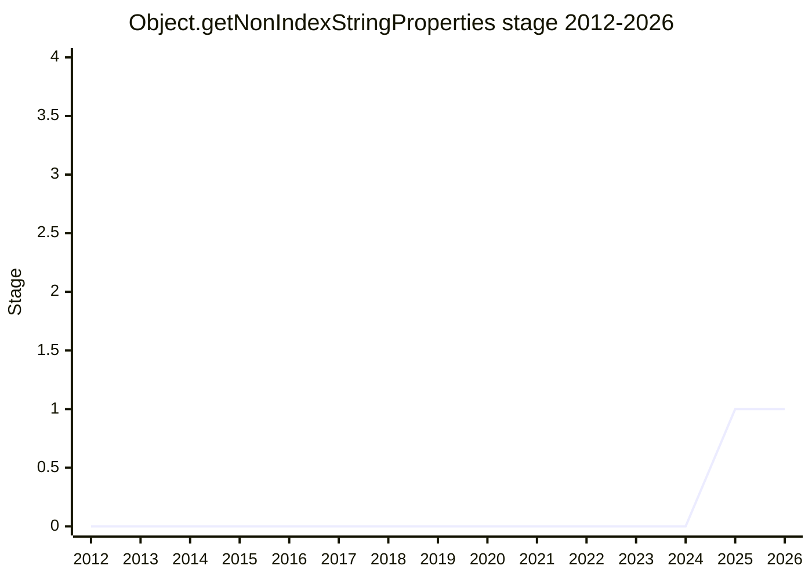

## Overview

Returns the non-index string-keyed own properties of an array-like object (arrays, `TypedArray`s): the "extra" properties that index-based APIs ignore. Use cases are validation (assert that an array or `TypedArray` carries no extra properties), testing, and generic logging/debugging of arbitrary objects - all currently expensive enough (full `Object.keys` scan) that code skips them. Node already implements this internally for `util.inspect` and `assert`.

Championed by [RBR](../people/RBR.md) (Ruben Bridgewater) with [JHD](../people/JHD.md). First presented in 2025-07 as `Array.getNonIndexStringProperties`; renamed to `Object.*` in 2025-11 to align with array-like and `TypedArray` inputs.

## Stage history

| Meeting                                                                            | What happened                                                                                                 | Stage |
| ---------------------------------------------------------------------------------- | ------------------------------------------------------------------------------------------------------------- | ----- |
| [2025-07](https://github.com/tc39/notes/blob/main/meetings/2025-07/july-31.md)     | First presented as `Array.getNonIndexStringProperties` for Stage 1 (no advancement)                           | 0     |
| [2025-11](https://github.com/tc39/notes/blob/main/meetings/2025-11/november-20.md) | Renamed to `Object.getNonIndexStringProperties`. **Reached Stage 1** (not asked for; committee encouraged it) | → 1   |

> First presented 2025-07 without advancing; Stage 1 in 2025-11.

## Main issues

### Proving the use case (2025-11)

The dominant theme was evidence. [RBR](../people/RBR.md) said the use cases (validation, testing, logging) are hard to pinpoint with searchable code patterns and floated a survey; [MF](../people/MF.md) dismissed surveys as methodologically weak and asked for paving cow paths instead, and [ACE](../people/ACE.md) explained what would convince: maintainers pointing at concrete code saying "here I would rewrite it". [KG](../people/KG.md) was unconvinced throughout - logging and assert use cases are "very far from convincing", assert is mostly a server-side pattern, and he argued code should not care whether it was handed an array or a RegExp match object ("opinions on coding styles" - [JHD](../people/JHD.md) replied that distaste for a category of object does not remove the need to identify it; [KG](../people/KG.md): "that's what we are for, as a committee"). [MAH](../people/MAH.md) offered a concrete validated use case (a library diagnosing extra properties on `TypedArray`s), which [WH](../people/WH.md) fully supported. [KG](../people/KG.md) did not object to Stage 1 but stated the motivation case must be made before Stage 2.

## Related proposals

- `object-propertycount` - same champion, adjacent problem area (counting properties), presented in the same meetings.

## Sources

- [2025-07 july-31](https://github.com/tc39/notes/blob/main/meetings/2025-07/july-31.md) - first presentation (as `Array.getNonIndexStringProperties`)
- [2025-11 november-20](https://github.com/tc39/notes/blob/main/meetings/2025-11/november-20.md) - Stage 1
