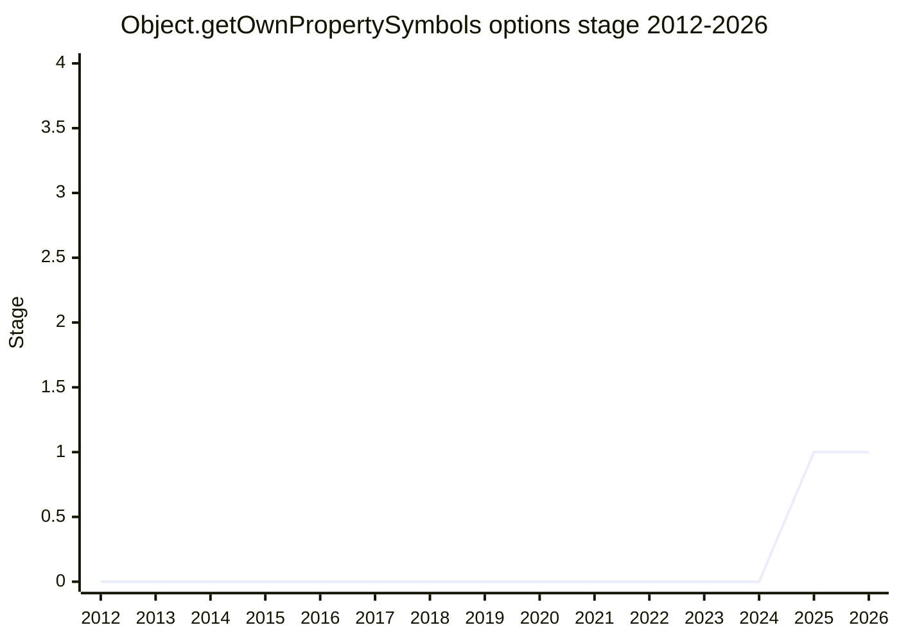

## Overview

An options bag on `Object.getOwnPropertySymbols` to filter by enumerability. The motivation is measurement: roughly 90% of `getOwnPropertySymbols` call sites immediately filter out non-enumerable symbols (serializers, loggers, `console.log`, Lodash, Node internals) because symbol-keyed properties are the idiom for hiding implementation details, and they are usually attached non-enumerable. Today that filtering costs an extra pass plus a descriptor check per symbol - "it is the only one I can think about for this one. And it is extra code and there is no way of optimizing it currently" ([RBR](../people/RBR.md)).

Championed by [RBR](../people/RBR.md) with [JHD](../people/JHD.md). Not yet in the canonical proposals list (judged from notes alone). It was the last of four adjacent property-introspection proposals [RBR](../people/RBR.md) presented at the 2025-07 meeting, and reached Stage 1 at the end of that day alongside [object-get-non-index-string-properties](object-get-non-index-string-properties.md).

## Stage history

| Meeting                                                                        | What happened                                                                                                                                                                 | Stage |
| ------------------------------------------------------------------------------ | ----------------------------------------------------------------------------------------------------------------------------------------------------------------------------- | ----- |
| [2025-07](https://github.com/tc39/notes/blob/main/meetings/2025-07/july-31.md) | First presented for Stage 1. [KG](../people/KG.md) happy with the problem space but "extremely strongly" against the options-bag shape; Stage 1 granted at the end of the day | → 1   |

> First presented 2025-07; Stage 1 in the same session.

## Main issues

### Options bag vs a new method: the 2x2 matrix

[KG](../people/KG.md): "I feel extremely strongly that the proposed solution is wrong. I would not accept this method going forward to be anything other than a new separate method, not an options to the options bag." The existing APIs already fill a string-vs-symbol / enumerable-vs-non-enumerable matrix - `Object.keys`, `Object.getOwnPropertyNames`, `Object.getOwnPropertySymbols` - and "the only acceptable way to solve this is with a separate method" matching the others (`Object.keys` vs `getOwnPropertyNames` is exactly this same enumerability distinction done by method). [KM](../people/KM.md) added a performance argument against the bag: "you don't want an options bag, because that option has to be allocated every time you call this" - efficient handling only kicks in deep in the optimizing pipelines. [MF](../people/MF.md) hoped to see `Object.symbols` as the Stage 2 name. [KG](../people/KG.md) also disliked the name: "I don't like the name. But I'm happy with the problem space."

### Is any of this API service warranted? ([MM](../people/MM.md) across the four proposals)

[MM](../people/MM.md) took the four [RBR](../people/RBR.md) proposals of the day together: "we got too much existing API and I'm very shy about adding yet more API with regard to enumerating properties." He prefers the narrowest or broadest tool plus post-filtering, and asked what the maximum symbol count on a real object is - [RBR](../people/RBR.md): "roughly... 10 to 15." [MM](../people/MM.md): "throwing away 14 out of 15 is just not a terrible cost." The motivated exceptions, for him, are where the thing filtered out is voluminous and skipping it is sublinear - which is the indexed-properties case (the getNonIndex proposal), not symbols. He wanted the four considered as one problem space with minimum total API. [ZTZ](../people/ZTZ.md) supported Stage 1 while being "not convinced it will be used in the wild."

### Proxy behavior (deferred to Stage 2)

[JHD](../people/JHD.md) committed to handling exotic-object edge cases before Stage 2: a property that `ownKeys` reports but `getOwnPropertyDescriptor` then denies (proxies) will follow the existing `getOwnPropertySymbols` behavior of skipping it; array-vs-non-array proxy treatment was discussed under the same umbrella.

## Related proposals

- [Object.getNonIndexStringProperties](object-get-non-index-string-properties.md) - granted Stage 1 the same day; the sibling slice of the property-introspection matrix.
- `object-propertycount` - same champion cluster; Stage 2 was denied the same day (see also `array-issparse`, which did not advance).

## Sources

- [2025-07 july-31](https://github.com/tc39/notes/blob/main/meetings/2025-07/july-31.md) - first presentation, Stage 1 (end-of-day grant)
