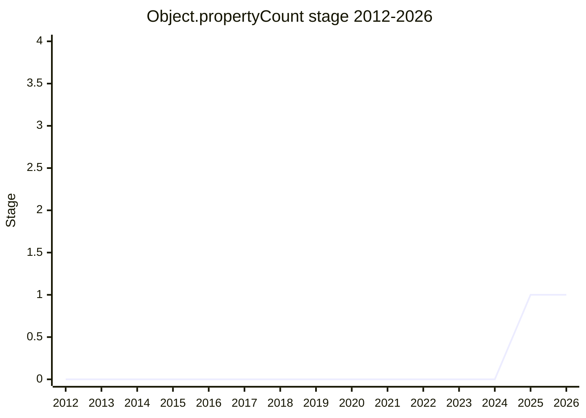

## Overview

`Object.propertyCount(target, options)` - count an object's own properties without allocating the array that `Object.keys(obj).length` builds. Co-championed by [RBR](../people/RBR.md) (Ruben Bridgewater, Node.js TSC / core collaborator; first TC39 presentation) and [JHD](../people/JHD.md) (repo: `ljharb/object-property-count`). The `options` bag filters by key type (`index` / `nonIndexString` / `symbol`) and enumerability (`true` / `false` / `'all'`), with defaults aligning with `Object.keys`.

The core use case is uncontroversial: input validation, object comparison, sparse-array detection, checking an array-like for extra properties, telemetry - all of which today allocate an array just to take its `length`. Everything around that core (which filters belong, whether arrays are in scope, what the name is) is where the proposal has spent its life.

## Stage history

| Meeting                                                                            | What happened                                                                                                                                                                                                                                                        | Stage                                                                                  |
| ---------------------------------------------------------------------------------- | -------------------------------------------------------------------------------------------------------------------------------------------------------------------------------------------------------------------------------------------------------------------- | -------------------------------------------------------------------------------------- | --- |
| [2025-04](https://github.com/tc39/notes/blob/main/meetings/2025-04/april-16.md)    | "Object.propertyCount" for Stage 1 or 2 ([RBR](../people/RBR.md) presenting, [JHD](../people/JHD.md) co-champion). Stage 1 with support from [DE](../people/DE.md), [KG](../people/KG.md), [CDA](../people/CDA.md), [DJM](../people/DJM.md), [JSH](../people/JSH.md) | → 1                                                                                    |
| [2025-04](https://github.com/tc39/notes/blob/main/meetings/2025-04/april-17.md)    | Continuation. [SYG](../people/SYG.md) rejected the "avoid performance cliffs" breadth; problem statement settled as a burn-down list of use cases; Stage 1 confirmed                                                                                                 | 1                                                                                      |
| [2025-07](https://github.com/tc39/notes/blob/main/meetings/2025-07/july-31.md)     | For Stage 2: **declined**. [KG](../people/KG.md) convinced of `Object.propertyCount` alone but not with the options bag; [MM](../people/MM.md) asked to hold                                                                                                         | 1                                                                                      |
| [2025-11](https://github.com/tc39/notes/blob/main/meetings/2025-11/november-19.md) | Remains at Stage 1. `Object.key[sLength                                                                                                                                                                                                                              | Count]` split out as a new Stage 2 proposal; the name will be decided before Stage 2.7 | 1   |

> Stage 1 in 2025-04 (granted in a continuation the next day), Stage 2 declined in 2025-07, still Stage 1 as of 2025-11 with a sibling proposal (`Object.key[sLength|Count]`) split off.

## Main issues

### The options-bag scope fight

The Stage 1 debate, in one exchange: [KG](../people/KG.md) said he was "extremely skeptical of everything that is not the basic use case... explosion in complexity" - and specifically did not want the API encouraging sparse-array fast paths or non-index keys on arrays ([WH](../people/WH.md) had similar concerns in the 2025-07 sibling discussions). [MM](../people/MM.md) defended the filters: defensive input validation "needs to be much more fast... change from O(n) to O(1)" - "does it have any non-index properties" is exactly what a validator wants to ask. [SYG](../people/SYG.md) cut through: "that sounds to me like a different problem statement than the problem statement presented... What is the thing we got Stage 1 on?" The recorded conclusion notes "not everyone in committee was convinced of some of the aspect of the broader scope and some people wanted the scope to be narrower."

A technical example of why the filters are harder than they look: [SYG](../people/SYG.md) pointed out V8's integer index is 32-bit while the spec allows up to 2^53-1, so "index vs non-index string" is not a clean spec-level distinction.

### Optimize the pattern instead? ([MF](../people/MF.md))

[MF](../people/MF.md)'s standing objection: the motivation is performance, and the historical answer is that engines optimize hot patterns (his analogy: `array.length` caching). [SYG](../people/SYG.md)'s counter: the optimizing-tier trick doesn't apply because the counting uses "seem to be kind of all over the place. Not necessarily in hot code... I don't think it's basically possible or worth it to ever optimize in the non-optimizing tiers."

### Stage 2 declined, then split (2025-07 / 2025-11)

In 2025-07 [KG](../people/KG.md): "I'm convinced of `Object.propertyCount` without the other options, but not prepared for this to go to stage two with the other things in it" - preferring separate `Object.keysLength` / `getOwnPropertyNamesLength` / `getOwnPropertySymbolsLength` methods over an options bag. [MM](../people/MM.md): "I would like to hold `Object.propertyCount` from stage two until we understand better the issues." The same session split off siblings: `Array.isSparse` was **rejected** for Stage 1 ([WH](../people/WH.md): an "attractive nuisance... they will not be O(1) algorithms"; [KM](../people/KM.md): JSC's sparse mode is always on, so the API would encode engine-specific internals; [OFR](../people/OFR.md): V8's holey arrays don't convert back, so the API semantics don't match internal kinds), while `Array.getNonIndexStringProperties` and the symbol-options idea reached Stage 1 (see [Object.getNonIndexStringProperties](object-get-non-index-string-properties.md) and [Object.getOwnPropertySymbols options](object-getownpropertysymbols-options.md)). In 2025-11 the committee split `Object.key[sLength|Count]` out as a new Stage 2 proposal - effectively adopting [KG](../people/KG.md)'s 2025-07 suggestion - with both proposals continuing to iterate and the name to be decided before Stage 2.7.

## Related proposals

- [Object.getNonIndexStringProperties](object-get-non-index-string-properties.md) - sibling split from the same 2025-07 session.
- [Object.getOwnPropertySymbols options](object-getownpropertysymbols-options.md) - sibling; the enumerability filter for symbol keys.
- `array-isSparse` - split out in 2025-07 and rejected for Stage 1 (no page yet).

## Sources

- [2025-04 april-16](https://github.com/tc39/notes/blob/main/meetings/2025-04/april-16.md) - Stage 1 granted
- [2025-04 april-17](https://github.com/tc39/notes/blob/main/meetings/2025-04/april-17.md) - continuation; scope narrowed
- [2025-07 july-31](https://github.com/tc39/notes/blob/main/meetings/2025-07/july-31.md) - Stage 2 declined; siblings split off
- [2025-11 november-19](https://github.com/tc39/notes/blob/main/meetings/2025-11/november-19.md) - `key[sLength|Count]` split out
