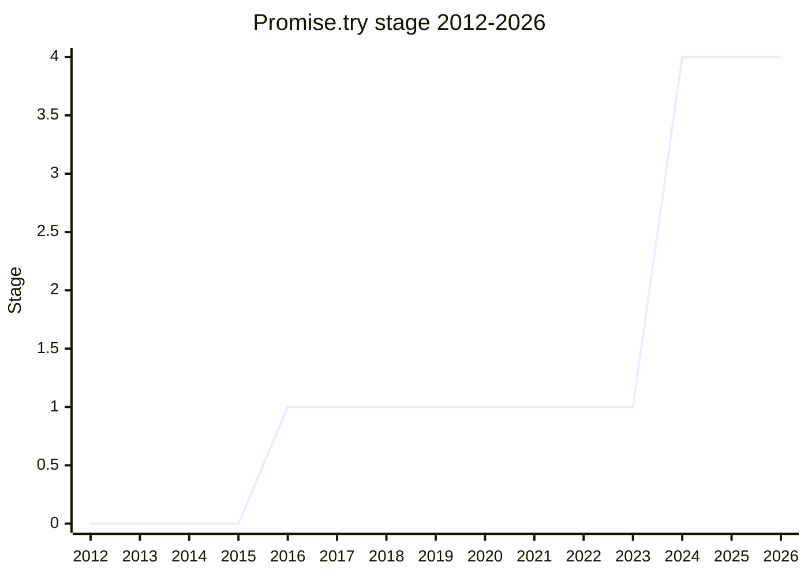

## Overview

`Promise.try(callback, ...args)` starts a promise chain from a function of unknown color: it invokes the callback synchronously, and the result - a value, a thenable, a throw - is normalized into a promise. It replaces both the awkward `new Promise(resolve => resolve(fn()))` idiom and `Promise.resolve().then(fn)`, which delays the call by a tick (so a synchronous throw escapes the chain). The champion is [JHD](../people/JHD.md), from first presentation in 2016 to Stage 4.

## Stage history

| Meeting                                                                           | Event                                                                                                                                                                                                                                                                             | Stage   |
| --------------------------------------------------------------------------------- | --------------------------------------------------------------------------------------------------------------------------------------------------------------------------------------------------------------------------------------------------------------------------------- | ------- |
| [2016-11](https://github.com/tc39/notes/blob/main/meetings/2016-11/nov-29.md)     | First presented. Stage 1, but "not ready for Stage 2, pending more evidence of motivation"                                                                                                                                                                                        | → 1     |
| [2024-02](https://github.com/tc39/notes/blob/main/meetings/2024-02/feb-6.md)      | Revived after ~7 years (userland package at ~46M downloads/week). First Stage 2 request stalled on [SYG](../people/SYG.md)'s motivation question; a same-day revisit granted **Stage 2** (support from [JRL](../people/JRL.md), [LGH](../people/LGH.md), [DMM](../people/DMM.md)) | 1 → 2   |
| [2024-02](https://github.com/tc39/notes/blob/main/meetings/2024-02/feb-8.md)      | Stage 3 reviewers volunteered ([RGN](../people/RGN.md), [RKG](../people/RKG.md))                                                                                                                                                                                                  | 2       |
| [2024-04](https://github.com/tc39/notes/blob/main/meetings/2024-04/april-08.md)   | **Reached Stage 2.7**                                                                                                                                                                                                                                                             | 2 → 2.7 |
| [2024-06](https://github.com/tc39/notes/blob/main/meetings/2024-06/june-11.md)    | **Reached Stage 3**                                                                                                                                                                                                                                                               | 2.7 → 3 |
| [2024-10](https://github.com/tc39/notes/blob/main/meetings/2024-10/october-09.md) | **Reached Stage 4**. Shipping in Cloudflare Workers, Bun, Node, Chrome; Firefox 132 flagged, unflagged in 133/134; LibJS, Boa, Kiesel; WebKit flag removed                                                                                                                        | 3 → 4   |

> Stage 1 in 2016-11, then a **seven-year flat line** while the committee waited for motivation evidence. Revived in 2024-02 and fast-tracked: Stage 2, 2.7, 3, and 4 all within the year.

## Main issues

### The seven-year motivation gap

The 2016 Stage 1 conclusion explicitly withheld Stage 2 "pending more evidence of motivation" - at the time, `await` syntax was expected to make the helper unnecessary. What changed by 2024 was data: a userland implementation at ~46M npm downloads a week, plus [JRL](../people/JRL.md)'s concrete war story - in [AMP](../people/AMP.md), `Promise.resolve(fn())` swallowed a synchronous throw from `fn` because only async catch existed, a bug class their team only fixed by forcing everyone onto a `promise.try` helper. [SYG](../people/SYG.md) still pressed for a concrete in-language example during the 2024 revival, and only signed off after seeing one in Matrix - the Stage 2 grant came from a same-day "revisit" session with explicit support from three delegates.

> ([SYG](../people/SYG.md), 2024-02) I think you could, given that there doesn't seem to be a lot of design room here, I think you could, for folks who have expressed reservation, work with us off-line and go straight to 2.7 or 3.

That quote is also why the fast track worked: nobody disputed the design (there is essentially none to dispute), only the need.

### What it removes

[JHD](../people/JHD.md)'s framing of the win: modern code should almost never need `new Promise` - the constructor remains for wrapping callback APIs and inverting promises, and `Promise.try` takes away the third reason (normalizing a possibly-throwing callback), which "is confusing when users run across a new promise construction in code."

## Related proposals

- [AsyncContext](async-context.md) - shares the "start a async chain from sync code" neighborhood (no page yet).
- [Explicit Resource Management](explicit-resource-management.md) - the other place where sync/async boundary ergonomics drove API shape.

## Sources

- [2016-11 nov-29](https://github.com/tc39/notes/blob/main/meetings/2016-11/nov-29.md) - Stage 1 (motivation evidence requested)
- [2024-02 feb-6](https://github.com/tc39/notes/blob/main/meetings/2024-02/feb-6.md) - revival; Stage 2 via the revisit session
- [2024-02 feb-8](https://github.com/tc39/notes/blob/main/meetings/2024-02/feb-8.md) - reviewers volunteered ([RGN](../people/RGN.md), [RKG](../people/RKG.md))
- [2024-04 april-08](https://github.com/tc39/notes/blob/main/meetings/2024-04/april-08.md) - Stage 2.7
- [2024-06 june-11](https://github.com/tc39/notes/blob/main/meetings/2024-06/june-11.md) - Stage 3
- [2024-10 october-09](https://github.com/tc39/notes/blob/main/meetings/2024-10/october-09.md) - Stage 4 ([JHD](../people/JHD.md))
