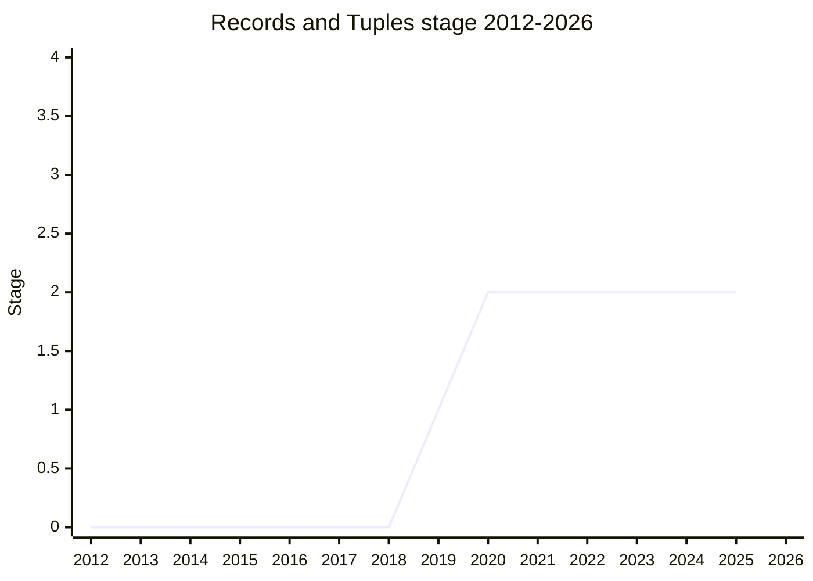

## 概要

Records & Tuples は、deeply immutable な複合 value type を JavaScript に追加する提案でした。`#{ x: 1, y: 2 }`(Record)と `#[1, 2, 3]`(Tuple)という構文で、object/array に対応する不変版を生成します。

魅力は「value としての等価性」にありました。これらは primitive として設計され、独自の `typeof`(`"record"` / `"tuple"`)を持ち、`===` が pointer 比較ではなく構造的(再帰的)な value 比較になります。つまり `#{ a: 1 } === #{ a: 1 }` が `true` になり、Map/Set のキーや React の差分検出など「内容が同じなら同じものとして扱いたい」場面を、ライブラリの deep-equal や `JSON.stringify` キーといった回避策なしに解決できる、というものでした。

難しさの根は「primitive かつ value 等価」という選択そのものにありました。

- **deeply immutable** を保証するため、中に入れられるのは他の Record/Tuple と primitive のみ。object・function・Symbol を一切格納できない。これが「言語の大部分を切り落とす」制約となった。
- `===` を構造比較にすると、エンジンは「pointer 比較で済む」という前提を失う。interning(同一値を 1 つに正規化)も in-place の deep 比較も、実装者から「遅すぎる/コストが高すぎる」と明確に否定された。
- `+0`/`-0`、`NaN`、`Object.is` と `===` の整合性、membrane(realm 越しの隔離)など、既存の等価セマンティクスと衝突する論点が次々と現れた。

Stage 2 到達後、これらの根本制約が長期間動かせず、最終的に primitive を諦めた再設計(後述の Composites)へ道を譲って撤回されました。

## ステージ遷移

| 会合 | できごと | Stage |
| --- | --- | --- |
| 2019-10 | Records & Tuples for Stage 1。[RRD](../people/RRD.md)(Robin Ricard)/[RBU](../people/RBU.md)(Rick Button)が初登壇。`===` の構造比較、`#{}`/`#[]` 構文、JSON 連携の可能性が議論され Stage 1 合意(※この回の出席者表は Robin Ricard に別 delegate と同じ略号を割り当てているが、本 wiki では Robin Ricard を一貫して [RRD](../people/RRD.md) とする) | 1 |
| 2020-03 | Record and Tuple Update(中間報告) | 1 |
| 2020-07 | Record and Tuple for Stage 2。`Object.is`/`===` のセマンティクス、Symbol をキーにできない件を整理し Stage 2 合意。ただし [KG](../people/KG.md)/[SYG](../people/SYG.md)/[YSV](../people/YSV.md)/Moddable が「Stage 3 前に実装可能性の実証が必須」と条件付け | 2 |
| 2020-09 / 2021-03 / 2021-10 | updates。設計の細部調整が続くが基本設計は不変 | 2 |
| 2021-12 | 「object をどう参照するか」の決定木を提示(Symbols-as-WeakMap-keys / ObjectPlaceholder / object 直接格納)。membrane の security invariant を巡り紛糾、結論出ず | 2 |
| 2022-07 / 2022-09 | updates。2022-09 時点で「次回 Stage 3 を目指す」と表明 | 2 |
| 2022-11 | updates。[YSV](../people/YSV.md) が「そもそも解こうとしている根本問題は何か」を問い、動機の不明確さが露呈。Stage 3 には進めず | 2 |
| (2023-2024) | 長期停滞。plenary での進展なし | 2 |
| 2025-02 | Records and Tuples future directions。[ACE](../people/ACE.md) が「new primitive・`===` 過負荷には appetite がない」と総括し、primitive を諦めた再設計(object 化・shallow 化・Map/Set 専用の合成キー等価)を提示 | 2 |
| 2025-04 | Withdrawing Records & Tuples。再設計は Composites として別途 Stage 1 へ。本提案は撤回で consensus | withdrawn |

> 横軸=2012-2026、縦軸=Stage。2019-10 に Stage 1、2020-07 に Stage 2 到達後、**Stage 2 のまま横ばい**(実装可能性・等値セマンティクスの壁で Stage 3 に進めず)。2025-04 に**撤回**したため線はそこで終わる(以降は描かない)。

## 主な論点

### 等値セマンティクス(`===` で構造的等価)

中核にして最大の争点。`===` を「内容が同じなら true」にする設計は [MM](../people/MM.md)・[BE](../people/BE.md)・[WH](../people/WH.md) らが支持し、Stage 1/2 を通じて「触るとパンドラの箱が開く」として固められました(2020-07, [WH](../people/WH.md)「変えないでほしい」)。

一方でこれは既存の等価規則と緊張関係にありました。

- **`+0`/`-0` と `NaN`**([WH](../people/WH.md), [YK](../people/YK.md), 2019-10): 要素ごとの `===` だと reflexivity/transitivity と `±0`・`NaN` の扱いが衝突する。提案は「`NaN` を含む Record は自分自身と等しい」「`±0` は値としては保持するが等価判定でのみ区別」という妥協を採用。
- **`===` と `Object.is` の不一致**([NRO](../people/NRO.md), 2021-12): primitive なら `===` に SameValueZero、`Object.is` に SameValue を使い分けられるが、もし object 化すると「`===` と `Object.is` は object に対して同じ結果でなければならない」という invariant に抵触する。

最終的な 2025-02 の総括では、[ACE](../people/ACE.md)/[DE](../people/DE.md) が「`===` を overload することへの appetite はない」「実装者から interning も in-place deep 比較も不可と明言された」と述べ、`===` 構造等価そのものを諦める方向に転じました。これが事実上の決定打の一つです。

### エンジン実装の負担

Stage 2 の段階から [KG](../people/KG.md)「performant に実装するのは全く自明でない。Stage 3 前に実装者の声を聞きたい」、[SYG](../people/SYG.md)「V8 は実装可能性について中立。Stage 3 前に調査・サインオフが要る」、[YSV](../people/YSV.md)/Moddable「実装負担が高く、それに見合う有用性の実証が要る」と、繰り返し条件が付けられました(2020-07)。

2025-02 で [DE](../people/DE.md) が明言したとおり、過去に Stage 3 を目指した際、実装者から「interning はコストが高すぎ、in-place の deep 比較は『object の `===` は単なる pointer 比較』という重要性を壊すので不可」という極めて明確な否定を受けていました。この実装上の壁が、設計を動かせなかった主因です。

### object / function / Symbol を含められない

deeply immutable を保証するため、中身は Record/Tuple と primitive に限定されました。

- **Symbol をキーにできない**([WH](../people/WH.md), [RRD](../people/RRD.md), [JHD](../people/JHD.md), 2020-07): Record はキーをソートして格納するが、Symbol には全順序がなくソートできない。[JHD](../people/JHD.md)「これを解こうとしない限り、Symbol を Record キーにする道は閉ざされる」。[MM](../people/MM.md) はソート順自体が side channel になりうると指摘。
- **object を参照できない**(2021-12 の決定木): everything is an object な言語で object/function を一切入れられないのは致命的に窮屈。解決案として (a) Symbols-as-WeakMap-keys、(b) ObjectPlaceholder primitive、(c) object の直接格納(shallow 化)が比較されたが、いずれも membrane の security invariant や realm 越しの扱いで難航し、結論が出なかった。
- 2025-02 で [ACE](../people/ACE.md) は「2019 年の deeply-immutable 設計は言語の大部分を切り落とす。Temporal のような新しい不変データすら入れられないのは申し訳ない」と述べ、shallow immutability への緩和を提案。

### typeof / primitive か object か

提案は Record/Tuple を独自 `typeof` を持つ primitive としてモデル化していました。これは [MM](../people/MM.md) らの「stable/fixed な value」というモデルには整合する一方、[PHE](../people/PHE.md) が指摘したとおり「object や array に見えるのに `Array.isArray` を通らない値」はエコシステムの既存コード(型 sniffing)を壊します。

2025-02 で [ACE](../people/ACE.md) は「これらは object であるべきだと考えを改めた」と転向。primitive をやめることで、既存の prototype・reflection・型判定との互換性を取りに行く方針へ変えました。

### boxing / unboxing

object を Record/Tuple に持ち込む手段として議論された ObjectPlaceholder(2021-12)は、object を直接持たずに「箱」越しに参照する案でしたが、realm を跨いだ dereference の制約(factory と getObject のペアでしか開けない)や membrane との相互作用が複雑で、[WH](../people/WH.md) から「Realms から切り離して再設計してほしい」と要請されたまま収束しませんでした。

### Map/Set キーと WeakMap

「合成キーが欲しい」が一貫した動機でした(`Map.groupBy` で複数値をキーにしたい等)。primitive 設計なら WeakMap キーにできない・GC されない問題があり、object 化すると「object は WeakMap キーになれ、GC されうる」という期待との整合が問われました([MAH](../people/MAH.md), 2025-02)。2025-02 の再設計は「Record/Tuple を `===` には載せないが、Map/Set など特定 API でだけ合成キー等価として扱う」案で、ここを突破口にしようとしました。

### 撤回に至った決定打

固まった核(new primitive + `typeof` + `===` 構造等価 + deep immutability)が、(1)実装者の明確な不可表明、(2)object/Symbol を入れられない窮屈さ、(3)等価セマンティクスの increase(JS は既に 4 種の等価を持つ)への committee の忌避、という三点で動かせなくなりました。2025-02 で [ACE](../people/ACE.md) が「これらの fundamentals に appetite がないと分かった」と総括し、primitive を捨てた再設計(object 化・shallow・合成キー等価)へ舵を切りました。

その再設計は Composites として別提案で Stage 1 を取得。2025-04、[ACE](../people/ACE.md) は「new primitive を足す本来の核は前進の道が見つからなかった。Composites という新しい見方がある」として撤回を提案し、consensus を得ました([NRO](../people/NRO.md)「RIP R&T」)。なお「Record」という名前は TypeScript での既存用法が強すぎるため再設計では使わない、とされています。

## 関連提案

- Composites(本提案の後継。primitive をやめ object として再設計。2025-04 時点で Stage 1)
- Symbols as WeakMap keys(object 参照手段の候補として 2021-12 に検討)
- shared structs(2025-02 で immutable struct/born-immutable の文脈で比較)
- Temporal(immutable データモデルだが Record/Tuple とは意図的に結合しないと判断)

## 出典

- [2019-10 october-1.md — Records & Tuples for Stage 1](../../raw/notes/meetings/2019-10/october-1.md)
- [2020-03 april-1.md — Record and Tuple Update](../../raw/notes/meetings/2020-03/april-1.md)
- [2020-07 july-22.md — Record and Tuple for Stage 2](../../raw/notes/meetings/2020-07/july-22.md)
- [2020-09 sept-22.md — Records & Tuples](../../raw/notes/meetings/2020-09/sept-22.md)
- [2021-03 mar-9.md — Records and Tuples update](../../raw/notes/meetings/2021-03/mar-9.md)
- [2021-10 oct-28.md — Records & Tuples update](../../raw/notes/meetings/2021-10/oct-28.md)
- [2021-12 dec-15.md — Records and Tuples(object 参照の決定木)](../../raw/notes/meetings/2021-12/dec-15.md)
- [2022-07 jul-19.md — Record & Tuple Update](../../raw/notes/meetings/2022-07/jul-19.md)
- [2022-09 sep-13.md — Record and Tuple update](../../raw/notes/meetings/2022-09/sep-13.md)
- [2022-11 nov-30.md — Records and Tuples](../../raw/notes/meetings/2022-11/nov-30.md)
- [2025-02 february-19.md — Records and Tuples future directions](../../raw/notes/meetings/2025-02/february-19.md)
- [2025-04 april-14.md — Withdrawing Records & Tuples](../../raw/notes/meetings/2025-04/april-14.md)
