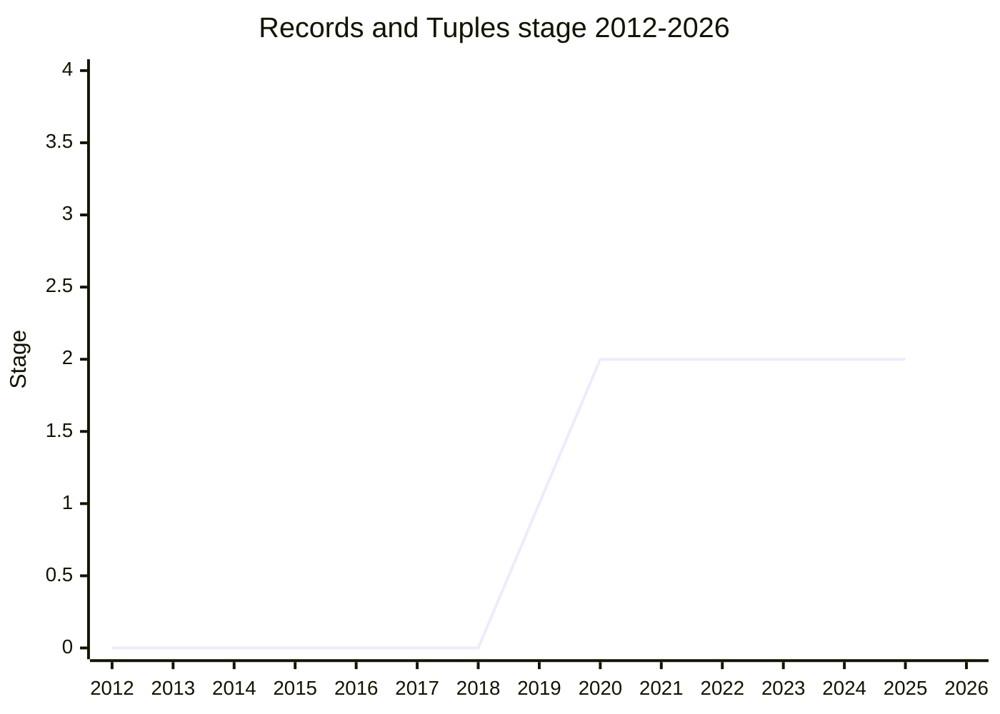

## Overview

Records & Tuples was a proposal to add deeply immutable compound value types to JavaScript. The syntax `#{ x: 1, y: 2 }` (Record) and `#[1, 2, 3]` (Tuple) produces immutable counterparts of objects and arrays.

The appeal was equality as a value. They were designed as primitives, had their own `typeof` (`"record"` / `"tuple"`), and `===` was structural (recursive) value comparison rather than pointer comparison. That is, `#{ a: 1 } === #{ a: 1 }` would be `true`, solving the cases where the same contents should be treated as the same thing — Map/Set keys, React change detection, and so on — without workarounds such as a library deep-equal or using `JSON.stringify` as a key.

The root of the difficulty was the choice itself: primitive, and equal by value.

- To guarantee **deeply immutable**, the only things that can go inside are other Records/Tuples and primitives. Objects, functions, and Symbols cannot be stored at all. This became a constraint that cuts off most of the language.
- If `===` is structural comparison, engines lose the premise that pointer comparison is enough. Both interning (canonicalizing identical values to a single one) and in-place deep comparison were explicitly rejected by implementers as too slow or too costly.
- Issues that collide with existing equality semantics kept appearing: `+0` / `-0`, `NaN`, the consistency of `Object.is` and `===`, and membranes (isolation across realms).

After it reached Stage 2, these fundamental constraints could not be moved for a long time. It was eventually withdrawn, giving way to a redesign that gave up on primitives (Composites, below).

## Stage history

| Meeting                     | What happened                                                                                                                                                                                                                                                                                                                                                                                                                                                            | Stage     |
| --------------------------- | ------------------------------------------------------------------------------------------------------------------------------------------------------------------------------------------------------------------------------------------------------------------------------------------------------------------------------------------------------------------------------------------------------------------------------------------------------------------------ | --------- |
| 2019-10                     | Records & Tuples for Stage 1. [RRD](../people/RRD.md) (Robin Ricard) / [RBU](../people/RBU.md) (Rick Button) presented for the first time. Structural comparison for `===`, the `#{}` / `#[]` syntax, and the possibility of JSON integration were discussed, and Stage 1 was agreed (the attendee table for this meeting assigns Robin Ricard the same abbreviation as a different delegate, but this wiki consistently treats Robin Ricard as [RRD](../people/RRD.md)) | 1         |
| 2020-03                     | Record and Tuple Update (interim report)                                                                                                                                                                                                                                                                                                                                                                                                                                 | 1         |
| 2020-07                     | Record and Tuple for Stage 2. Sorted out the semantics of `Object.is` / `===` and the fact that Symbols cannot be keys, and agreed Stage 2. However [KG](../people/KG.md) / [SYG](../people/SYG.md) / [YSV](../people/YSV.md) / Moddable conditioned it on a demonstration of implementability being required before Stage 3                                                                                                                                             | 2         |
| 2020-09 / 2021-03 / 2021-10 | Updates. Adjustments to the details of the design continued, but the basic design was unchanged                                                                                                                                                                                                                                                                                                                                                                          | 2         |
| 2021-12                     | Presented a decision tree for how to refer to an object (Symbols-as-WeakMap-keys / ObjectPlaceholder / storing the object directly). Became contentious over the membrane security invariant; no conclusion                                                                                                                                                                                                                                                              | 2         |
| 2022-07 / 2022-09           | Updates. As of 2022-09, stated an intention to aim for Stage 3 next time                                                                                                                                                                                                                                                                                                                                                                                                 | 2         |
| 2022-11                     | Updates. [YSV](../people/YSV.md) asked what fundamental problem was actually being solved, and the unclear motivation was exposed. Did not advance to Stage 3                                                                                                                                                                                                                                                                                                            | 2         |
| (2023-2024)                 | A long stall. No progress at plenary                                                                                                                                                                                                                                                                                                                                                                                                                                     | 2         |
| 2025-02                     | Records and Tuples future directions. [ACE](../people/ACE.md) summarized that there is no appetite for a new primitive or for overloading `===`, and presented a redesign that gave up on primitives (making them objects, making them shallow, and composite-key equality dedicated to Map/Set)                                                                                                                                                                         | 2         |
| 2025-04                     | Withdrawing Records & Tuples. The redesign goes separately to Stage 1 as Composites. Consensus to withdraw this proposal                                                                                                                                                                                                                                                                                                                                                 | withdrawn |

```mermaid
xychart-beta
    title "Records and Tuples stage 2012-2026"
    x-axis [2012, 2013, 2014, 2015, 2016, 2017, 2018, 2019, 2020, 2021, 2022, 2023, 2024, 2025, 2026]
    y-axis "Stage" 0 --> 4
    line [0, 0, 0, 0, 0, 0, 0, 1, 2, 2, 2, 2, 2, 2]
```

> X-axis = 2012-2026, y-axis = Stage. Stage 1 in 2019-10 and Stage 2 in 2020-07, then **flat at Stage 2** (it could not advance to Stage 3 because of the walls of implementability and equality semantics). **Withdrawn** in 2025-04, so the line ends there (nothing is drawn after that).

## Main issues

### Equality semantics (structural equality with `===`)

The core issue, and the biggest dispute. The design that makes `===` true when the contents are the same was supported by [MM](../people/MM.md), [BE](../people/BE.md), [WH](../people/WH.md), and others, and through Stage 1 and Stage 2 it was locked in on the grounds that touching it would open Pandora's box (2020-07, [WH](../people/WH.md): "Please don't change it").

On the other hand, this was in tension with the existing equality rules.

- **`+0` / `-0` and `NaN`** ([WH](../people/WH.md), [YK](../people/YK.md), 2019-10): per-element `===` collides with reflexivity and transitivity and with the treatment of `±0` and `NaN`. The proposal adopted a compromise: a Record that contains `NaN` is equal to itself, and `±0` is preserved as a value but distinguished only in the equality check.
- **`===` and `Object.is` disagree** ([NRO](../people/NRO.md), 2021-12): for a primitive one can use SameValueZero for `===` and SameValue for `Object.is`, but if they became objects this would violate the invariant that `===` and `Object.is` must give the same result for objects.

In the 2025-02 summary, [ACE](../people/ACE.md) / [DE](../people/DE.md) said there is no appetite for overloading `===`, and that implementers had stated clearly that neither interning nor in-place deep comparison is acceptable. The direction turned toward giving up structural equality via `===` itself. This was one of the blows that decided it.

### The burden on engine implementers

From the Stage 2 point onward, conditions were attached repeatedly (2020-07). [KG](../people/KG.md): "It is not at all obvious how to implement this performantly. I want to hear from implementers before Stage 3." [SYG](../people/SYG.md): "V8 is neutral on implementability. Investigation and sign-off are required before Stage 3." [YSV](../people/YSV.md) / Moddable: "The implementation burden is high, and we need a demonstration that the usefulness is worth it."

As [DE](../people/DE.md) stated plainly in 2025-02, when they had previously aimed at Stage 3 they received a very clear rejection from implementers: interning is too costly, and in-place deep comparison is unacceptable because it destroys the importance of object `===` being mere pointer comparison. This implementation wall was the main reason the design could not be moved.

### Objects, functions, and Symbols cannot be included

To guarantee deeply immutable, the contents were limited to Records/Tuples and primitives.

- **Symbols cannot be keys** ([WH](../people/WH.md), [RRD](../people/RRD.md), [JHD](../people/JHD.md), 2020-07): a Record stores its keys sorted, but Symbols have no total order and cannot be sorted. [JHD](../people/JHD.md): "Unless we try to solve this, the path to using Symbols as Record keys stays closed." [MM](../people/MM.md) pointed out that the sort order itself could become a side channel.
- **Objects cannot be referred to** (the 2021-12 decision tree): in a language where everything is an object, being unable to put an object or a function in at all is fatally cramped. The options compared were (a) Symbols-as-WeakMap-keys, (b) an ObjectPlaceholder primitive, and (c) storing the object directly (making immutability shallow). All of them struggled with the membrane security invariant and with cross-realm handling, and no conclusion was reached.
- In 2025-02 [ACE](../people/ACE.md) said the 2019 deeply-immutable design cuts off most of the language, and that it is regrettable that even new immutable data such as Temporal cannot be put in, and proposed relaxing to shallow immutability.

### typeof: primitive or object

The proposal modeled Records and Tuples as primitives with their own `typeof`. That fits the model of a stable, fixed value held by [MM](../people/MM.md) and others, but as [PHE](../people/PHE.md) pointed out, a value that looks like an object or an array but does not pass `Array.isArray` breaks existing ecosystem code (type sniffing).

In 2025-02 [ACE](../people/ACE.md) changed course, saying he had come to think these ought to be objects. Giving up on primitives shifted the plan toward compatibility with existing prototypes, reflection, and type tests.

### Boxing and unboxing

ObjectPlaceholder, discussed in 2021-12 as a way to bring an object into a Record or Tuple, was a plan to refer to the object through a box rather than holding it directly. Constraints on cross-realm dereference (it can be opened only as a factory and getObject pair) and the interaction with membranes were complicated, and it never converged after [WH](../people/WH.md) asked for it to be redesigned detached from Realms.

### Map/Set keys and WeakMap

Wanting composite keys was a consistent motivation (for example, wanting several values as a key in `Map.groupBy`). Under the primitive design they cannot be WeakMap keys and are not garbage-collected; if they became objects, consistency with the expectation that an object can be a WeakMap key and can be garbage-collected was in question ([MAH](../people/MAH.md), 2025-02). The 2025-02 redesign tried to break through here by not putting Records and Tuples on `===`, but treating them as composite-key equality only in specific APIs such as Map and Set.

### What decided the withdrawal

The hardened core — a new primitive, plus `typeof`, plus structural equality via `===`, plus deep immutability — could no longer be moved, for three reasons: (1) implementers' clear statement that it was not acceptable, (2) the cramped inability to put objects and Symbols inside, and (3) the committee's aversion to an increase in equality semantics (JS already has four kinds of equality). In 2025-02 [ACE](../people/ACE.md) summarized that there is no appetite for these fundamentals, and steered toward a redesign that dropped primitives (objects, shallow immutability, and composite-key equality).

That redesign obtained Stage 1 as a separate proposal, Composites. In 2025-04 [ACE](../people/ACE.md) proposed withdrawal, saying no path forward had been found for the original core of adding a new primitive, and that there is a new way of looking at it called Composites, and got consensus ([NRO](../people/NRO.md): "RIP R&T"). The name "Record" will not be used in the redesign, because its existing use in TypeScript is too strong.

## Related proposals

- [Composite Keys](composite-keys.md) (the successor to this proposal. Gives up on primitives and is redesigned as objects. Stage 1 as of 2025-04)
- Symbols as WeakMap keys (considered in 2021-12 as a candidate way to refer to objects)
- shared structs (compared in 2025-02 in the context of immutable structs and born-immutable)
- Temporal (an immutable data model, but it was decided not to couple it intentionally with Records and Tuples)

## Sources

- [2019-10 october-1.md — Records & Tuples for Stage 1](https://github.com/tc39/notes/blob/main/meetings/2019-10/october-1.md)
- [2020-03 april-1.md — Record and Tuple Update](https://github.com/tc39/notes/blob/main/meetings/2020-03/april-1.md)
- [2020-07 july-22.md — Record and Tuple for Stage 2](https://github.com/tc39/notes/blob/main/meetings/2020-07/july-22.md)
- [2020-09 sept-22.md — Records & Tuples](https://github.com/tc39/notes/blob/main/meetings/2020-09/sept-22.md)
- [2021-03 mar-9.md — Records and Tuples update](https://github.com/tc39/notes/blob/main/meetings/2021-03/mar-9.md)
- [2021-10 oct-28.md — Records & Tuples update](https://github.com/tc39/notes/blob/main/meetings/2021-10/oct-28.md)
- [2021-12 dec-15.md — Records and Tuples (decision tree for object references)](https://github.com/tc39/notes/blob/main/meetings/2021-12/dec-15.md)
- [2022-07 jul-19.md — Record & Tuple Update](https://github.com/tc39/notes/blob/main/meetings/2022-07/jul-19.md)
- [2022-09 sep-13.md — Record and Tuple update](https://github.com/tc39/notes/blob/main/meetings/2022-09/sep-13.md)
- [2022-11 nov-30.md — Records and Tuples](https://github.com/tc39/notes/blob/main/meetings/2022-11/nov-30.md)
- [2025-02 february-19.md — Records and Tuples future directions](https://github.com/tc39/notes/blob/main/meetings/2025-02/february-19.md)
- [2025-04 april-14.md — Withdrawing Records & Tuples](https://github.com/tc39/notes/blob/main/meetings/2025-04/april-14.md)
