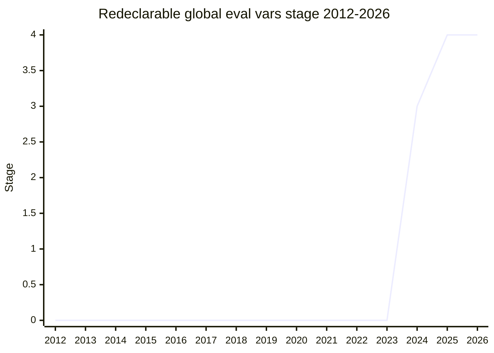

## Overview

Makes `var` bindings introduced into the global scope by (indirect or direct) `eval` redeclarable, by removing the special `[[VarNames]]` tracking on the global object. The global scope is an **open scope** - every script tag shares the same global environment - and the spec used `[[VarNames]]` to remember which global-object properties came from `var` declarations, which made them conflict with global lexical declarations in a way ordinary non-configurable global properties are not. [SYG](../people/SYG.md)'s argument: the special case is "a slight pain in the ass for implementations" (an extra bit on the property descriptor for everything on the global object), and the conflict it enforces protects a use case nobody cares about.

The concrete observable change: `eval("var x")` at global scope followed by a global `let x` (or another redeclaration) is no longer an error - the lexical binding shadows the eval-introduced one, as it already would for any other global property. Chrome had shipped the new behavior first as an experiment and "nobody really complained"; the proposal then standardized it.

## Stage history

| Meeting                                                                            | Event                                                                                                                                                                                                                                                                   | Stage   |
| ---------------------------------------------------------------------------------- | ----------------------------------------------------------------------------------------------------------------------------------------------------------------------------------------------------------------------------------------------------------------------- | ------- |
| [2024-04](https://github.com/tc39/notes/blob/main/meetings/2024-04/april-08.md)    | Originally a needs-consensus PR; [SYG](../people/SYG.md) moved it into a proposal to follow the process, and advanced to Stage 2.7 in the same session ([WH](../people/WH.md) consulted; support [DLM](../people/DLM.md), [KG](../people/KG.md), [MM](../people/MM.md)) | → 2.7   |
| [2024-04](https://github.com/tc39/notes/blob/main/meetings/2024-04/april-11.md)    | Continuation session: Stage 3                                                                                                                                                                                                                                           | 2.7 → 3 |
| [2025-02](https://github.com/tc39/notes/blob/main/meetings/2025-02/february-18.md) | Stage 4: all three engines have shipped the proposed behavior                                                                                                                                                                                                           | 3 → 4   |



> A late-2024 needs-consensus PR turned proposal: Stage 2.7 and Stage 3 within the same 2024-04 meeting (moved as a proposal "instead of as a consensus-needed PR"), Stage 4 in 2025-02. Nothing before 2024 - the topic only ever existed as a spec bug fix.

## Main issues

### [[VarNames]] and the implementation burden

The `[[VarNames]]` slot exists to make a specific corner an error: a global lexical binding (`let`/`const`/`class`) shadowing an eval-introduced global `var`. [SYG](../people/SYG.md) argued the mechanism costs every engine an extra property-descriptor bit on the global object to enforce a distinction with no practical value, and that treating eval-introduced vars like any other non-configurable global property removes the corner instead of specifying it more precisely. The change is still normative - code that relied on the error would observe a difference - which is why it went through the proposal process at all.

### Shadowing allowed - but don't

The headline consequence is that this becomes legal:

```js
eval("var x = 1;");
let x = 2; // now allowed (shadowing); used to throw
```

[SYG](../people/SYG.md) at Stage 4: "this is currently disallowed. But it will become allowed. **Nevertheless, don't do this.** I don't know why you would do this." The committee accepted the change as simplification, not as a pattern to adopt; a Test262 test (written by Safari engineers) had been asserting the old behavior, and surfaced the divergence to [SYG](../people/SYG.md) in the first place.

## Related proposals

- `ShadowRealm` - the other line of work on what the global scope contains and who sees it (no page yet).

## Sources

- [2024-04 april-08](https://github.com/tc39/notes/blob/main/meetings/2024-04/april-08.md) - proposal conversion + Stage 2.7
- [2024-04 april-11](https://github.com/tc39/notes/blob/main/meetings/2024-04/april-11.md) - Stage 3
- [2025-02 february-18](https://github.com/tc39/notes/blob/main/meetings/2025-02/february-18.md) - Stage 4
