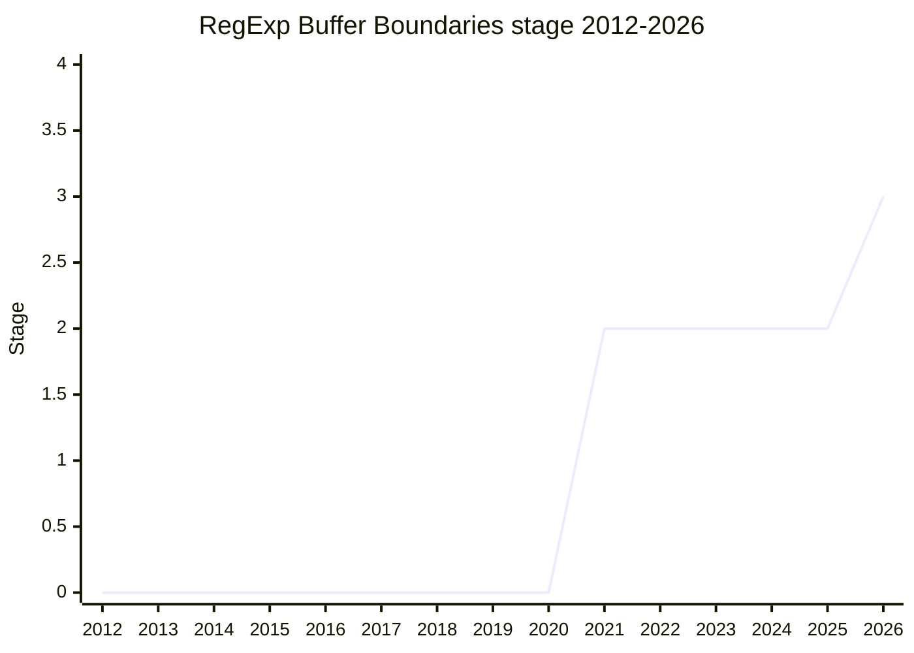

## 概要

RegExp Buffer Boundaries は、入力文字列全体(buffer)の境界に対するアンカー `\A`(buffer 先頭)・`\z`(buffer 末尾)・`\Z`(末尾の line terminator を許す buffer 末尾)を JavaScript の正規表現に追加する提案です。`^`/`$` が `m`(multiline)flag の影響を受けるのに対し、これらは flag に依存せず常に buffer 境界に一致します。他言語(Perl/Ruby など)で一般的な機能の移植です。

champion は [RBN](../people/RBN.md)(Ron Buckton)。

## ステージ遷移

| 会合                                                    | できごと                                                                           | Stage   |
| ------------------------------------------------------- | ---------------------------------------------------------------------------------- | ------- |
| [2021-10](../../raw/notes/meetings/2021-10/oct-28.md)   | Stage 1 到達(`\A`, `\z`, `\Z`)                                                     | → 1     |
| [2021-12](../../raw/notes/meetings/2021-12/dec-15.md)   | Stage 2 到達                                                                       | 1 → 2   |
| [2026-03](../../raw/notes/meetings/2026-03/march-10.md) | Stage 2.7 を要求(継続へ)                                                           | 2       |
| [2026-05](../../raw/notes/meetings/2026-05/may-19.md)   | `\A`/`\z` を 2.7 へ、`\Z` 再導入を提案。**conditional Stage 2.7**(`\Z` 込みが条件) | 2       |
| [2026-05](../../raw/notes/meetings/2026-05/may-20.md)   | `\Z` の意味を `(?=(?:\r\n\|\n\|\r\|
\|
)?(?-m:$))` で確定                          | 2.7     |
| [2026-05](../../raw/notes/meetings/2026-05/may-21.md)   | **Stage 3 到達**(`\Z` 込みで spec・test262 承認)                                   | 2.7 → 3 |

> 横軸=2012-2026、縦軸=Stage。Stage 1 が 2021-10、Stage 2 が 2021-12。以後 4 年ほど停滞し、2026-05 の 3 日間で conditional 2.7 → 2.7 → Stage 3 へ一気に前進。

## 主な論点

### `\Z` の再導入と意味論(2026-05)

当初 `\A`/`\z` のみで 2.7 を目指しましたが、会期中に `\Z`(末尾の改行を 1 つ許す buffer 末尾)の再導入に consensus。意味は「末尾の `LineTerminatorSequence` を任意に挟んだ上での buffer 末尾」、すなわち `(?=(?:\r\n|\n|\r|
|
)?(?-m:$))` と確定しました。`\Z` 込みで spec とテストが承認され、同会期の day 3 で Stage 3 に到達しています。

### multiline flag からの独立性

`^`/`$` は `m` flag で行単位に変わりますが、`\A`/`\z`/`\Z` は flag に依存せず buffer 境界に固定で一致する点が動機です。

## 関連提案

- `regexp-legacy-features` ほか RegExp 系提案 — 2026-05 では「RegExp 提案の linear 実装への影響を評価する」合意もなされた([2026-05 may-21](../../raw/notes/meetings/2026-05/may-21.md))。

## 出典

- [2021-10 oct-28](../../raw/notes/meetings/2021-10/oct-28.md) — Stage 1
- [2021-12 dec-15](../../raw/notes/meetings/2021-12/dec-15.md) — Stage 2
- [2026-05 may-19](../../raw/notes/meetings/2026-05/may-19.md) — conditional Stage 2.7 / `\Z` 再導入
- [2026-05 may-20](../../raw/notes/meetings/2026-05/may-20.md) — `\Z` の意味確定
- [2026-05 may-21](../../raw/notes/meetings/2026-05/may-21.md) — Stage 3
