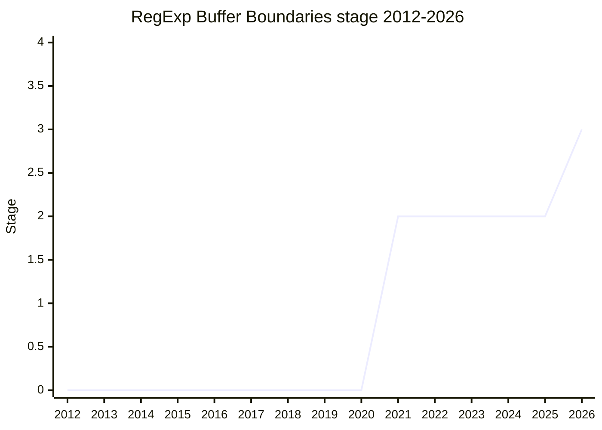

## Overview

RegExp Buffer Boundaries adds anchors `\A` (start of the buffer), `\z` (end of the buffer), and `\Z` (end of the buffer, allowing a trailing line terminator) to JavaScript regular expressions, matching against the boundaries of the whole input string (the buffer). Unlike `^`/`$`, which are affected by the `m` (multiline) flag, these always match buffer boundaries regardless of flags. It ports a feature common in other languages (Perl, Ruby, and others).

The champion is [RBN](../people/RBN.md) (Ron Buckton).

## Stage history

| Meeting                                                                         | What happened                                                                                                | Stage   |
| ------------------------------------------------------------------------------- | ------------------------------------------------------------------------------------------------------------ | ------- |
| [2021-10](https://github.com/tc39/notes/blob/main/meetings/2021-10/oct-28.md)   | Reached Stage 1 (`\A`, `\z`, `\Z`)                                                                           | → 1     |
| [2021-12](https://github.com/tc39/notes/blob/main/meetings/2021-12/dec-15.md)   | Reached Stage 2                                                                                              | 1 → 2   |
| [2026-03](https://github.com/tc39/notes/blob/main/meetings/2026-03/march-10.md) | Asked for Stage 2.7 (continued)                                                                              | 2       |
| [2026-05](https://github.com/tc39/notes/blob/main/meetings/2026-05/may-19.md)   | Proposed `\A`/`\z` for 2.7 and reintroducing `\Z`. **Conditional Stage 2.7** (conditional on including `\Z`) | 2       |
| [2026-05](https://github.com/tc39/notes/blob/main/meetings/2026-05/may-20.md)   | Settled the meaning of `\Z` as `(?=(?:\r\n\|\n\|\r\|\u2028\|\u2029)?(?-m:$))`                                | 2.7     |
| [2026-05](https://github.com/tc39/notes/blob/main/meetings/2026-05/may-21.md)   | **Reached Stage 3** (spec and test262 approved, including `\Z`)                                              | 2.7 → 3 |

```mermaid
xychart-beta
    title "RegExp Buffer Boundaries stage 2012-2026"
    x-axis [2012, 2013, 2014, 2015, 2016, 2017, 2018, 2019, 2020, 2021, 2022, 2023, 2024, 2025, 2026]
    y-axis "Stage" 0 --> 4
    line [0, 0, 0, 0, 0, 0, 0, 0, 0, 2, 2, 2, 2, 2, 3]
```

> Horizontal axis = 2012-2026, vertical axis = Stage. Stage 1 in 2021-10, Stage 2 in 2021-12. It then stalled for about four years, and over three days in 2026-05 advanced in one burst: conditional 2.7 → 2.7 → Stage 3.

## Main issues

### Reintroduction and semantics of `\Z` (2026-05)

It initially aimed for 2.7 with only `\A`/`\z`, but during the meeting there was consensus to reintroduce `\Z` (end of the buffer, allowing one trailing newline). The meaning was settled as the end of the buffer with an optional trailing `LineTerminatorSequence`, that is `(?=(?:\r\n|\n|\r|\u2028|\u2029)?(?-m:$))`. The spec and tests including `\Z` were approved, and it reached Stage 3 on day 3 of the same meeting.

### Independence from the multiline flag

`^`/`$` become per-line under the `m` flag, whereas the motivation is that `\A`/`\z`/`\Z` match buffer boundaries regardless of flags.

## Related proposals

- `regexp-legacy-features` and other RegExp proposals — in 2026-05 there was also agreement to "evaluate the impact of RegExp proposals on linear implementations" ([2026-05 may-21](https://github.com/tc39/notes/blob/main/meetings/2026-05/may-21.md)).

## Sources

- [2021-10 oct-28](https://github.com/tc39/notes/blob/main/meetings/2021-10/oct-28.md) — Stage 1
- [2021-12 dec-15](https://github.com/tc39/notes/blob/main/meetings/2021-12/dec-15.md) — Stage 2
- [2026-05 may-19](https://github.com/tc39/notes/blob/main/meetings/2026-05/may-19.md) — conditional Stage 2.7 / reintroduction of `\Z`
- [2026-05 may-20](https://github.com/tc39/notes/blob/main/meetings/2026-05/may-20.md) — meaning of `\Z` settled
- [2026-05 may-21](https://github.com/tc39/notes/blob/main/meetings/2026-05/may-21.md) — Stage 3
