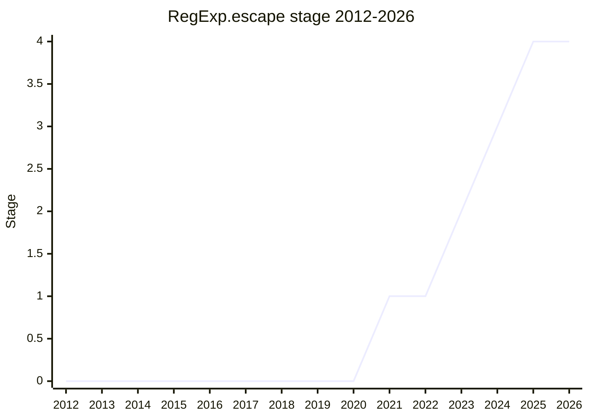

## Overview

A static `RegExp.escape(string)` that returns a string safe to embed in any position of a regular expression built by concatenation - the standard-library answer to the NPM `escape-string-regexp` family. The ecosystem version is dangerous: userland implementations do not escape enough characters to be safe in _every_ syntactic context of a composed pattern, which is exactly the position concatenation puts the output in.

The design that finally advanced is deliberately maximal and context-insensitive: escape every ASCII punctuation character (except `_`), all whitespace and line terminators, unpaired surrogates, and any leading ASCII digit or letter (digits because of backreferences, letters because of `\c`/`\x`/`\u` consuming what follows), and make the currently-illegal identity escapes in `u`/`v` mode legal no-ops so the output works in any mode. The output is ugly by design - readability was traded away, twice, in exchange for not changing the RegExp grammar.

## Stage history

| Meeting                                                                             | Event                                                                                                                                                                       | Stage    |
| ----------------------------------------------------------------------------------- | --------------------------------------------------------------------------------------------------------------------------------------------------------------------------- | -------- |
| [2015-07](https://github.com/tc39/notes/blob/main/meetings/2015-07/july-28.md)      | Presented by [DD](../people/DD.md) (original champions [DD](../people/DD.md) and Benjamin Gruenbaum)                                                                        | (none)   |
| [2021-01](https://github.com/tc39/notes/blob/main/meetings/2021-01/jan-28.md)       | Revisted by [JHD](../people/JHD.md); reached Stage 1                                                                                                                        | → 1      |
| [2023-03](https://github.com/tc39/notes/blob/main/meetings/2023-03/mar-22.md)       | "Next steps for RegExp escaping": free discussion of `RegExp.escape` vs. a template tag; [MM](../people/MM.md) to revisit whether a single escape function can be made safe | 1 (kept) |
| [2023-03](https://github.com/tc39/notes/blob/main/meetings/2023-03/mar-23.md)       | "Quick Regex Escaping update": [MM](../people/MM.md)'s security concerns addressed via [KG](../people/KG.md)'s context-safety analysis                                      | 1 (kept) |
| [2023-09](https://github.com/tc39/notes/blob/main/meetings/2023-09/september-26.md) | Stage 2 on the "escape everything" design; Stage 3 reviewers [JRL](../people/JRL.md), [MF](../people/MF.md), [RGN](../people/RGN.md) named the next day                     | 1 → 2    |
| [2024-02](https://github.com/tc39/notes/blob/main/meetings/2024-02/feb-7.md)        | Hex-escape debate (issue #58): the readable version required new RegExp syntax; committee chose hex escapes and no grammar change                                           | 2        |
| [2024-04](https://github.com/tc39/notes/blob/main/meetings/2024-04/april-08.md)     | Stage 2.7 requested; [MM](../people/MM.md)/[RGN](../people/RGN.md) safety follow-ups (leading ASCII letters, missing newlines, unpaired surrogates) to be folded in first   | 2        |
| [2024-06](https://github.com/tc39/notes/blob/main/meetings/2024-06/june-11.md)      | Character-vs-hex escapes settled by temperature check (dead heat, nobody blocking): keep character escapes. Stage 2.7                                                       | 2 → 2.7  |
| [2024-07](https://github.com/tc39/notes/blob/main/meetings/2024-07/july-29.md)      | Stage 3                                                                                                                                                                     | 2.7 → 3  |
| [2025-02](https://github.com/tc39/notes/blob/main/meetings/2025-02/february-18.md)  | Stage 4: Firefox and Safari shipped (plus two polyfills); Chrome implemented, shipping in 135/136                                                                           | 3 → 4    |

> First shown in 2015-07 without advancement; Stage 1 in 2021-01, Stage 2 in 2023-09, Stage 2.7 in 2024-06, Stage 3 in 2024-07, Stage 4 in 2025-02 - a ten-year arc from presentation to shipping.

## Main issues

### Safety in every context (the 2023 restart)

The reason the 2015 version stalled was that escaping "enough" is context-dependent. The breakthrough was [KG](../people/KG.md)'s analysis: escape one fixed maximal set regardless of context, and the output is safe to place anywhere **except** immediately after a backslash or an escape-start token (`\x`, `\c`, `\u`) - positions where the caller is already writing an escape by hand. [MM](../people/MM.md), whose 2015-era security concerns had blocked the idea, endorsed the result: "bravo... solved them very elegantly with a nice small explicit list". [MF](../people/MF.md) named the trade-off being made: the fixed escape set is a commitment that constrains future RegExp grammar additions ("we are kind of painting ourselves into a corner") - accepted, on the argument that a smaller set of context-entry markers is a feature, not a bug.

[MM](../people/MM.md) also noted the safety analysis makes a safe template-tag alternative easier to build; [JHD](../people/JHD.md) kept that door open but declined to pursue it. A Node TSC member had said Node would ship its own `RegExp.escape` if progress stopped - external pressure to land something standard.

### Readability vs. grammar changes (2024-02)

The readable output required adding new **identity escapes** to the RegExp grammar (so `\-`, `\@`, etc. become legal no-ops). [MF](../people/MF.md)'s objection reframed the debate: the issue was never what the output looks like but that "this feature for RegExp escaping adds RegExp syntax unnecessarily" - every JS programmer gets a grammar change so that escaped output can look nicer. [SYG](../people/SYG.md), [RBN](../people/RBN.md), and [MM](../people/MM.md) agreed (future modes may want those characters to mean something else); [KG](../people/KG.md) - the author of the readability argument ("code is data. And data gets consumed by humans") - was "in the strong minority, so I will let it go". The proposal switched to hex escapes and stopped touching the grammar.

### The hex-vs-character relitigation (2024-06)

[RGN](../people/RGN.md) then argued the _punctuator_ escapes should also be hex, so that a future `\@` in some new mode could not collide with the frozen output of `RegExp.escape`. [MF](../people/MF.md) countered that legacy-mode regexes already use `\@` informally, so the design space was closed anyway. A temperature check came out 3-3 (19 neutral, nobody blocking), [JHD](../people/JHD.md) chose the status quo, and Stage 2.7 passed with character escapes kept. [SYG](../people/SYG.md) (absent, in a prepared statement): V8 "can live with either outcome but weakly prefers character escapes" - changing non-throwing behavior is already hard enough.

### The safety follow-ups (2024-04)

Reviewing for 2.7 surfaced three holes, all fixed: leading ASCII **letters** must be hex-escaped (after `\c`/`\x`/`\u` an unescaped letter would be consumed); line terminators were missing from the whitespace set ([WH](../people/WH.md): the safety explainer claimed they were escaped - "surely an oversight", [KG](../people/KG.md)); and [WH](../people/WH.md)'s surrogate-dribbling attack - a non-BMP whitespace character fed in one code unit at a time produces unpaired surrogates that `RegExp.escape` does not recognize as whitespace, so the reassembled string escapes nothing - fixed by escaping unpaired surrogates unconditionally.

## Related proposals

- [RegExp Buffer Boundaries](regexp-buffer-boundaries.md) - another 2025-26 RegExp addition (`\A`/`\z`/`\Z`).

## Sources

- [2015-07 july-28](https://github.com/tc39/notes/blob/main/meetings/2015-07/july-28.md) - first presentation ([DD](../people/DD.md))
- [2021-01 jan-28](https://github.com/tc39/notes/blob/main/meetings/2021-01/jan-28.md) - Stage 1 ([JHD](../people/JHD.md))
- [2023-03 mar-22](https://github.com/tc39/notes/blob/main/meetings/2023-03/mar-22.md) - next steps (free discussion)
- [2023-03 mar-23](https://github.com/tc39/notes/blob/main/meetings/2023-03/mar-23.md) - quick update ([MM](../people/MM.md) concerns addressed)
- [2023-09 september-26](https://github.com/tc39/notes/blob/main/meetings/2023-09/september-26.md) - Stage 2
- [2024-02 feb-7](https://github.com/tc39/notes/blob/main/meetings/2024-02/feb-7.md) - hex-escape debate
- [2024-04 april-08](https://github.com/tc39/notes/blob/main/meetings/2024-04/april-08.md) - safety follow-ups, Stage 2.7 request
- [2024-06 june-11](https://github.com/tc39/notes/blob/main/meetings/2024-06/june-11.md) - temperature check, Stage 2.7
- [2024-07 july-29](https://github.com/tc39/notes/blob/main/meetings/2024-07/july-29.md) - Stage 3
- [2025-02 february-18](https://github.com/tc39/notes/blob/main/meetings/2025-02/february-18.md) - Stage 4
