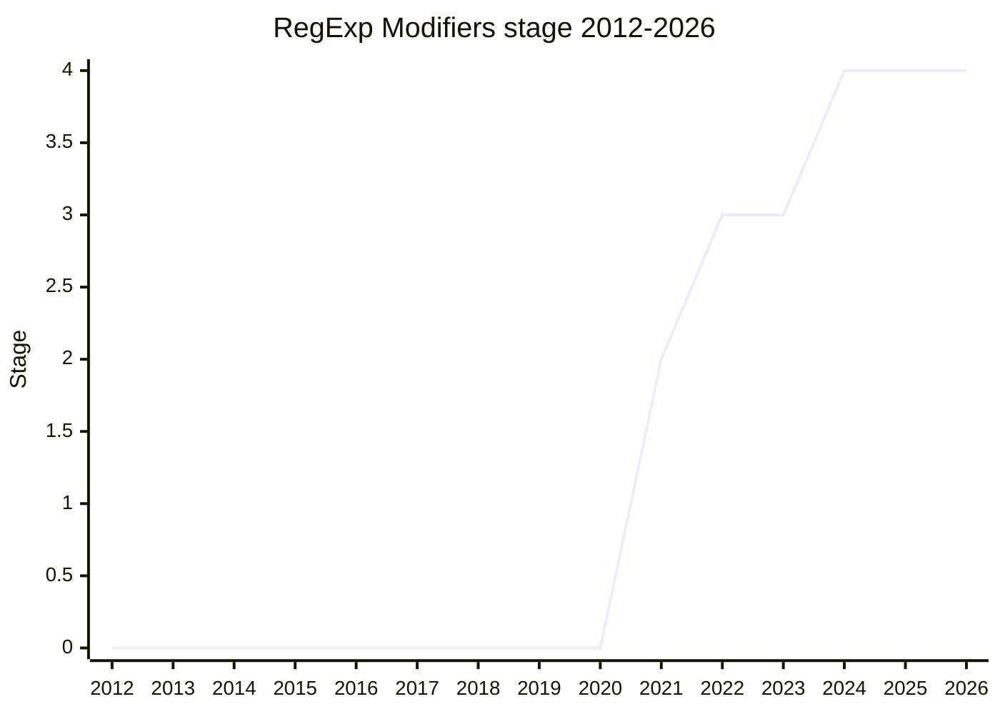

## Overview

Inline modifiers for regular expressions: within a pattern, a subexpression can turn a subset of the flags on or off, e.g. `(?i:...)` (case-insensitive for that group only) or `(?im-s:...)`. Only the `i`, `m`, and `s` flags are supported - the other flags (`g`, `y`, `u`, `d`, ...) affect the parsing state of the whole pattern, so they cannot be scoped to a subexpression. Prior art exists in Perl, PCRE, and other regex engines; the motivating use cases include TextMate grammars (used by VS Code and other editors) and matching data from external sources where the pattern cannot change the surrounding flags.

The champion is [RBN](../people/RBN.md) (Microsoft, TypeScript team).

## Stage history

| Meeting                                                                            | Event                                                                                                                    | Stage |
| ---------------------------------------------------------------------------------- | ------------------------------------------------------------------------------------------------------------------------ | ----- |
| [2021-10](https://github.com/tc39/notes/blob/main/meetings/2021-10/oct-27.md)      | First presented, reached Stage 1                                                                                         | → 1   |
| [2021-12](https://github.com/tc39/notes/blob/main/meetings/2021-12/dec-15.md)      | Reached Stage 2                                                                                                          | 1 → 2 |
| [2022-06](https://github.com/tc39/notes/blob/main/meetings/2022-06/jun-07.md)      | Reached Stage 3. Open question on whether enabling and disabling the same flag should be an early error                  | 2 → 3 |
| [2023-07](https://github.com/tc39/notes/blob/main/meetings/2023-07/july-12.md)     | Stage 3 review club: tests were still missing; contributions requested                                                   | 3     |
| [2023-11](https://github.com/tc39/notes/blob/main/meetings/2023-11/november-27.md) | Stage 3 update                                                                                                           | 3     |
| [2024-06](https://github.com/tc39/notes/blob/main/meetings/2024-06/june-11.md)     | Status check: tests have landed, no reason to retract                                                                    | 3     |
| [2024-10](https://github.com/tc39/notes/blob/main/meetings/2024-10/october-08.md)  | **Reached Stage 4** - without the proposed normative change (see below). Shipping in Chrome/Edge 125 and Firefox 130/132 | 3 → 4 |

> Stage 1 in 2021-10, Stage 2 in 2021-12 (end of 2021 is 2), Stage 3 in 2022-06, Stage 4 in 2024-10.

## Main issues

### The late early-error tweak that was withdrawn

Right before the Stage 4 request, a Babel maintainer suggested widening the early error: the proposal errors when both modifier sets are empty (`(?-:)`), but still allows `(?im-:)`, which is equivalent to `(?im:)` because removing nothing has no effect. Making the second empty set an error too would catch developer typos - but the feature had already been shipping in Chrome/Edge 125 for months, and [SYG](../people/SYG.md) pushed back:

> ([SYG](../people/SYG.md), 2024-10) We made a decision already, for whatever reason, and it has shipped, and I would prefer barring a really compelling reason to just not change it last minute.

[NRO](../people/NRO.md) also leaned against (regexes are already complex enough to lint). [RBN](../people/RBN.md) noted most other languages do not even error for the cases the proposal already errors on, and withdrew the needs-consensus PR. Stage 4 was granted "without the proposed normative change".

### Slow Stage 3: the tests gap

The proposal reached Stage 3 in 2022-06 but sat there for over two years. At the 2023-07 review club the readme still said there were no tests, and the committee asked for test262 contributions before it could move on. The tests landed by 2024-06, which unblocked the path to Stage 4.

## Related proposals

- [RegExp.escape](regexp-escaping.md) - another proposal on the recent RegExp line.
- `duplicate named capture groups` - shipped from the same era of RegExp proposals (no page yet).

## Sources

- [2021-10 oct-27](https://github.com/tc39/notes/blob/main/meetings/2021-10/oct-27.md) - Stage 1
- [2021-12 dec-15](https://github.com/tc39/notes/blob/main/meetings/2021-12/dec-15.md) - Stage 2
- [2022-06 jun-07](https://github.com/tc39/notes/blob/main/meetings/2022-06/jun-07.md) - Stage 3
- [2023-07 july-12](https://github.com/tc39/notes/blob/main/meetings/2023-07/july-12.md) - Stage 3 review club (tests missing)
- [2023-11 november-27](https://github.com/tc39/notes/blob/main/meetings/2023-11/november-27.md) - Stage 3 update
- [2024-06 june-11](https://github.com/tc39/notes/blob/main/meetings/2024-06/june-11.md) - status check (tests landed)
- [2024-10 october-08](https://github.com/tc39/notes/blob/main/meetings/2024-10/october-08.md) - Stage 4 ([RBN](../people/RBN.md)); normative tweak withdrawn
