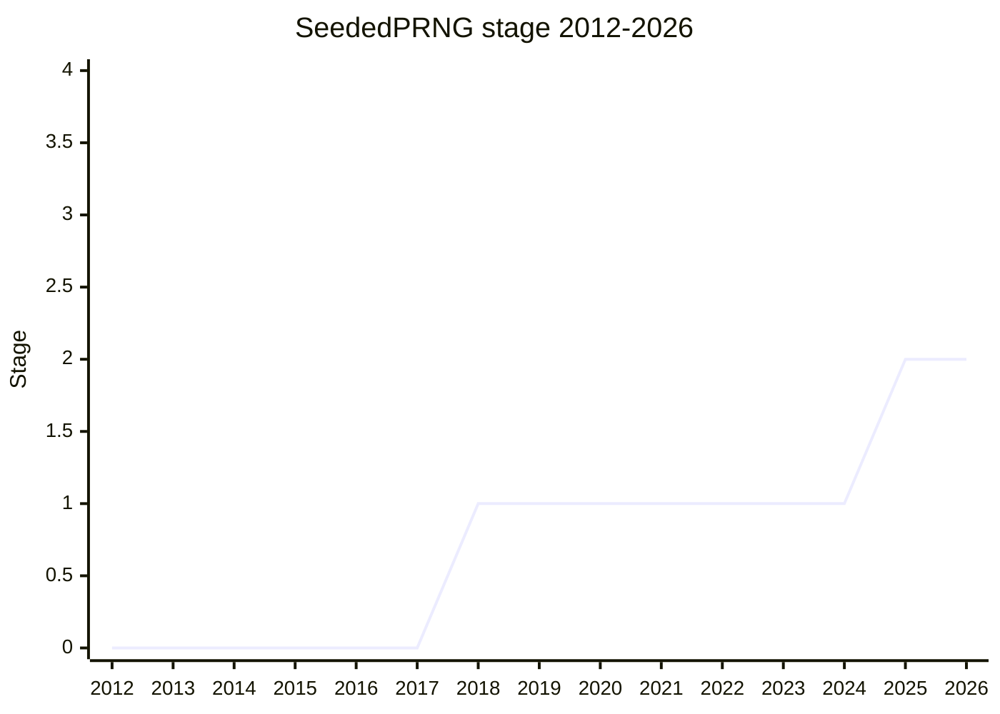

## Overview

A built-in seeded pseudo-random number generator: construct an instance from a seed (a 32-byte `Uint8Array`, or a small convenience integer), draw reproducible floats with `.random()`, spawn child sequences with `.randomSeed()`, and pause/resume by reading and writing the full internal state. Use cases are reproducible test runs, games that want to avoid save-scumming, and graphics that need stable randomness across repaints (CSS custom paint's "rough borders" was [TAB](../people/TAB.md)'s original motivating example back in 2018). Explicitly **not** aiming at cryptography: the WebCrypto APIs keep that territory, and the design tries not to be shaped for misuse.

The algorithm is specified in the language itself: **ChaCha12** (the Rust / NumPy choice), so sequences are reproducible across engines and versions. The class was granted Stage 2 in 2025-05 as `SeededPRNG`, and immediately moved under the new `Random` namespace as **`Random.Seeded`** (see [More Random Functions](more-random-functions.md)). Championed by [TAB](../people/TAB.md) (Tab Atkins-Bittner), with Stage 2.7 reviewers [KG](../people/KG.md), [JMN](../people/JMN.md), and [MM](../people/MM.md).

## Stage history

| Meeting                                                                       | What happened                                                                                                                                                                                                                | Stage |
| ----------------------------------------------------------------------------- | ---------------------------------------------------------------------------------------------------------------------------------------------------------------------------------------------------------------------------- | ----- |
| [2018-01](https://github.com/tc39/notes/blob/main/meetings/2018-01/jan-23.md) | Presented as `Math.seededRandoms()` (a generator function) and reached Stage 1 - then left dormant for seven years                                                                                                           | → 1   |
| [2025-05](https://github.com/tc39/notes/blob/main/meetings/2025-05/may-29.md) | Returned as a `SeededPRNG` class (`.random()` / `.randomSeed()` / state get-set / `fromRandomSeed`). Reached Stage 2; reviewers [KG](../people/KG.md)/[JMN](../people/JMN.md)/[MM](../people/MM.md); renamed `Random.Seeded` | 1 → 2 |
| [2025-05](https://github.com/tc39/notes/blob/main/meetings/2025-05/may-30.md) | Stage 2.7 reviewers confirmed (the ask had been missed during the Stage 2 grant)                                                                                                                                             | 2     |

> Stage 1 in 2018-01 as `Math.seededRandoms()`; dormant at Stage 1 until Stage 2 in 2025-05, now placed as `Random.Seeded`.

## Main issues

### Entropy as a communication channel (hardened JS)

[MM](../people/MM.md)'s running concern: `Math.random` and `Date.now` are the two primordial sources of nondeterminism that hardened JS has to censor or virtualize, and he wants any new randomness quarantined the way Temporal isolated `Temporal.Now` - "keep mutable state in instances, and when there's mutable state attached to a proposal in TC39, to make sure that it's easily separated from the rest of the functionality." Only `fromRandomSeed()` draws platform entropy, and since ChaCha12 is a CSPRNG, observing outputs reveals nothing about future ones - though [KG](../people/KG.md) supplied the caveat that broke [MM](../people/MM.md)'s reassurance: "if you know the seed, you can give it to two people. The two people can communicate by advancing it." (The exposed state getter is precisely what makes that possible; [MM](../people/MM.md): "Everything I said about it not being a communication channel is wrong.")

### Why a built-in at all, and is ChaCha12 overkill?

[DLM](../people/DLM.md) asked the userland question (why not a library?) and relayed Mozilla security's feedback: ChaCha8 might suffice; 32 bytes is not a cryptographically secure seed; developers may misuse it. [TAB](../people/TAB.md)'s answers: writing a good generator is deceptively hard (even an LCG means copying constants from Wikipedia, and the CSS custom-paint use case has no storage to do it in userland); ChaCha12 is the Rust/NumPy choice whose safety margin ages better than the newer ChaCha8; only 32 bytes of entropy are needed; and the API is deliberately shaped against crypto use (the convenience integer seed is limited to 0-255 so its 256 possible sequences are obvious). [KG](../people/KG.md) settled the framing: "ChaCha12 is a CSPRNG so I don't understand the question" - the 20-round variant is for encryption, and 12 rounds is "convincingly argued" to be enough.

### Naming and placement: from `Math.seededRandoms()` to `Random.Seeded`

The 2018 shape was a `Math.seededRandoms(seed)` generator function; the 2025 shape is a class. The Stage 2 session then converged on namespace placement from several directions at once: [EAO](../people/EAO.md) objected to two new globals and proposed `new Random.Seeded` ("I think `SeededPRNG` is clumsy"); [SFC](../people/SFC.md) reported the Seattle breakout's conclusion that the committee should "tend towards putting things in namespaces... even if it's the only thing in the namespace for now"; and [MM](../people/MM.md) floated an instance-based refactor (a single global seeded instance instead of a static `fromRandomSeed`) that [KG](../people/KG.md) dismantled - the instance exposes its state, so the global instance would too, and the replay use case needs seeds you can extract. The result: the Stage 2 class moved under the companion `Random` namespace proposal as `Random.Seeded`, with identical method names and signatures so swapping a browser-seeded generator for a fixed-seed one is a one-line change.

### First API outside the TypedArray family to accept TypedArrays

An open issue [TAB](../people/TAB.md) flagged as setting precedent: the constructor takes a `Uint8Array` (112-byte state / 32-byte seed), but DOM convention is to accept any `TypedArray` view - which drags in endianness exposure and value-truncation oddities. His middle position was to accept only byte-sized view types. Whatever is chosen will be "a precedent set for ECMAScript in the future."

## Related proposals

- [More Random Functions](more-random-functions.md) - the `Random` namespace this class lives under; shares the ChaCha12 backbone and the method surface.

## Sources

- [2018-01 jan-23](https://github.com/tc39/notes/blob/main/meetings/2018-01/jan-23.md) - `Math.seededRandoms()` Stage 1
- [2025-05 may-29](https://github.com/tc39/notes/blob/main/meetings/2025-05/may-29.md) - Stage 2 as `SeededPRNG`; ChaCha12, entropy quarantine, `Random.Seeded` placement
- [2025-05 may-30](https://github.com/tc39/notes/blob/main/meetings/2025-05/may-30.md) - Stage 2.7 reviewers ([KG](../people/KG.md), [JMN](../people/JMN.md), [MM](../people/MM.md))
