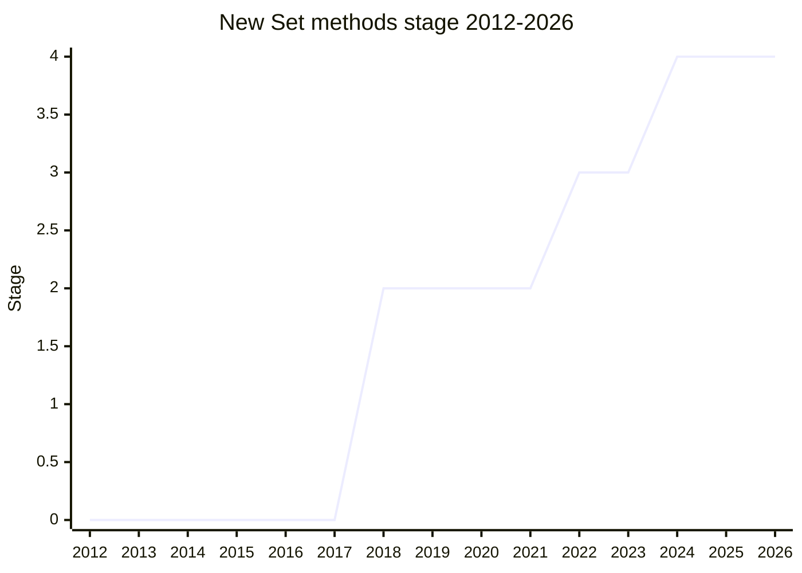

## Overview

Adds seven methods to `Set.prototype`: `union`, `intersection`, `difference`, `symmetricDifference`, `isSubsetOf`, `isSupersetOf`, and `isDisjointFrom` - "the missing basic utilities for working with Sets that we left out of ES6 and then never got back to" ([KG](../people/KG.md), 2022-11). The naming follows set-theory convention used by other mainstream languages (over a "bitfield" design), with the `Of` suffix on all the comparison methods.

The proposal began as the Set-specific half of a broader collection-methods idea, split so the two halves could advance independently. Originally championed by Michał Wadas, [SGN](../people/SGN.md) (Sathya Gunasekaran), and [KG](../people/KG.md); after [SGN](../people/SGN.md) left the committee, [KG](../people/KG.md) carried it alone through Stage 3 and Stage 4.

## Stage history

| Meeting                                                                         | Event                                                                                                                                                                                                                              | Stage |
| ------------------------------------------------------------------------------- | ---------------------------------------------------------------------------------------------------------------------------------------------------------------------------------------------------------------------------------- | ----- |
| [2018-05](https://github.com/tc39/notes/blob/main/meetings/2018-05/may-22.md)   | Presented by [SGN](../people/SGN.md) as the Set-specific split of an earlier collection-methods proposal; reached Stage 2 (reviewers [RW](../people/RW.md), [KG](../people/KG.md), [MF](../people/MF.md), [TAB](../people/TAB.md)) | → 2   |
| [2019-01](https://github.com/tc39/notes/blob/main/meetings/2019-01/jan-29.md)   | Update; [SGN](../people/SGN.md) to gather prior art and enumerate use cases                                                                                                                                                        | 2     |
| [2022-07](https://github.com/tc39/notes/blob/main/meetings/2022-07/jul-20.md)   | Design discussion: how to access properties of the argument                                                                                                                                                                        | 2     |
| [2022-09](https://github.com/tc39/notes/blob/main/meetings/2022-09/sep-14.md)   | "Set Methods, part III": option 2 chosen for the argument-handling design; spec text to follow                                                                                                                                     | 2     |
| [2022-11](https://github.com/tc39/notes/blob/main/meetings/2022-11/nov-30.md)   | Reached Stage 3 (complete spec text; [SYG](../people/SYG.md) asked the champions to keep tabs on the implementability of the ordering semantics)                                                                                   | 2 → 3 |
| [2023-03](https://github.com/tc39/notes/blob/main/meetings/2023-03/mar-21.md)   | What to do about `intersection` order                                                                                                                                                                                              | 3     |
| [2023-07](https://github.com/tc39/notes/blob/main/meetings/2023-07/july-12.md)  | Deferring callability check / handling negative sizes                                                                                                                                                                              | 3     |
| [2024-02](https://github.com/tc39/notes/blob/main/meetings/2024-02/feb-6.md)    | Bugfix PR #105 reached consensus                                                                                                                                                                                                   | 3     |
| [2024-04](https://github.com/tc39/notes/blob/main/meetings/2024-04/april-08.md) | **Reached Stage 4**. Shipping in Safari 17 and Chrome 122; Firefox implemented, release-flip pending ([DLM](../people/DLM.md): "completely implemented... shipping will be a few weeks later")                                     | 3 → 4 |

> Stage 2 at its first presentation (2018-05), Stage 3 in 2022-11 after a three-and-a-half-year gap, Stage 4 in 2024-04.

## Main issues

### Argument handling: how generic should the methods be?

From the first presentation, delegates pushed on whether the methods should accept any iterable rather than only Sets ([LZU](../people/LZU.md): "You can't do this on iterables or arrays. Why does it have to be on the Set instance?"; [JHD](../people/JHD.md) argued for symmetry with array methods that accept generic array-likes). [WH](../people/WH.md) countered that Sets have well-defined key behavior while arrays do not. The question resurfaced in 2022-07/2022-09 ("how to access properties of the argument") and was settled as "option 2" in the part-III discussion, with the spec text following in time for Stage 3.

### A three-and-a-half-year stall and champion turnover (2019-2022)

After the 2019-01 update the proposal went silent until mid-2022. The original champion [SGN](../people/SGN.md) left the committee, and [KG](../people/KG.md) picked the proposal back up: the 2022-2023 meetings worked through the remaining design questions (argument access, `intersection` ordering, callability checks, negative sizes) that had been left open, culminating in Stage 3 in 2022-11 with complete spec text. Even at Stage 3, [SYG](../people/SYG.md) kept a caveat open: the specified ordering semantics might have implementation consequences that would only surface when engines implemented.

### Blocked on tests at the Stage 4 gate (2024)

The final delay before Stage 4 was not design but process: the proposal "was blocked on tests for a while and tests were landed and that unblocked implementation and shipping" ([KG](../people/KG.md), 2024-04). By the Stage 4 request Safari and Chrome were shipping and Firefox had a complete implementation awaiting its release flip.

## Related proposals

- [Iterator helpers](iterator-helpers.md) - the same "missing standard-library utilities" motivation, on the iterator axis rather than the Set axis.
- `collection-normalization` - the 2019-era idea of normalizing values as they enter a collection (cited later in the Records & Tuples redesign discussions as an alternative way to get value-based collection behavior; no page yet).

## Sources

- [2018-05 may-22](https://github.com/tc39/notes/blob/main/meetings/2018-05/may-22.md) - Stage 2
- [2019-01 jan-29](https://github.com/tc39/notes/blob/main/meetings/2019-01/jan-29.md) - update
- [2022-07 jul-20](https://github.com/tc39/notes/blob/main/meetings/2022-07/jul-20.md) - argument-access discussion
- [2022-09 sep-14](https://github.com/tc39/notes/blob/main/meetings/2022-09/sep-14.md) - part III
- [2022-11 nov-30](https://github.com/tc39/notes/blob/main/meetings/2022-11/nov-30.md) - Stage 3
- [2023-03 mar-21](https://github.com/tc39/notes/blob/main/meetings/2023-03/mar-21.md) - intersection order
- [2023-07 july-12](https://github.com/tc39/notes/blob/main/meetings/2023-07/july-12.md) - callability / negative sizes
- [2024-02 feb-6](https://github.com/tc39/notes/blob/main/meetings/2024-02/feb-6.md) - bugfix consensus
- [2024-04 april-08](https://github.com/tc39/notes/blob/main/meetings/2024-04/april-08.md) - Stage 4
