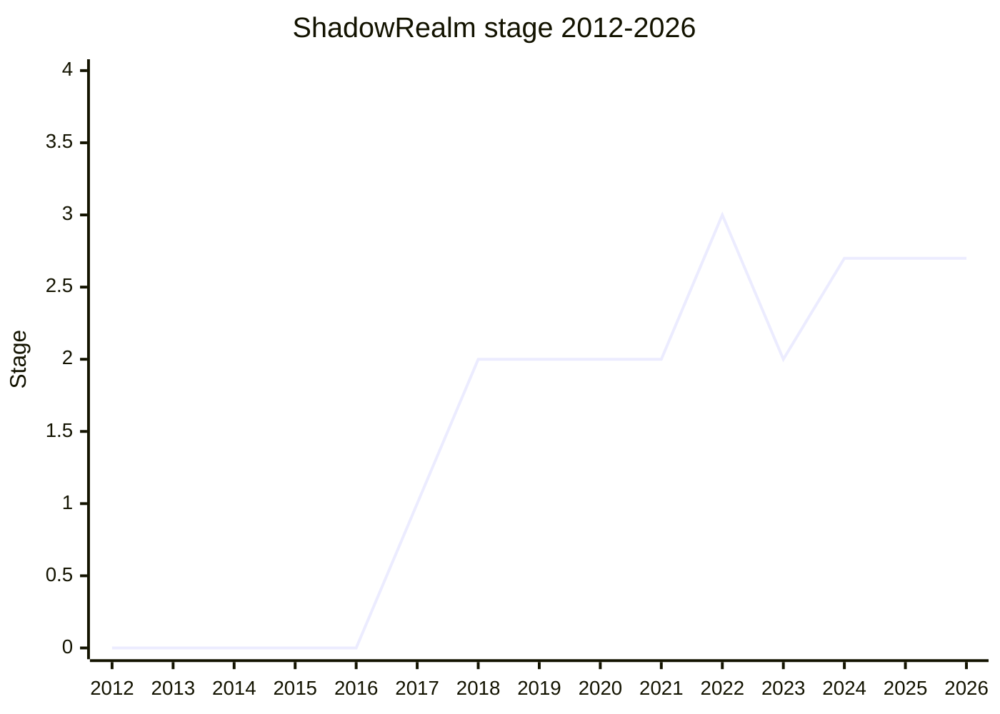

## Overview

A mechanism to execute JavaScript code inside a completely fresh execution environment: a `ShadowRealm` object carries its own global object and its own copy of all the ECMA-262 built-ins, so code evaluated inside it is unaffected by anything done to the outer realm's globals (and vice versa). The goal is integrity, not security - "complete control over the execution environment. It's not a security boundary" ([PFC](../people/PFC.md), 2024-12).

The proposal has been shaped by a single question for most of its life: **which web APIs should be present inside a ShadowRealm?** The champions' current answer is a W3C TAG design principle - "only purely computational features are exposed everywhere" (no I/O, no user-agent state, nothing relying on an event loop, conservative exposure for features mainly used by unexposed ones), implemented in HTML via the `Exposed everywhere` attribute. The lineage is long: an earlier "Realms" API existed in the ES6 draft and was removed in 2014-06 (postponed "to ES7"); the current proposal sought Stage 1 as Realms in 2017-01 and was renamed ShadowRealm in 2021-08.

## Stage history

| Meeting                                                                                                      | Event                                                                                                                                                                                          | Stage   |
| ------------------------------------------------------------------------------------------------------------ | ---------------------------------------------------------------------------------------------------------------------------------------------------------------------------------------------- | ------- |
| [2017-01](https://github.com/tc39/notes/blob/main/meetings/2017-01/jan-26.md)                                | "Seeking Stage 1 for Realms". Reached Stage 1                                                                                                                                                  | → 1     |
| [2018-05](https://github.com/tc39/notes/blob/main/meetings/2018-05/may-23.md)                                | Reached Stage 2                                                                                                                                                                                | 1 → 2   |
| [2020-02](https://github.com/tc39/notes/blob/main/meetings/2020-02/february-5.md)                            | Not seeking advancement; Stage 3 reviewers assigned ([MF](../people/MF.md), [SYG](../people/SYG.md))                                                                                           | 2       |
| [2020-11 / 2021-04 / 2021-05 / 2021-07](https://github.com/tc39/notes/blob/main/meetings/2021-07/july-13.md) | Repeated Stage 3 attempts, none successful (the HTML-integration and error-across-realm questions kept reopening)                                                                              | 2       |
| [2021-08](https://github.com/tc39/notes/blob/main/meetings/2021-08/aug-31.md)                                | Renamed: consensus for the **ShadowRealm** name                                                                                                                                                | 2       |
| [2022-11](https://github.com/tc39/notes/blob/main/meetings/2022-11/dec-01.md)                                | **Reached Stage 3** (with the "wrapped functions use the target's name/length" and error-stack decisions folded in)                                                                            | 2 → 3   |
| [2023-09](https://github.com/tc39/notes/blob/main/meetings/2023-09/september-27.md)                          | **Demoted to Stage 2**: Mozilla found the API-exposure list unimplementable without a thorough web-platform-test audit; readvancement requires two explicitly supporting implementations       | 3 → 2   |
| [2023-11](https://github.com/tc39/notes/blob/main/meetings/2023-11/november-27.md)                           | Stage 2 update; remains at Stage 2 with open concerns to address on the way back to 3                                                                                                          | 2       |
| [2024-02](https://github.com/tc39/notes/blob/main/meetings/2024-02/feb-7.md)                                 | **Reached Stage 2.7**. Entrance criteria for Stage 3 set: external signoff from WHATWG HTML stakeholders and Mathew Gaudet (Mozilla) on the API list, plus sufficient tests                    | 2 → 2.7 |
| [2024-06](https://github.com/tc39/notes/blob/main/meetings/2024-06/june-12.md)                               | Update ([PFC](../people/PFC.md) presenting)                                                                                                                                                    | 2.7     |
| [2024-12](https://github.com/tc39/notes/blob/main/meetings/2024-12/december-02.md)                           | Stage 3 requested; **[PFC](../people/PFC.md) withdrew the request in-session** ([SYG](../people/SYG.md) blocking until tests merge and browsers reach internal consensus with their DOM teams) | 2.7     |
| [2025-02](https://github.com/tc39/notes/blob/main/meetings/2025-02/february-19.md)                           | Status update and use cases                                                                                                                                                                    | 2.7     |

> Stage 1 in 2017-01 (as Realms), Stage 2 in 2018-05, Stage 3 in 2022-11, **demoted back to Stage 2 in 2023-09**, Stage 2.7 in 2024-02. The 2023 dip is the demotion - one of the few proposals to move backwards.

## Main issues

### Which web APIs exist inside a ShadowRealm?

The defining issue. The champions rejected "none" (confusing: why no `TextEncoder` in a browser realm?), a vetted list (same discoverability problem), and a confidentiality criterion (too hard to evaluate) before landing on the W3C TAG design principle: only purely computational features are exposed everywhere. By 2024-12 this was implemented - HTML gained an `Exposed everywhere` attribute governed by the principle, the HTML integration PR was reviewed, and 1300+ global properties had been triaged in a public spreadsheet with web-platform-tests running in ShadowRealms created from every scope (window, workers, worklets, nested realms).

- Discussed at essentially every meeting from 2020-11 onward; the principle dates from the 2024-02 → 2024-12 window.
- See [2024-12](https://github.com/tc39/notes/blob/main/meetings/2024-12/december-02.md) for the full design-principle presentation.

### The demotion (2023-09)

The proposal sat at Stage 3 for years as a stalemate: the champions had high-level browser signoff on the API list, but it "did not come backed with thorough-enough web-platform-tests or a thorough audit", and Mozilla judged the proposal not implementable on that basis. The committee demoted ShadowRealm to Stage 2 - explicitly "not an opportunity to relitigate design decisions" - with readvancement conditioned on two explicitly supporting implementations. This is one of the rare cases of a proposal moving backwards.

### The withdrawn Stage 3 request (2024-12)

With the design principle settled and tests landing, [PFC](../people/PFC.md) asked for Stage 3. [SYG](../people/SYG.md) blocked: granting Stage 3 without knowing whether browsers will actually ship it - because the DOM/HTML side has not signed on - would be "a breakdown in the norm of... working in TC39 at all" ("If we agree to Stage 3 and no browser ships it, that's bad. If we agree to Stage 3 and a subset of browsers ship it, that's also bad."). [DLM](../people/DLM.md), [KM](../people/KM.md), and [MLS](../people/MLS.md) reported no objection but also no strong desire from their HTML-side colleagues; [PFC](../people/PFC.md) withdrew the request, to return once the tests are merged and each browser's DOM team has committed.

> [SYG](../people/SYG.md), 2024-12: "as implementers, [we] should not... agree to grant Stage 3 unless we have our ducks internally in a row [on] whether we're going to implement and ship ShadowRealm."

## Related proposals

- [AsyncContext](async-context.md) - propagates context across the async operations that ShadowRealm-style isolation scenarios commonly compose with.
- `compartments` - the Stage-0-era ancestor of this line (no page yet).
- [shared structs](shared-structs.md) - the shared-memory counterpart for communicating between realms (compare `SharedStructType`).

## Sources

- [2017-01 jan-26](https://github.com/tc39/notes/blob/main/meetings/2017-01/jan-26.md) - Stage 1 (as Realms)
- [2018-05 may-23](https://github.com/tc39/notes/blob/main/meetings/2018-05/may-23.md) - Stage 2
- [2020-02 february-5](https://github.com/tc39/notes/blob/main/meetings/2020-02/february-5.md) - Stage 3 reviewers assigned
- [2021-08 aug-31](https://github.com/tc39/notes/blob/main/meetings/2021-08/aug-31.md) - renamed ShadowRealm
- [2022-11 dec-01](https://github.com/tc39/notes/blob/main/meetings/2022-11/dec-01.md) - Stage 3
- [2023-09 september-27](https://github.com/tc39/notes/blob/main/meetings/2023-09/september-27.md) - demotion to Stage 2
- [2023-11 november-27](https://github.com/tc39/notes/blob/main/meetings/2023-11/november-27.md) - Stage 2 update
- [2024-02 feb-7](https://github.com/tc39/notes/blob/main/meetings/2024-02/feb-7.md) - Stage 2.7
- [2024-06 june-12](https://github.com/tc39/notes/blob/main/meetings/2024-06/june-12.md) - update
- [2024-12 december-02](https://github.com/tc39/notes/blob/main/meetings/2024-12/december-02.md) - Stage 3 request withdrawn
- [2025-02 february-19](https://github.com/tc39/notes/blob/main/meetings/2025-02/february-19.md) - status update / use cases
