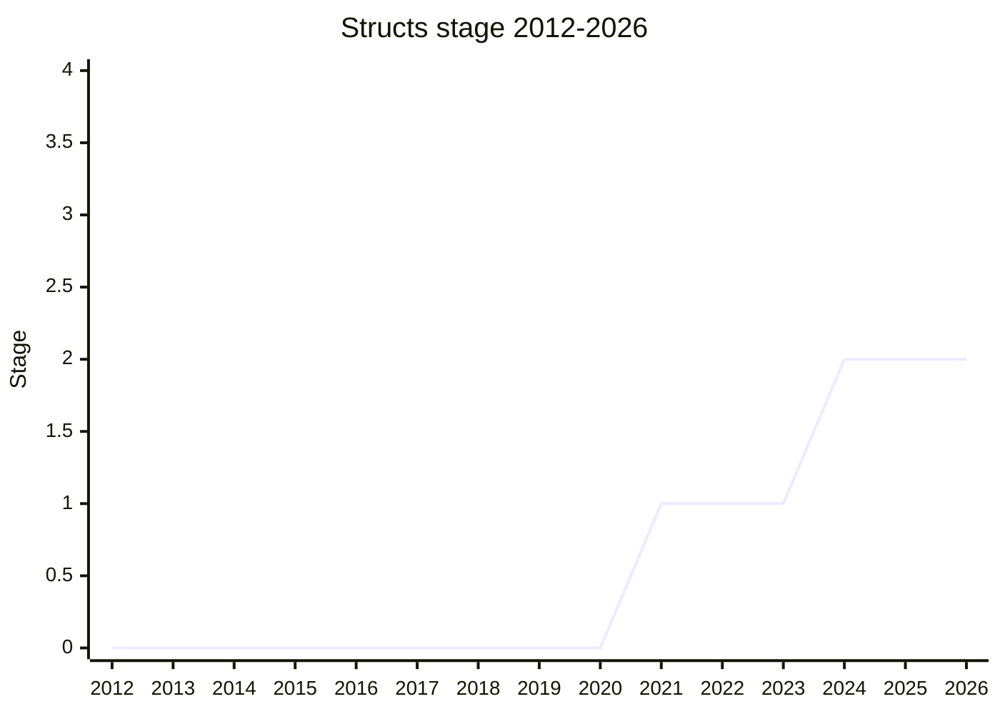

## Overview

Shared-memory objects for multithreaded JavaScript: fixed-layout structs (`SharedStructType`) that can be referenced from multiple agents, plus synchronization primitives (`Atomics.Mutex`, `Atomics.Condition`) built on them. Unlike `SharedArrayBuffer` (shared bytes), structs let threads share **objects** - which requires fixed layout, because an object's shape is normally mutable per-agent. Fields are initialized at construction and immutable afterwards (or shared mutable via `SharedArrayBuffer` cells), which sidesteps most data races by construction.

The champion is [SYG](../people/SYG.md), with [RBN](../people/RBN.md) co-presenting sessions from 2024. First presented 2021-08 as "Fixed layout objects"; the current title reflects the scope narrowing to structs plus a few primitives.

## Stage history

| Meeting                                                                           | Event                                                                                                                                                                                            | Stage |
| --------------------------------------------------------------------------------- | ------------------------------------------------------------------------------------------------------------------------------------------------------------------------------------------------ | ----- |
| [2021-08](https://github.com/tc39/notes/blob/main/meetings/2021-08/sep-01.md)     | First presented as "Fixed layout objects". Reached Stage 1 ([WH](../people/WH.md) questioned efficiency vs packing object fields)                                                                | → 1   |
| [2023-03](https://github.com/tc39/notes/blob/main/meetings/2023-03/mar-22.md)     | V8 experience report: moved from per-cage shared heaps to a shared cage per process, shared value barrier, publication fence ("allocation is publication")                                       | 1     |
| [2024-02](https://github.com/tc39/notes/blob/main/meetings/2024-02/feb-8.md)      | Update: convergence with WasmGC shared-everything work (shared type hierarchy, one story for JS + Wasm)                                                                                          | 1     |
| [2024-04](https://github.com/tc39/notes/blob/main/meetings/2024-04/april-11.md)   | Discussion of the methods design (non-generic methods extending `Set`/`Map` methods); prelude to the Stage 2 request                                                                             | 1     |
| [2024-06](https://github.com/tc39/notes/blob/main/meetings/2024-06/june-13.md)    | Methods discussion continued into working sessions (this-TDZ, prototype correlation)                                                                                                             | 1     |
| [2024-10](https://github.com/tc39/notes/blob/main/meetings/2024-10/october-09.md) | **Reached Stage 2** with explicit open questions (WeakMap keys, unsafe blocks); Stage 3 reviewers [MM](../people/MM.md), [WH](../people/WH.md), [YSV](../people/YSV.md), [NRO](../people/NRO.md) | 1 → 2 |

> Stage 1 in 2021-08, Stage 2 in 2024-10. The long flat stretch covers the implementation-driven redesign period (V8 experience report 2023-03, WasmGC convergence 2024).

## Main issues

### WeakMap keys and GC cost

Whether shared structs should be usable as WeakMap keys was the sharpest open question at Stage 2. [JHD](../people/JHD.md) framed structs as a "secret third thing" (neither primitive nor normal object) whose membership rules users will guess wrong; [MAH](../people/MAH.md) pushed for keeping the semantics virtualizable; and [YSV](../people/YSV.md) reported the implementation cost of the required per-agent ephemeron tracking as "frankly extremely prohibitively expensive". The Stage 2 grant explicitly left this open for prototyping.

### Unsafe blocks

`Atomics.Mutex` alone may not be enough for real producer/consumer patterns, and the proposal floated "unsafe" (data-race-prone) access blocks for performance. [WH](../people/WH.md) warned the benefit "may be a mirage" - races would corrupt engines' internal invariants in ways that are unshippable - while [MM](../people/MM.md) argued that without some such escape hatch the proposal's performance story is "unacceptable" for its target workloads. Unresolved as of Stage 2; the committee preferred to prototype before deciding.

### Per-realm prototypes

Each realm gets its own constructor for a shared struct type, so the same shared object is seen through different prototype objects across realms. The 2024-06/2024-04 discussions worked through the consequences (method lookup, brand checks, `this` being a non-shared receiver) and the correlation requirements on engines, folding the answers into the Stage 2 presentation.

### Wasm GC sequencing

Since 2024-02 the proposal is deliberately sequenced with the Wasm shared-everything threads work: one shared type hierarchy across JS and Wasm, so the two specs do not disagree about what "shared" means. This is why the committee accepted Stage 2 despite the open questions - the design space is being explored jointly with the WebAssembly working group.

## Related proposals

- [Stabilize](stabilize.md) - the integrity-traits proposal from the same [SYG](../people/SYG.md)/[MM](../people/MM.md) line of thinking about memory-safety boundaries.
- [Non-extensible applies to private](nonextensible-applies-to-private.md) - a small fix in the same "object capability" neighborhood.

## Sources

- [2021-08 sep-01](https://github.com/tc39/notes/blob/main/meetings/2021-08/sep-01.md) - Stage 1 (as Fixed layout objects)
- [2023-03 mar-22](https://github.com/tc39/notes/blob/main/meetings/2023-03/mar-22.md) - V8 experience report
- [2024-02 feb-8](https://github.com/tc39/notes/blob/main/meetings/2024-02/feb-8.md) - WasmGC convergence
- [2024-04 april-11](https://github.com/tc39/notes/blob/main/meetings/2024-04/april-11.md) - methods design discussion
- [2024-06 june-13](https://github.com/tc39/notes/blob/main/meetings/2024-06/june-13.md) - methods working sessions
- [2024-10 october-09](https://github.com/tc39/notes/blob/main/meetings/2024-10/october-09.md) - Stage 2 ([SYG](../people/SYG.md), [RBN](../people/RBN.md))
