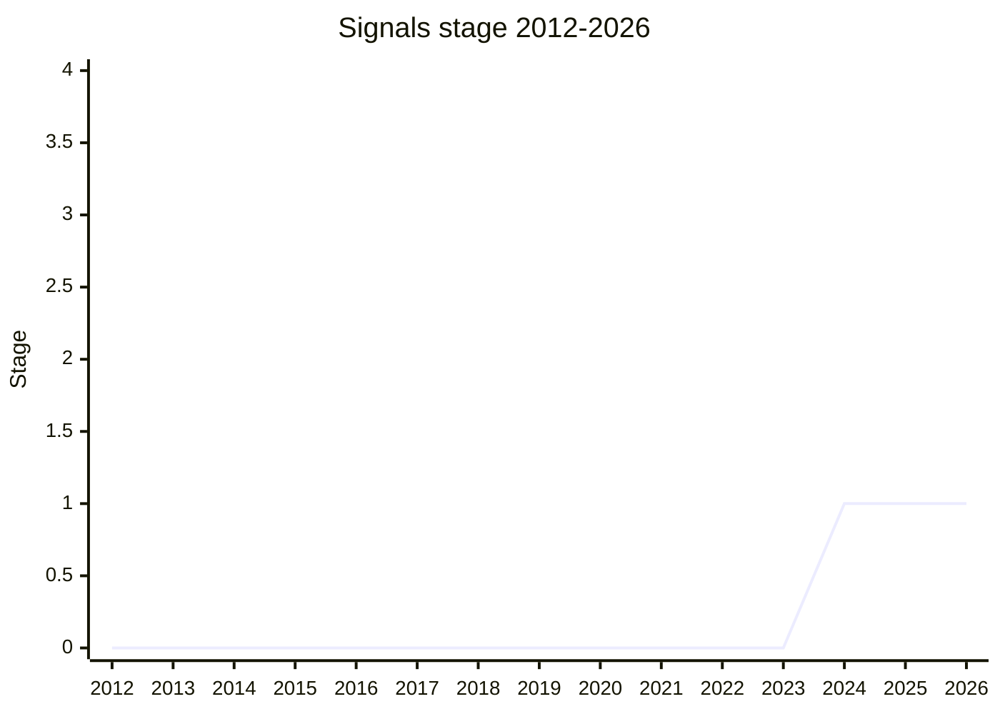

## Overview

A standard-library addition for reactive state management: a mutable, automatically-tracked data dependency graph. The minimal API is built around State and Computed signals, with a set of advanced "subtle" APIs (e.g. `Signal.subtle.Watcher`, `Signal.subtle.currentComputed`) in a more questionable state, expected to change.

What makes the proposal unusual is its provenance: it is the product of a cross-framework working group (Vue, Angular, Ember, Preact, Solid and others) collaborating to validate one common model underneath their existing systems - via branches integrating a (not production-suitable) polyfill - rather than a single champion's design. The tc39/proposal-signals champion list is correspondingly large; the working group is organized by Rob Eisenberg (not a plenary delegate, so not listed in the frontmatter abbreviations). [DE](../people/DE.md) presented it to the committee. The champions have been explicit that this is a slow project: framework validation comes first, Stage 2 is not expected until the model has proven out.

## Stage history

| Meeting                                                                         | Event                                                                                                                                                 | Stage |
| ------------------------------------------------------------------------------- | ----------------------------------------------------------------------------------------------------------------------------------------------------- | ----- |
| [2024-04](https://github.com/tc39/notes/blob/main/meetings/2024-04/april-11.md) | Presented by [DE](../people/DE.md) on behalf of the cross-framework signals working group. **Reached Stage 1**                                        | → 1   |
| [2024-06](https://github.com/tc39/notes/blob/main/meetings/2024-06/june-13.md)  | "Algorithms for Signals": [DE](../people/DE.md) walked through the core algorithms and APIs; "a slow project", no Stage 2 "within the next 12 months" | 1     |

> First presented 2024-04 and reached Stage 1; no advancement since (the champions are deliberately in no hurry).

## Main issues

### Global mutable state observable to user code ([MAH](../people/MAH.md))

[MAH](../people/MAH.md) (SpiderMonkey) raised the SES-style concern that the proposal exposes global mutable state: "No problems with global mutable state as long as it's not observable by a user's code... This proposal does provide capabilities to witness these mechanisms." `Signal.subtle.currentComputed` in particular looked like an unintended communication channel; [DE](../people/DE.md) agreed to look into making it "more limited" and to follow up on the `notify` state in SES calls. [YK](../people/YK.md) noted the pre-TC39 Signals implementation he built had grappled with the same concerns and that "low-level APIs we expect to change more."

### Relationship with events / observables ([RBN](../people/RBN.md))

[RBN](../people/RBN.md) asked how Signals relate to the Events/Observer pattern. The champions' position: Computed signals are pull-based and lazy and "not correctly modelled by events/observers (which are push-based)", but `Signal.subtle.Watcher` - the one callback-bearing API, aimed at frameworks rather than application code - might be a candidate for modeling with observables. Tracked in tc39/proposal-signals issue #111.

### Capability separation and the "rules of hooks" ([JHD](../people/JHD.md))

[JHD](../people/JHD.md) asked how Signals compare to React's "rules of hooks" constraints (the API doesn't impose quite the same rules; champions to follow up offline) and pushed on capability separation between reading and writing - suggesting a plain object with `get`/`set` functions would make it "safer by default" to hand out one capability without the other. Tracked in issues #94 and #124.

## Related proposals

- [AsyncContext](async-context.md) - the other library-style proposal about state that flows implicitly through a program (async context vs. reactive dependency graph).
- `observable` - the push-based counterpart discussed against `Signal.subtle.Watcher` (no page yet). Now pursued at WHATWG/WICG: presented informally at 2025-04 by [DMF](../people/DMF.md) (Chrome) - "a promise, but for multiple values," integrating with `EventTarget` via `when()` - received neutral-to-positive feedback. [MM](../people/MM.md), its original co-champion (with [JH](../people/JH.md)), lamented the move out of TC39; [DE](../people/DE.md) hoped TC39 and WHATWG would "work together ... rather than kind of in both directions trying to claim territory."

## Sources

- [2024-04 april-11](https://github.com/tc39/notes/blob/main/meetings/2024-04/april-11.md) - Stage 1
- [2024-06 june-13](https://github.com/tc39/notes/blob/main/meetings/2024-06/june-13.md) - Algorithms for Signals
- [2025-04 april-17](https://github.com/tc39/notes/blob/main/meetings/2025-04/april-17.md) - WHATWG Observables informal update ([DMF](../people/DMF.md))
