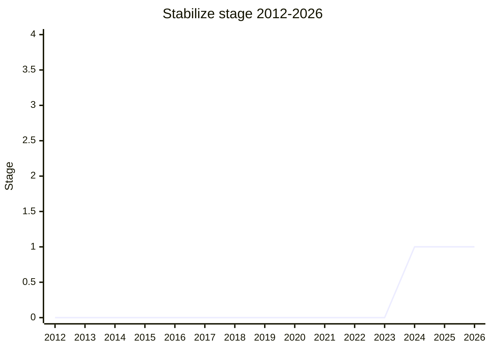

## Overview

"Stabilize and other integrity traits": a full unbundling of JavaScript's object integrity system into orthogonal, opt-in **traits**. The existing ladder - non-extensible → sealed → frozen - bundles several independent guarantees, and each bundle has friction: hardening an API surface breaks legacy prototype code, and frozen objects can still grow private fields via `return override`, which dooms fixed-shape implementations.

The traits on the table: **fixed** (no private-field extension via return override - the trait structs need for fixed shapes, and the retcon for the window proxy's special dispensation), **overridable** (exempts an object from the assignment-override mistake, so freezing primordials stops breaking pre-class prototype code), **non-trapping** (proxies on the target forward everything without invoking handler traps - closing the one remaining re-entrancy hazard in defensive programming), plus a possible split of non-extensible into "no new properties" and "prototype locked". Everything is explored against two counter-proposals: the minimal picture (just `fixed` broken out of a rebundled stable) and a parameterized `protect`/`isProtected` proxy trap pair instead of ten new traps.

## Stage history

| Meeting                                                                            | Event                                                                                                                                                                                                                                                                                                                                                                                                          | Stage    |
| ---------------------------------------------------------------------------------- | -------------------------------------------------------------------------------------------------------------------------------------------------------------------------------------------------------------------------------------------------------------------------------------------------------------------------------------------------------------------------------------------------------------- | -------- |
| [2024-12](https://github.com/tc39/notes/blob/main/meetings/2024-12/december-03.md) | Presented by [MM](../people/MM.md). Stage 1 with explicit support from [SYG](../people/SYG.md), weak support from [JWK](../people/JWK.md), plus [JHD](../people/JHD.md)                                                                                                                                                                                                                                        | → 1      |
| [2025-02](https://github.com/tc39/notes/blob/main/meetings/2025-02/february-19.md) | Status update ("hopes and dreams"): champions + [SYG](../people/SYG.md) agree **not** to unbundle non-extensible; hope to bundle `fixed` into non-extensible pending V8 use counters; hope to fix the override mistake globally via [JRL](../people/JRL.md)/[RGN](../people/RGN.md) carve-outs. `non-trapping` would be the only remaining explicit trait (root trait "stabilize", possible rename to "fixed") | 1 (kept) |

> First presented in 2024-12 and granted Stage 1 in the same session; presented as the distillation of years of Agoric hardening work, but new to the committee as a proposal.

## Main issues

### Unbundle - and the structs tail wagging the dog

The framing came from a hallway conversation with [SYG](../people/SYG.md): a single stronger "stable" level (implying frozen) could not apply to shared structs, which must stay mutable yet need fixed shapes. Hence "bundle or unbundle" - the traits were split so `fixed` alone could apply to non-frozen objects. [SYG](../people/SYG.md) supported Stage 1 _because_ of `fixed` for shared structs, and floated V8's simplification preference: **retcon non-extensible to imply fixed** if web-compatible, measured with a use counter on globalThis mutations. [MM](../people/MM.md) liked it on the spot: neither the return-override nor assignment-override mistake has known intentional production use. The window-proxy rationale for keeping `fixed` unbundled, [MM](../people/MM.md) conceded, is "not" compelling.

### Is the object model getting too complex?

[KG](../people/KG.md) endorsed the exploration but named the cost: "changes to the object model are very, very conceptually expensive for developers... Having more states that things can be in is at least potentially very expensive in terms of reasoning" - not convinced any of it is worth doing, happy to explore in Stage 1. [KM](../people/KM.md) warned of implementation complexity (the frozen-logic long tail of security bugs). [NRO](../people/NRO.md) argued the opposite reading: the fully unbundled picture is _simpler_ to explain, because developers already struggle to distinguish sealed from non-extensible - one labeled trait at a time beats three at once - and asked for a glossary in the proposal. [MM](../people/MM.md)'s own preference: the minimal picture, though he presented it as an open Stage 1 question.

### The hoped-for endgame (2025-02): rebundling instead of unbundling

The 2025-02 status update ([MM](../people/MM.md), "hopes and dreams") pivoted the proposal from unbundling toward **rebundling**:

- **Non-extensible stays bundled.** All champions and [SYG](../people/SYG.md) agreed that unbundling it into "prototype locked" + "no new properties" - though it would retroactively rationalize the window proxy and `Object.prototype` - is "just not worth it practically," accepting the loss of faithful virtualization in a corner case.
- **`fixed` may join it.** [SYG](../people/SYG.md) filed the issue proposing non-extensible imply fixed; V8 measured with a use counter on `globalThis` mutations. [SYG](../people/SYG.md): "I can't believe it is not zero. It is a `e-7` or something. So it is still more than I would like ... I think this is few enough axes that it would be worth trying still" (the slope had not flattened yet).
- **`overridable` may not be needed.** [JRL](../people/JRL.md) traced the one known breakage to an old lodash version (`toString` / `toStringTag` on TypedArrays), and he and [RGN](../people/RGN.md) each proposed safe narrow carve-outs that would let the override mistake be fixed globally for the language instead. [MM](../people/MM.md): "We have never encountered code that makes use of this aspect of the language on purpose." A strict-mode-only fix was agreed acceptable if that is all usage counters can measure.
- **`non-trapping` becomes the whole point.** If the above land, it is the only trait left, bundled into the root "stabilize" trait (making it explicit). [MM](../people/MM.md) reported Agoric already runs a faithful shim (by replacing the global `Proxy` constructor, with the safety burden that entails) and uses it in production code. With `fixed` freed up, the root trait could take back its original 2010-era name.

The acknowledged political cost: the narrower "stabilize" addresses much less than the original proposal, so "there's less wind in its sails" ([MM](../people/MM.md)).

## Related proposals

- [nonextensible-applies-to-private](nonextensible-applies-to-private.md) - the existing-spec corner (private fields landing on non-extensible objects) that `fixed` would close.
- `shared structs` - the fixed-shape consumer that motivated breaking `fixed` out (no page yet).

## Sources

- [2024-12 december-03](https://github.com/tc39/notes/blob/main/meetings/2024-12/december-03.md) - Stage 1 ([MM](../people/MM.md))
- [2025-02 february-19](https://github.com/tc39/notes/blob/main/meetings/2025-02/february-19.md) - status update: the rebundling pivot ("hopes and dreams")
