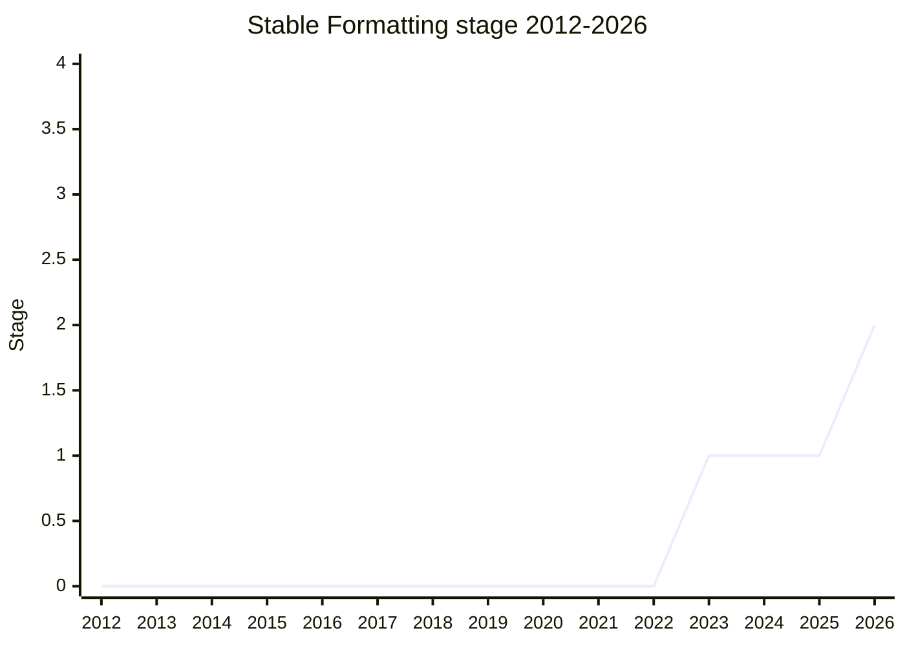

## 概要

Stable Formatting は、ロケールや ICU バージョンに依存しない**安定した整形出力**を提供する提案です。`zxx`(言語内容なしを表すロケール)を通じて、`Intl` の各 API に対し locale 非依存で予測可能な出力を得られるようにします。`Intl` を「整形」ではなく内部処理やテストの目的で誤用しているケースに対し、より適切な代替を与えることが動機です。

champion は [EAO](../people/EAO.md)(Eemeli Aro)。なお `Intl.Collator` と `Intl.Segmenter` については妥当な安定挙動を特定できず本提案からは除外され、その穴は [Intl Default Behaviours](../proposals/intl-default-behaviours.md) が担います。

## ステージ遷移

| 会合                                                        | できごと                                                                           | Stage |
| ----------------------------------------------------------- | ---------------------------------------------------------------------------------- | ----- |
| [2023-09](../../raw/notes/meetings/2023-09/september-27.md) | Stage 1 到達                                                                       | → 1   |
| [2025-02](../../raw/notes/meetings/2025-02/february-19.md)  | update                                                                             | 1     |
| [2026-05](../../raw/notes/meetings/2026-05/may-20.md)       | **Stage 2 到達**。`Collator`/`Segmenter` は対象外。短単位 ID 等は Stage 2 中に対応 | 1 → 2 |

> 横軸=2012-2026、縦軸=Stage。Stage 1 が 2023-09、Stage 2 が 2026-05。

## 主な論点

### `zxx` ロケールによる安定出力

`zxx`(no linguistic content)を使い、ロケール非依存で安定した整形を提供する設計。`Intl` の誤用やテスト用途に対する正攻法の代替を狙います。

### `Collator` / `Segmenter` の除外(2026-05)

これら 2 つは妥当な「安定挙動」を定義できなかったため本提案から外され、別提案 [Intl Default Behaviours](../proposals/intl-default-behaviours.md) で扱う方針になりました。`microsecond` や `mile-scandinavian` の短単位識別子に懸念があり Stage 2 中に対応するとされています。

## 関連提案

- [Intl Default Behaviours](../proposals/intl-default-behaviours.md) — Stable Formatting が扱えない `Collator`/`Segmenter` の locale 非依存挙動を担う姉妹提案(同 champion)。
- [Intl Keep Trailing Zeros](../proposals/intl-keep-trailing-zeros.md) — 同会期で進んだ [EAO](../people/EAO.md) の ECMA-402 提案。

## 出典

- [2023-09 september-27](../../raw/notes/meetings/2023-09/september-27.md) — Stage 1
- [2025-02 february-19](../../raw/notes/meetings/2025-02/february-19.md) — update
- [2026-05 may-20](../../raw/notes/meetings/2026-05/may-20.md) — Stage 2
