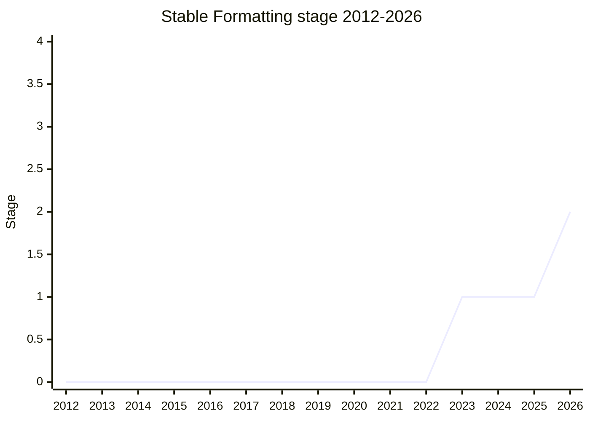

## Overview

Stable Formatting provides **stable formatting output** that does not depend on locale or ICU version. Through `zxx` (the locale that means no linguistic content), each `Intl` API can produce predictable, locale-independent output. The motivation is to give a better alternative for the cases that misuse `Intl` for internal processing or tests rather than for formatting.

The champion is [EAO](../people/EAO.md) (Eemeli Aro). A reasonable stable behavior could not be identified for `Intl.Collator` and `Intl.Segmenter`, so they are excluded from this proposal. [Intl Default Behaviours](../proposals/intl-default-behaviours.md) covers that hole.

## Stage history

| Meeting                                                                             | What happened                                                                                                                        | Stage |
| ----------------------------------------------------------------------------------- | ------------------------------------------------------------------------------------------------------------------------------------ | ----- |
| [2023-09](https://github.com/tc39/notes/blob/main/meetings/2023-09/september-27.md) | Reached Stage 1                                                                                                                      | → 1   |
| [2025-02](https://github.com/tc39/notes/blob/main/meetings/2025-02/february-19.md)  | Update                                                                                                                               | 1     |
| [2026-05](https://github.com/tc39/notes/blob/main/meetings/2026-05/may-20.md)       | **Reached Stage 2**. `Collator` / `Segmenter` are out of scope. Short unit identifiers and similar issues are handled during Stage 2 | 1 → 2 |

```mermaid
xychart-beta
    title "Stable Formatting stage 2012-2026"
    x-axis [2012, 2013, 2014, 2015, 2016, 2017, 2018, 2019, 2020, 2021, 2022, 2023, 2024, 2025, 2026]
    y-axis "Stage" 0 --> 4
    line [0, 0, 0, 0, 0, 0, 0, 0, 0, 0, 0, 1, 1, 1, 2]
```

> Horizontal axis = 2012-2026, vertical axis = Stage. Stage 1 in 2023-09, Stage 2 in 2026-05.

## Main issues

### Stable output through the `zxx` locale

The design uses `zxx` (no linguistic content) to provide stable, locale-independent formatting. It aims at a proper alternative for misuse of `Intl` and for test use.

### Excluding `Collator` / `Segmenter` (2026-05)

These two could not be given a reasonable "stable behavior," so they were taken out of this proposal and are handled by the separate proposal [Intl Default Behaviours](../proposals/intl-default-behaviours.md). There are concerns about the short unit identifiers for `microsecond` and `mile-scandinavian`, to be dealt with during Stage 2.

## Related proposals

- [Intl Default Behaviours](../proposals/intl-default-behaviours.md) — the sibling proposal (same champion) that covers the locale-independent behavior of `Collator` / `Segmenter`, which Stable Formatting cannot.
- [Intl Keep Trailing Zeros](../proposals/intl-keep-trailing-zeros.md) — an ECMA-402 proposal by [EAO](../people/EAO.md) that advanced in the same meeting.

## Sources

- [2023-09 september-27](https://github.com/tc39/notes/blob/main/meetings/2023-09/september-27.md) — Stage 1
- [2025-02 february-19](https://github.com/tc39/notes/blob/main/meetings/2025-02/february-19.md) — update
- [2026-05 may-20](https://github.com/tc39/notes/blob/main/meetings/2026-05/may-20.md) — Stage 2
