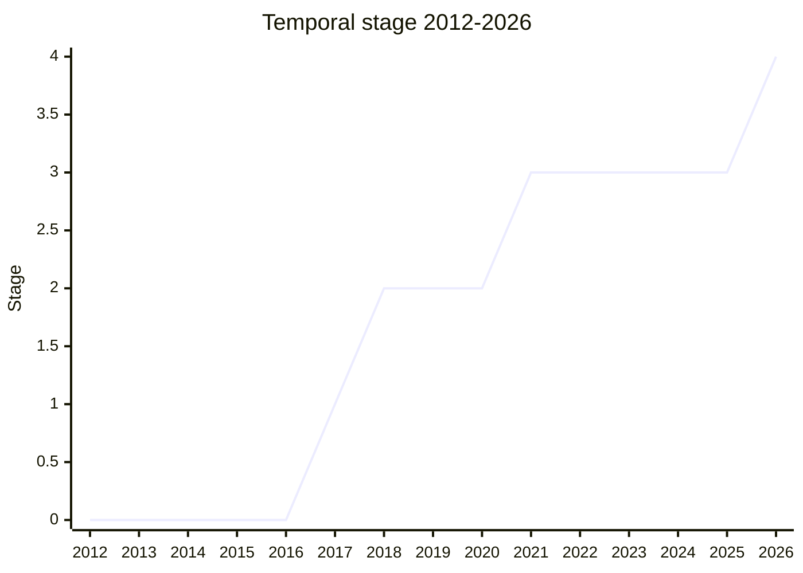

## 概要

Temporal は、JavaScript の `Date` オブジェクトに代わる、日付・時刻を扱うための新しい標準 API です。`Date` は可変 (mutable) で、タイムゾーンの扱いが曖昧、パースの挙動が一貫しない、月が 0 始まりであるなど、長年多くの問題を抱えてきました。Temporal はこれらを正面から解決するため、不変 (immutable) なオブジェクト群を提供し、「exact time (絶対時刻)」「wall-clock time (壁時計時刻)」「duration (期間)」といった概念を型として明確に分離します。

設計の出発点は Java の JodaTime / java.time であり、当初の提案も Moment のメンテナによって championed されました (元 champion は [MPT](../people/MPT.md) = Maggie Pint)。`Temporal.Instant`、`Temporal.PlainDate`、`Temporal.PlainDateTime`、`Temporal.ZonedDateTime`、`Temporal.Duration` などの型を持ち、API surface が非常に大きいことが特徴です。現在時刻のような非決定的な情報はすべて `Temporal.Now` に隔離され、それ以外のルートから到達可能なものは決定的であるという設計上の不変条件を持ちます。

Temporal は TC39 史上でも最大級の提案であり、champion グループも 9〜10 名と最大級でした。Stage 1 到達 (2017-03) から Stage 4 到達 (2026-03) まで約 9 年を要し、ECMA-262 と ECMA-402 の双方にまたがります。

## ステージ遷移

| 会合 | できごと | Stage |
|------|----------|-------|
| [2017-03](../../raw/notes/meetings/2017-03/mar-23.md) | "Date Proposal - NodaTime as a built-in Module" として [MPT](../people/MPT.md) が提案し Stage 1 到達 | → 1 |
| [2018-09](../../raw/notes/meetings/2018-09/sept-27.md) | Stage 2 到達。`valueOf` と `Now` を削減した上で承認 | 1 → 2 |
| [2021-03](../../raw/notes/meetings/2021-03/mar-9.md) | [PFC](../people/PFC.md) が Stage 3 を要求。`Calendar.from()`/`TimeZone.from()` の observable 化を撤回 | 2 → 3 (継続) |
| [2021-03](../../raw/notes/meetings/2021-03/mar-10.md) | 議論を継続し Stage 3 到達。IETF 確定までは unflagged 出荷しない条件付き | 2 → 3 |
| [2024-06](../../raw/notes/meetings/2024-06/june-12.md) | scope reduction。custom calendar/time zone を含む約 96 関数 (全体の約 1/3) を削除 | 3 (維持) |
| [2025-04](../../raw/notes/meetings/2025-04/april-14.md) | Firefox 139 で出荷。「Stage 3 のまま出荷可能」と報告 | 3 (維持) |
| [2026-03](../../raw/notes/meetings/2026-03/march-11.md) | Stage 4 到達。仕様文書の分離・専用 TG は当面見送り | 3 → 4 |

> 横軸=議事録のある全区間 (2012-2026)、縦軸=Stage。各年末時点の stage を下から積み上げて表示。2017-03 に Stage 1、2018-09 に Stage 2、2021-03 に Stage 3、2026-03 に Stage 4。提案が存在しない 2012-2016 は 0。Temporal は Stage 2.7 制度 (2023 新設) より前に 2 → 3 を遷移したため小数 stage は経ていない。

## 主な論点

### Now / 非決定性の隔離 (System object 論争)
Stage 2 (2018-09) で、現在時刻取得などの非決定的 API をどう扱うかが大きな争点でした。[MM](../people/MM.md) は WeakRefs や getStack と同様、非決定性の源は一箇所にまとめ、先行コードが後続コードから防御できる形 (System object のような場所) で導入すべきだと主張しました。一方 [DD](../people/DD.md) は「System object に皆が嫌う非決定性を集める夢は実現しない。host は System を使わない。スケールしない」と反論しました。最終的に Temporal では現在時刻を `Temporal.Now` に隔離する設計に落ち着き、Stage 3 (2021-03) で [MM](../people/MM.md) は「動的に変わる情報がルートの別プロパティに well-quarantined されている」ことを確認した上で支持しました。

### IDL / 仕様記述方法 (WebIDL vs JSIDL)
Stage 2 で [DE](../people/DE.md) が、Temporal のような大きな API をどの IDL で記述するか (WebIDL を使うか、JS 向けの "JSIDL" を作るか) を提起しました。[WH](../people/WH.md) は「IDL の仕様自体が複雑で、外部標準に依存すると ECMAScript 仕様との間で循環参照のリスクがある」と懸念。[JHD](../people/JHD.md) は「IDL に合わせるためだけに 3 万行規模の normative change を入れてレビューするのは困難」と反対し、段階的に進める方針となりました。

### subclassing / @@species
Stage 3 (2021-03) で [SYG](../people/SYG.md) は、Temporal の設計が単純な string protocol と species ベースの subclassing が混在して「muddled」だと指摘しました。ただし「これは champion の責任ではなく JS の subclassing 設計自体が muddled なのであり、この未解決の大問題で Temporal を止めたくない」とも述べ、blocking はしませんでした。[JHD](../people/JHD.md) は「これを species なしの最初の組み込みにしてはどうか」「`new.target` が intrinsic でなければ throw して subclassing を能動的に塞ぐべき」と提案。[DE](../people/DE.md) は「Temporal は現行の慣習に従っているだけで、慣習を変えたい人が別途提案すべき」とし、Stage 3 後に remove-subclassable-builtins 提案で対処する方向で合意しました。

### ISO 8601 拡張構文と IETF との並行標準化
Stage 3 で、time zone 注釈 (`[...]`) と calendar 注釈の拡張構文が IETF で並行して RFC 化されている点が論点になりました。[RGN](../people/RGN.md) は「Stage 3 は出荷シグナルであり、実装が出荷した後で RFC が構文を変えると、提案された構文と確定標準が併存して固定化されてしまう」と懸念。[USA](../people/USA.md) が「RFC 確定 (当時の見込みで July 2021) までは unflagged 出荷しない」ことを提案し、[RGN](../people/RGN.md) もこれで合意しました (後に RFC 9557 として標準化)。

### compare() と calendar の扱い
Stage 3 で [KG](../people/KG.md) が、`compare()` が同一時点だが calendar が異なる 2 つの日付を calendar ID の辞書順で順序付けている点を問題視しました。「`Array.prototype.sort` が stable になった今、`compare()` がゼロを返しても `equals()` が false であってよい。calendar を順序付けに使うべきではない」と主張。champion 側 ([PFC](../people/PFC.md)) は champion グループで合意済みの内容として慎重でしたが、[KG](../people/KG.md) は「議論が誤った前提 (compare が 0 を返すなら概念的に等しいはず) に基づいていた」と再検討を求めました。

### scope reduction (custom calendar/time zone の削除と user-code callout)
2024-06 が最大の論点で、[JGT](../people/JGT.md) は「Google・Apple・Mozilla から Temporal は大きすぎるという強いフィードバックを受けた。圧力は ECMAScript の外、Apple Watch や Android など低スペック端末を担当する人々から来ている」と説明しました。

> V8 はこの scope reduction を強く支持し、終盤での簡素化にこれほど前向きであった champion たちに感謝する。

特に **custom calendar / custom time zone が user code への callout を伴う** 点が実装側の重い懸念でした。結果として `Temporal.Calendar`/`Temporal.TimeZone` クラスと user-defined calendar/time zone、`getISOFields()`、各種変換メソッド、`Duration.add` の `relativeTo` などを削除し、**約 96 関数 (約 300 → 約 200)** を削減することに consensus が得られました。custom calendar はビルトイン文字列識別子のみ残し、将来 reentrant でない設計で再導入する余地を残しました。

このとき以下が記録されています:
- `valueOf`/`toJSON` の関数オブジェクト統合は Mozilla ([ABL](../people/ABL.md)) の実装確認待ちで持ち越し。
- `subtract()` / `since()` の削除は consensus に至らず。
- [JHD](../people/JHD.md) は「reified な Calendar/TimeZone オブジェクトを持つことが重要 (stringly-typed API を避け将来機能追加できる)」とし将来提案向けの論点として残しました。
- [SBE](../people/SBE.md) は user time zone を重要なユースケースとし iCalendar データモデルでの再追加を推奨。
- [JHD](../people/JHD.md) は「複雑性とコードサイズはもっと早期に評価できたはず」とコメント (ただし stage 変更の話ではない)。

### Intl との統合 (非 Gregorian calendar)
[TST](../people/TST.md) は早期から Intl.DateTimeFormat との統合不足を懸念していました。custom calendar が Intl と統合されない (custom calendar で format すると例外) ことは scope reduction の一因でもあり、[SFC](../people/SFC.md) は「ほとんどのユースケースは CLDR で十分」と述べました。era / month code の locale 依存挙動は別提案 `intl-era-month-code` で並行して詰められました (2025-04, 2026-03)。

### 仕様文書の分離と専用 TG (Stage 4 時)
Stage 4 (2026-03) では提案本体に異論はなく (Date を擁護する人もおらず満場一致)、論点はむしろ仕様の publish 方法でした。編集者グループ ([MF](../people/MF.md)) は専門家の維持を理由に「別標準 + 専用 TG (TG2 のような形)」を提案しましたが、[JHD](../people/JHD.md) は「分離は誤った方向。単一ドキュメントの find-in-page は貴重で、HTML 仕様のように散在させるべきでない。文書構造と専門家グループは無関係」と強く反対。[CDA](../people/CDA.md) も「TG は専門家維持を保証しない」と push back しました。結論として Temporal は **当面は別仕様文書にせず、専用 TG も作らない** (1 年以内に再確認) こととなりました。同じ議論から RegExp の分離可能性も話題に上りました。

## 関連提案
- `intl-era-month-code` — era / month code の locale 依存挙動。ECMA-402 側で Temporal と並行して標準化され、2026-03 に Stage 4 到達。

## 出典
- [2017-03 mar-23](../../raw/notes/meetings/2017-03/mar-23.md) — "Date Proposal - NodaTime as a built-in Module" として [MPT](../people/MPT.md) が提示し Stage 1 到達
- [2018-09 sept-27](../../raw/notes/meetings/2018-09/sept-27.md) — Stage 2 到達。Now / 非決定性 (System object)、IDL の議論
- [2021-03 mar-9](../../raw/notes/meetings/2021-03/mar-9.md) — Stage 3 要求。monkeypatch 撤回、subclassing/species、ISO 8601 拡張と IETF、compare()
- [2021-03 mar-10](../../raw/notes/meetings/2021-03/mar-10.md) — 議論継続し Stage 3 到達 (unflagged 出荷の条件付き)
- [2024-06 june-12](../../raw/notes/meetings/2024-06/june-12.md) — scope reduction。custom calendar/time zone 削除、約 96 関数削減
- [2025-04 april-14](../../raw/notes/meetings/2025-04/april-14.md) — Firefox 139 出荷、「Stage 3 のまま出荷可能」と報告
- [2026-03 march-11](../../raw/notes/meetings/2026-03/march-11.md) — Stage 4 到達。仕様分離・専用 TG は当面見送り
