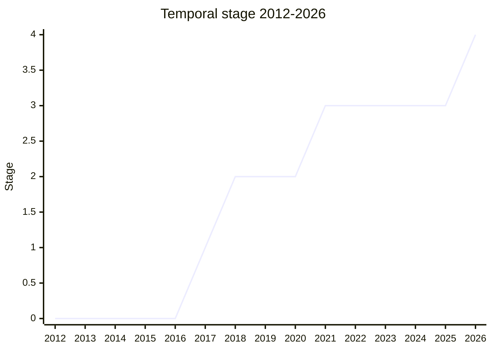

## Overview

Temporal is a new standard API for dates and times, replacing JavaScript's `Date` object. `Date` has long had many problems: it is mutable, timezone handling is ambiguous, parsing behavior is inconsistent, and months are 0-based. Temporal addresses these head-on by providing a set of immutable objects and by clearly separating concepts such as "exact time," "wall-clock time," and "duration" into distinct types.

The design started from Java's JodaTime / java.time, and the original proposal was championed by a Moment maintainer (the original champion is [MPT](../people/MPT.md) = Maggie Pint). It has types such as `Temporal.Instant`, `Temporal.PlainDate`, `Temporal.PlainDateTime`, `Temporal.ZonedDateTime`, and `Temporal.Duration`, and is characterized by a very large API surface. All nondeterministic information, such as the current time, is isolated in `Temporal.Now`, with the design invariant that everything reachable from any other root is deterministic.

Temporal is one of the largest proposals in TC39 history, and its champion group, at 9 to 10 people, was also among the largest. It took about nine years from reaching Stage 1 (2017-03) to reaching Stage 4 (2026-03), and it spans both ECMA-262 and ECMA-402.

## Stage history

| Meeting                                                                             | What happened                                                                                                                                                                                                                                                                                                                                                                                                                                                                                   | Stage         |
| ----------------------------------------------------------------------------------- | ----------------------------------------------------------------------------------------------------------------------------------------------------------------------------------------------------------------------------------------------------------------------------------------------------------------------------------------------------------------------------------------------------------------------------------------------------------------------------------------------- | ------------- |
| [2017-03](https://github.com/tc39/notes/blob/main/meetings/2017-03/mar-23.md)       | [MPT](../people/MPT.md) proposed it as "Date Proposal - NodaTime as a built-in Module" and it reached Stage 1                                                                                                                                                                                                                                                                                                                                                                                   | → 1           |
| [2018-09](https://github.com/tc39/notes/blob/main/meetings/2018-09/sept-27.md)      | Reached Stage 2. Approved after cutting back `valueOf` and `Now`                                                                                                                                                                                                                                                                                                                                                                                                                                | 1 → 2         |
| [2021-03](https://github.com/tc39/notes/blob/main/meetings/2021-03/mar-9.md)        | [PFC](../people/PFC.md) requested Stage 3. Withdrew making `Calendar.from()`/`TimeZone.from()` observable                                                                                                                                                                                                                                                                                                                                                                                       | 2 (continued) |
| [2021-03](https://github.com/tc39/notes/blob/main/meetings/2021-03/mar-10.md)       | Discussion continued and it reached Stage 3. Conditional on not shipping unflagged until the IETF finalizes                                                                                                                                                                                                                                                                                                                                                                                     | 2 → 3         |
| [2024-02](https://github.com/tc39/notes/blob/main/meetings/2024-02/feb-6.md)        | Four normative fixes agreed on consensus: week numbering made optional for non-ISO calendars (PR #2756), a duration-rounding bug (PR #2758), more useful results from date differences in end-of-month edge cases (PR #2759), and a ZonedDateTime-differences bug (PR #2760). Champions: no further known outstanding bugs                                                                                                                                                                      | 3 (kept)      |
| [2024-04](https://github.com/tc39/notes/blob/main/meetings/2024-04/april-08.md)     | Normative bugfix agreed: rounding a `ZonedDateTime` to the nearest day could add an extra day across DST changes. Complexity-reduction concerns aired ([SYG](../people/SYG.md) on V8's code-size/maintenance worry; user-defined calendars and `relativeTo` as candidate cuts) ahead of the June scope reduction                                                                                                                                                                                | 3 (kept)      |
| [2024-06](https://github.com/tc39/notes/blob/main/meetings/2024-06/june-12.md)      | Scope reduction. Removed about 96 functions (about 1/3 of the whole), including custom calendars/time zones                                                                                                                                                                                                                                                                                                                                                                                     | 3 (kept)      |
| [2024-07](https://github.com/tc39/notes/blob/main/meetings/2024-07/july-30.md)      | Two normative bug fixes on consensus: start-of-day computation now handles the TZDB corner case of 1919-03-31 in Toronto (the only day not starting on a whole-hour boundary), and an ambiguous `Duration.prototype.round` option combination (roundingIncrement > 1 with a calendar `smallestUnit` and a larger `largestUnit`) throws RangeError. `valueOf`/`toJSON` collapse dropped; "Stop Coercing Things" reaffirmed as not applying to Temporal. Test262: SpiderMonkey 96%, V8/LibJS ~75% | 3 (kept)      |
| [2024-10](https://github.com/tc39/notes/blob/main/meetings/2024-10/october-09.md)   | Progress update: the Stage 3 condition against unflagged shipping (imposed 2021-03 pending the IETF work) was lifted - "implementations should complete work on the proposal and ship it". Test262 pass rates measured across implementations (SpiderMonkey and GraalJS on top); Firefox close to shipping in Nightly after ICU4X work                                                                                                                                                          | 3 (kept)      |
| [2025-02](https://github.com/tc39/notes/blob/main/meetings/2025-02/february-18.md)  | Normative change agreed ([PFC](../people/PFC.md), PR #3054): creating a `PlainMonthDay` in a non-ISO calendar outside the supported `PlainDate` range throws RangeError (ISO 8601 stays permissive, as it is fully specified). Status: Firefox Nightly enabled (pref flipped), MDN docs complete, SpiderMonkey near 100% Test262                                                                                                                                                                | 3 (kept)      |
| [2025-04](https://github.com/tc39/notes/blob/main/meetings/2025-04/april-14.md)     | Reported as scheduled to ship in Firefox 139. "Temporal is at Stage 3 and ready to ship"                                                                                                                                                                                                                                                                                                                                                                                                        | 3 (kept)      |
| [2025-05](https://github.com/tc39/notes/blob/main/meetings/2025-05/may-28.md)       | Status update: shipped in Firefox the day before (SpiderMonkey at ~99% Test262 conformance; V8 temporarily down while swapping its implementation for `temporal_rs`). Consensus on a normative change to UTC offset matching: optional seconds in an offset, when present, must match exactly (else RangeError)                                                                                                                                                                                 | 3 (kept)      |
| [2025-07](https://github.com/tc39/notes/blob/main/meetings/2025-07/july-28.md)      | Consensus on a normative PR ([NRO](../people/NRO.md) for [PFC](../people/PFC.md)): reorder the get / cast / validate of options-bag properties (the `until` methods, `durationToString`) to match V8's implementation. Observable effect: errors may be delayed and getters triggered differently                                                                                                                                                                                               | 3 (kept)      |
| [2025-09](https://github.com/tc39/notes/blob/main/meetings/2025-09/september-23.md) | Consensus on a normative fix for a sign-flip bug at DST transitions in `ZonedDateTime` difference arithmetic and `Duration`'s `round` / `total` (a regression from a refactor about two years earlier, reported by user Patrick Hensley)                                                                                                                                                                                                                                                        | 3 (kept)      |
| [2025-11](https://github.com/tc39/notes/blob/main/meetings/2025-11/november-18.md)  | Status: two implementations at 99% Test262 and V8 unflagged in trunk (production release mid-January). Snapshot testing (combinations of "interesting" inputs, flagging divergences between implementations) presented - it found the spec bug fixed by normative PR #3172 on consensus: duration-rounding bounds could fail to surround the duration when rounding relative to an end-of-month date, giving wrong results in Firefox release builds                                            | 3 (kept)      |
| [2026-01](https://github.com/tc39/notes/blob/main/meetings/2026-01/january-20.md)   | Two normative changes on consensus, both removing surprising edge cases: PR #3253 restricts `PlainYearMonth` to adding/subtracting years and months (day arithmetic removed as buggy and unused; fallback bug-fix PR #3208 withdrawn), and PR #3246 stops the Plain types' `toLocaleString` from being subject to the system time zone. V8 now unflagged on the web; Stage 4 planned together with Intl Era/Month Code                                                                          | 3 (kept)      |
| [2026-03](https://github.com/tc39/notes/blob/main/meetings/2026-03/march-11.md)     | Reached Stage 4. Splitting the spec document and a dedicated TG deferred for now                                                                                                                                                                                                                                                                                                                                                                                                                | 3 → 4         |
| [2026-05](https://github.com/tc39/notes/blob/main/meetings/2026-05/may-19.md)       | Post-Stage-4: spec integration PRs open in ECMA-262 (#3759) and ECMA-402 (#1044) awaiting editor review (now the source of truth over the proposal repo). Two needs-consensus fixes on consensus for Firefox-fuzzing-found spec assertion failures: capping epoch nanoseconds when rounding a `ZonedDateTime` across a discontinuous day (an Antarctica base's 3-hour backwards shift), and a duration-rounding window fix; two further edge cases under investigation                          | 4 (kept)      |

```mermaid
xychart-beta
    title "Temporal stage 2012-2026"
    x-axis [2012, 2013, 2014, 2015, 2016, 2017, 2018, 2019, 2020, 2021, 2022, 2023, 2024, 2025, 2026]
    y-axis "Stage" 0 --> 4
    line [0, 0, 0, 0, 0, 1, 2, 2, 2, 3, 3, 3, 3, 3, 4]
```

> X-axis = the full span covered by the notes (2012-2026); y-axis = Stage. Each point is the stage at year-end, shown stacked from the bottom. Stage 1 in 2017-03, Stage 2 in 2018-09, Stage 3 in 2021-03, Stage 4 in 2026-03. Years before the proposal existed (2012-2016) are 0. Temporal moved from 2 to 3 before the Stage 2.7 process was introduced (2023), so it never passed through a fractional stage.

## Main issues

### Now / isolating nondeterminism (the System object debate)

At Stage 2 (2018-09), how to handle nondeterministic APIs such as reading the current time was a major dispute. [MM](../people/MM.md) argued that, as with WeakRefs and getStack, sources of nondeterminism should be gathered in one place and introduced in a form (something like a System object) that lets earlier code defend itself against later code. [DD](../people/DD.md) countered: "This dream of a System object, where we put all the sources of nondeterminism that we don't like is extremely unlikely. Hosts won't use System. We shouldn't be constrained in that way. This just doesn't scale." Temporal settled on isolating the current time in `Temporal.Now`. At Stage 3 (2021-03), [MM](../people/MM.md) supported it after confirming that "the ability to get dynamically changing information, in particular the current date or time, is well-quaratined, well separated from all of the rest of Temporal in a separate separate property of the root Temporal object" (sic).

### IDL / how the spec is written (WebIDL vs JSIDL)

This was discussed on a **separate agenda item, "IDL for JavaScript"** (presenter [DE](../people/DE.md)), at the same 2018-09 meeting as Temporal's Stage 2. It was not a deliberation of Temporal itself, but it was related as the question of which IDL should describe a large API like Temporal (use WebIDL, or create a "JSIDL" aimed at JS). [WH](../people/WH.md) was concerned: "The IDL specifications themselves are complicated. Also, if the IDL itself is defined by an external standard, then we run the risk of evolution leading to circularities." [JHD](../people/JHD.md) opposed it, saying it would be hard to review a normative change on the order of 30,000 lines introduced only to fit an IDL, and the committee settled on proceeding step by step.

### subclassing / @@species

At Stage 3 (2021-03), [SYG](../people/SYG.md) pointed out that Temporal's design mixes a simple string protocol with species-based subclassing and is "muddled." He also said this is not the champions' fault — JS's subclassing design itself is muddled — and that he did not want to stop Temporal over this large unsolved problem, so he did not block. [JHD](../people/JHD.md) proposed making this the first built-in without species, and that if `new.target` is not an intrinsic it should throw and actively close off subclassing. [DE](../people/DE.md) said Temporal is only following current convention, and anyone who wants to change the convention should propose that separately. The committee agreed to address it after Stage 3 via the remove-subclassable-builtins proposal.

### ISO 8601 extended syntax and parallel standardization with the IETF

At Stage 3, extended syntax for time zone annotations (`[...]`) and calendar annotations, being turned into an RFC in parallel at the IETF, became an issue. [RGN](../people/RGN.md) worried: "My concern is that advancing to stage 3 is a signal for implementations to ship, and we're then putting ourselves in a race condition where if they do ship and developers start counting on syntax that ultimately looks different when an RFC is published, that we'll be stuck with it." [USA](../people/USA.md) proposed not shipping unflagged until the RFC is finalized (then expected in July 2021), and [RGN](../people/RGN.md) agreed (it was later standardized as RFC 9557).

### compare() and how calendars are treated

At Stage 3, [KG](../people/KG.md) objected to `compare()` ordering two dates that are the same instant but have different calendars by dictionary order of calendar ID. He argued that "two dates which represent the same day should not be arbitrarily ordered by the lexicographic ID of their calendar" and, since `Array.prototype.sort()` is now stable, "it's okay for the `compare()` method to return zero for two objects, even if the objects have an `equals()` method that says they are not equal." The champions ([PFC](../people/PFC.md)) were cautious, treating it as something the champion group had already agreed, but [KG](../people/KG.md) asked for a reconsideration because the discussion had rested on a wrong premise (that if compare returns 0, the values ought to be conceptually equal).

### Scope reduction (removing custom calendars/time zones, and user-code callouts)

2024-06 was the largest issue. [JGT](../people/JGT.md) explained that they had received strong feedback from Google, Apple, and Mozilla that Temporal is too big, and that the pressure comes from outside ECMAScript, from people responsible for low-spec devices such as Apple Watch and Android. [SYG](../people/SYG.md) gave a prepared statement on behalf of V8:

> ([SYG](../people/SYG.md)) V8 strongly supports this scope reduction and thanks the champions for being so open to late-stage simplification.

In particular, **custom calendars / custom time zones that involve callouts into user code** were a heavy concern on the implementation side. The result was consensus to remove the `Temporal.Calendar` / `Temporal.TimeZone` classes and user-defined calendars/time zones, `getISOFields()`, various conversion methods, `relativeTo` on `Duration.add`, and so on, cutting **about 96 functions (about 300 down to about 200)**. Custom calendars were left only as built-in string identifiers, with room to reintroduce them later in a design that is not reentrant.

The following was recorded at the time:

- Merging the `valueOf` / `toJSON` function objects was carried over, pending implementation confirmation from Mozilla ([ABL](../people/ABL.md)).
- Removing `subtract()` / `since()` did not reach consensus.
- [JHD](../people/JHD.md) said it is important to have reified Calendar/TimeZone objects (avoid a stringly-typed API so features can be added later) and left this as an issue for a future proposal.
- [SBE](../people/SBE.md) treated user time zones as an important use case and recommended adding them back in an iCalendar data model.
- [JHD](../people/JHD.md) commented that complexity and code size could have been evaluated much earlier (though this was not a discussion of changing stage).

### Late-Stage-3 change management, snapshot testing, and post-Stage-4 edge cases

After the scope reduction the champions assumed the size concern was resolved and asked implementers to speak up otherwise. At the 2024-07 meeting, [DLM](../people/DLM.md) (Mozilla) supported the bug fixes but voiced a principle objection to further API changes:

> [DLM](../people/DLM.md): as an implementer I would like to not see more API changes if we could avoid them and in particular my understanding of stage 3 is that proposed changes would come by implementation feedback. I don't believe that's the case here.

The committee reaffirmed the existing consensus not to apply the "Stop Coercing Things" convention to Temporal as a Stage 3 proposal ([DE](../people/DE.md) apologized for muddying the waters by suggesting it in chat), and the `valueOf`/`toJSON` collapse left over from June was dropped (Mozilla's position: only revisit it if the size feedback recurred).

Two practices then drove the endgame. **Snapshot testing** (2025-11): [PFC](../people/PFC.md) presented a technique combining "interesting" inputs into hundreds of thousands to millions of test cases - not correctness tests, but a flag when results diverge between implementations or an invariant breaks. It surfaced implementation bugs across engines and the spec bug fixed by PR #3172 (duration-rounding bounds failing to surround the duration when rounding relative to an end-of-month date). **Removal over repair** (2026-01): [PFC](../people/PFC.md) stated the champions' philosophy as "If we have functionality that has a bug and the functionality doesn't seem to be essential, then we consider removing it" - applied to `PlainYearMonth` day arithmetic (PR #3253; the bug had sat in the spec for over five years).

After Stage 4 (2026-05), the ECMA-262 / ECMA-402 integration PRs became the source of truth pending merge, and a Firefox fuzzing push found three spec assertion failures in rare time-zone-database edge cases (24-hour date-line shifts; an Antarctica research base shifting back three hours across midnight, splitting one calendar day into two discontinuous pieces). Two fixes reached consensus; two further edge cases remained under investigation.

### Integration with Intl (non-Gregorian calendars)

[TST](../people/TST.md) had been concerned from early on about insufficient integration with Intl.DateTimeFormat. Custom calendars not being integrated with Intl (formatting with a custom calendar throws) was also one cause of the scope reduction, and [SFC](../people/SFC.md) said CLDR is enough for most use cases. Locale-dependent behavior of era / month code was worked out in parallel in the separate proposal `intl-era-month-code` (2025-04, 2026-03).

### Splitting the specification and a dedicated TG (at Stage 4)

At Stage 4 (2026-03) there was no objection to the proposal itself (nobody defended Date; it was unanimous). The issue was rather how to publish the specification. The editors ([MF](../people/MF.md)) proposed a separate standard plus a dedicated TG (something like TG2), in order to retain specialists, but [JHD](../people/JHD.md) strongly opposed this: splitting is the wrong direction; find-in-page in a single document is valuable, and it should not be scattered the way the HTML specification is; document structure and expert groups are unrelated. [CDA](../people/CDA.md) also pushed back, saying a TG does not guarantee that specialists are retained. The conclusion was that Temporal would **for now neither become a separate specification nor get a dedicated TG** (to be revisited within one year). The same discussion also raised the possibility of splitting out RegExp.

## Related proposals

- [Intl Era/Month Code](intl-era-month-code.md) — locale-dependent behavior of era / month code. Standardized on the ECMA-402 side in parallel with Temporal, and reached Stage 4 in 2026-03.

## Sources

- [2017-03 mar-23](https://github.com/tc39/notes/blob/main/meetings/2017-03/mar-23.md) — [MPT](../people/MPT.md) presented it as "Date Proposal - NodaTime as a built-in Module" and it reached Stage 1
- [2018-09 sept-27](https://github.com/tc39/notes/blob/main/meetings/2018-09/sept-27.md) — Reached Stage 2. Discussion of Now / nondeterminism (the System object) and of IDL
- [2021-03 mar-9](https://github.com/tc39/notes/blob/main/meetings/2021-03/mar-9.md) — Request for Stage 3. Withdrew the monkeypatch; subclassing/species; ISO 8601 extensions and the IETF; compare()
- [2021-03 mar-10](https://github.com/tc39/notes/blob/main/meetings/2021-03/mar-10.md) — Discussion continued and it reached Stage 3 (conditional on unflagged shipping)
- [2024-02 feb-6](https://github.com/tc39/notes/blob/main/meetings/2024-02/feb-6.md) — Four normative fixes on consensus (PRs #2756 / #2758 / #2759 / #2760)
- [2024-04 april-08](https://github.com/tc39/notes/blob/main/meetings/2024-04/april-08.md) — DST rounding bugfix (consensus); complexity-reduction concerns ahead of the scope reduction
- [2024-06 june-12](https://github.com/tc39/notes/blob/main/meetings/2024-06/june-12.md) — Scope reduction. Removed custom calendars/time zones; cut about 96 functions
- [2024-07 july-30](https://github.com/tc39/notes/blob/main/meetings/2024-07/july-30.md) — Two normative bug fixes on consensus (TZDB 1919 Toronto start-of-day corner case; `Duration.round` RangeError); `valueOf`/`toJSON` collapse dropped
- [2024-10 october-09](https://github.com/tc39/notes/blob/main/meetings/2024-10/october-09.md) — Progress update: unflagged-shipping condition lifted; Test262 pass rates measured
- [2025-02 february-18](https://github.com/tc39/notes/blob/main/meetings/2025-02/february-18.md) — Normative change on `PlainMonthDay` in non-ISO calendars (PR #3054, consensus); Firefox Nightly enabled
- [2025-04 april-14](https://github.com/tc39/notes/blob/main/meetings/2025-04/april-14.md) — Scheduled to ship in Firefox 139; concluded "Temporal is at Stage 3 and ready to ship"
- [2025-05 may-28](https://github.com/tc39/notes/blob/main/meetings/2025-05/may-28.md) — Firefox ship confirmed; normative change to UTC offset matching (consensus)
- [2025-07 july-28](https://github.com/tc39/notes/blob/main/meetings/2025-07/july-28.md) — Normative PR on options-bag get / cast / validate ordering (consensus)
- [2025-11 november-18](https://github.com/tc39/notes/blob/main/meetings/2025-11/november-18.md) — Snapshot testing presented; normative PR #3172 on consensus (duration-rounding edge case)
- [2026-01 january-20](https://github.com/tc39/notes/blob/main/meetings/2026-01/january-20.md) — PRs #3253 (`PlainYearMonth` years/months only) and #3246 (`toLocaleString` time zone) on consensus
- [2026-03 march-11](https://github.com/tc39/notes/blob/main/meetings/2026-03/march-11.md) — Reached Stage 4. Splitting the spec and a dedicated TG deferred for now
- [2026-05 may-19](https://github.com/tc39/notes/blob/main/meetings/2026-05/may-19.md) — Post-Stage-4: spec integration PRs; fuzzing-found edge-case fixes on consensus
