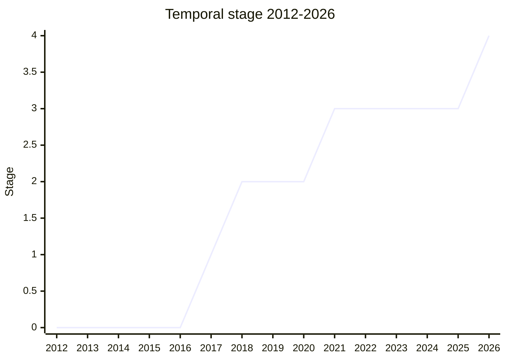

## Overview

Temporal is a new standard API for dates and times, replacing JavaScript's `Date` object. `Date` has long had many problems: it is mutable, timezone handling is ambiguous, parsing behavior is inconsistent, and months are 0-based. Temporal addresses these head-on by providing a set of immutable objects and by clearly separating concepts such as "exact time," "wall-clock time," and "duration" into distinct types.

The design started from Java's JodaTime / java.time, and the original proposal was championed by a Moment maintainer (the original champion is [MPT](../people/MPT.md) = Maggie Pint). It has types such as `Temporal.Instant`, `Temporal.PlainDate`, `Temporal.PlainDateTime`, `Temporal.ZonedDateTime`, and `Temporal.Duration`, and is characterized by a very large API surface. All nondeterministic information, such as the current time, is isolated in `Temporal.Now`, with the design invariant that everything reachable from any other root is deterministic.

Temporal is one of the largest proposals in TC39 history, and its champion group, at 9 to 10 people, was also among the largest. It took about nine years from reaching Stage 1 (2017-03) to reaching Stage 4 (2026-03), and it spans both ECMA-262 and ECMA-402.

## Stage history

| Meeting                                                                             | What happened                                                                                                                                                                                                                                                                                                                                                                                                                                                                                   | Stage         |
| ----------------------------------------------------------------------------------- | ----------------------------------------------------------------------------------------------------------------------------------------------------------------------------------------------------------------------------------------------------------------------------------------------------------------------------------------------------------------------------------------------------------------------------------------------------------------------------------------------- | ------------- |
| [2017-03](https://github.com/tc39/notes/blob/main/meetings/2017-03/mar-23.md)       | [MPT](../people/MPT.md) proposed it as "Date Proposal - NodaTime as a built-in Module" and it reached Stage 1                                                                                                                                                                                                                                                                                                                                                                                   | → 1           |
| [2017-07](https://github.com/tc39/notes/blob/main/meetings/2017-07/jul-27.md)       | Stage 1 update ([MPT](../people/MPT.md)): API cut to 5 types divided into "Civil" (wall-clock) and "Instance" (exact time); 1-based months; nanosecond precision floated. Internally dubbed "Stage 1.5" - still no spec text                                                                                                                                                                                                                                                                    | 1 (continued) |
| [2018-07](https://github.com/tc39/notes/blob/main/meetings/2018-07/july-26.md)      | [MPT](../people/MPT.md) requested Stage 2, but "Not advancing yet due to deadline". Shaping debates: [AWB](../people/AWB.md) module-only ("We need to stop polluting the global namespace"), [MM](../people/MM.md) called direct current-time access "a non-starter", [WH](../people/WH.md) on leap seconds, [YK](../people/YK.md) asked for "a smaller kernel... instead of a 1000 types" (~56 KB gzipped)                                                                                     | 1 (continued) |
| [2018-09](https://github.com/tc39/notes/blob/main/meetings/2018-09/sept-27.md)      | Reached Stage 2. Approved after cutting back `valueOf` and `Now`                                                                                                                                                                                                                                                                                                                                                                                                                                | 1 → 2         |
| [2019-03](https://github.com/tc39/notes/blob/main/meetings/2019-03/mar-27.md)       | Stage 2 update ([PDL](../people/PDL.md)): `BigInt` throughout; ZonedInstance renamed `ZonedDateTime`; standard (built-in) modules now a blocking issue; [RGN](../people/RGN.md) argued for merging `Instant` into an optionally-zoned type, [WH](../people/WH.md) countered                                                                                                                                                                                                                     | 2 (continued) |
| [2019-10](https://github.com/tc39/notes/blob/main/meetings/2019-10/october-2.md)    | Update ([PDL](../people/PDL.md)): combination-type (DateTime + zone) debate - [RBN](../people/RBN.md) pro, [PDL](../people/PDL.md) wary of implicit choices; [SFC](../people/SFC.md): a global namespace "gets rid of the Civil prefix", "looking forward to stage 3"                                                                                                                                                                                                                           | 2 (continued) |
| [2020-02](https://github.com/tc39/notes/blob/main/meetings/2020-02/february-6.md)   | [SFC](../people/SFC.md) polled the committee on strings vs symbols for the `Temporal.Calendar` protocol (issue #310); general support for strings                                                                                                                                                                                                                                                                                                                                               | 2 (continued) |
| [2020-03](https://github.com/tc39/notes/blob/main/meetings/2020-03/april-1.md)      | Champion group expanded - presented by [PDL](../people/PDL.md), [JWS](../people/JWS.md), [PFC](../people/PFC.md) and [USA](../people/USA.md). Enumerable own properties vs prototype accessors debated (issue #403)                                                                                                                                                                                                                                                                             | 2 (continued) |
| [2020-06](https://github.com/tc39/notes/blob/main/meetings/2020-06/june-2.md)       | `valueOf()` to throw on comparison (nanosecond epoch values overflow doubles in ~104 days; `BigInt` internal slots). SES review satisfied by the `Temporal.now` isolation ([KKL](../people/KKL.md)); [RGN](../people/RGN.md) raised compartmentalizability of `TimeZone.from`; [JHD](../people/JHD.md) requested a multi-meeting review freeze                                                                                                                                                  | 2 (continued) |
| [2020-09](https://github.com/tc39/notes/blob/main/meetings/2020-09/sept-23.md)      | [JHD](../people/JHD.md): freeze the spec modulo naming so Stage 3 can be asked for in January. "Spreadable fields" debated (issue #917): [MM](../people/MM.md) favored own enumerable properties, [JHD](../people/JHD.md) warned a two-calendar spread silently overrides                                                                                                                                                                                                                       | 2 (continued) |
| [2020-11](https://github.com/tc39/notes/blob/main/meetings/2020-11/nov-18.md)       | "Tour of Temporal" ([USA](../people/USA.md)): "Temporal is stable!" - polyfill v0.6, design complete; Stage 3 targeted for January. [RGN](../people/RGN.md) temperature check: "tc39 should not ship a serialization format that hasn't been standardized" - taken up as a Stage 4 requirement (IETF RFC)                                                                                                                                                                                       | 2 (continued) |
| [2021-01](https://github.com/tc39/notes/blob/main/meetings/2021-01/jan-27.md)       | "Frozen and camera ready" - no new ideas, API or normative changes except in response to review; RFC 3339 extension draft heading to IETF. Stage 3 planned for March                                                                                                                                                                                                                                                                                                                            | 2 (continued) |
| [2021-03](https://github.com/tc39/notes/blob/main/meetings/2021-03/mar-9.md)        | [PFC](../people/PFC.md) requested Stage 3. Withdrew making `Calendar.from()`/`TimeZone.from()` observable                                                                                                                                                                                                                                                                                                                                                                                       | 2 (continued) |
| [2021-03](https://github.com/tc39/notes/blob/main/meetings/2021-03/mar-10.md)       | Discussion continued and it reached Stage 3. Conditional on not shipping unflagged until the IETF finalizes                                                                                                                                                                                                                                                                                                                                                                                     | 2 → 3         |
| [2021-04](https://github.com/tc39/notes/blob/main/meetings/2021-04/apr-19.md)       | "Normative changes upon which stage 3 was conditional have been resolved. Temporal is now formally stage 3."                                                                                                                                                                                                                                                                                                                                                                                    | 3 (kept)      |
| [2021-05](https://github.com/tc39/notes/blob/main/meetings/2021-05/may-25.md)       | First Stage 3 normative PRs on consensus ([JGT](../people/JGT.md)): `getISOFields` iso-prefix/order fix; singular unit names made canonical, aligned with Intl. Detailed SpiderMonkey feedback (André Bargull) started arriving                                                                                                                                                                                                                                                                 | 3 (kept)      |
| [2021-08](https://github.com/tc39/notes/blob/main/meetings/2021-08/aug-31.md)       | IETF SEDATE WG chartered, `draft-ietf-sedate-datetime-extended` adopted; ~30 implementer-driven normative PRs on consensus. [JHD](../people/JHD.md): "I'm growing concerned about somebody shipping it, and then we discover another thirty of these things"                                                                                                                                                                                                                                    | 3 (kept)      |
| [2021-10](https://github.com/tc39/notes/blob/main/meetings/2021-10/oct-27.md)       | Sub-minute UTC offsets removed from ISO strings (IETF request); `Z` strings exact-time only; `Duration` constructor throws on non-integers; string shorthand in options bags on consensus                                                                                                                                                                                                                                                                                                       | 3 (kept)      |
| [2021-10](https://github.com/tc39/notes/blob/main/meetings/2021-10/oct-28.md)       | ZonedDateTime offset/name compatibility bugfix on consensus; `round()` with no options left without consensus ([WH](../people/WH.md) vs [JHD](../people/JHD.md))                                                                                                                                                                                                                                                                                                                                | 3 (kept)      |
| [2021-12](https://github.com/tc39/notes/blob/main/meetings/2021-12/dec-14.md)       | ISO 8601 conformance fixes on consensus: optional `T` prefix; syntactic validity split from known-zone existence (`[Mars/Olympus_Mons]`); TimeZone brand checks                                                                                                                                                                                                                                                                                                                                 | 3 (kept)      |
| [2022-03](https://github.com/tc39/notes/blob/main/meetings/2022-03/mar-29.md)       | Duration internal slots bounded to the intersection of JS Numbers and mathematical integers (no `-0`, no non-double integers); default options made consistent. [SYG](../people/SYG.md) questioned the process "for something the size and scope of Temporal"; [YSV](../people/YSV.md) proposed splitting giant proposals into epics                                                                                                                                                            | 3 (kept)      |
| [2022-06](https://github.com/tc39/notes/blob/main/meetings/2022-06/jun-06.md)       | Implementations without Intl no longer restricted to the ISO 8601 calendar (supported non-ISO calendars must still come from Intl's set); `dateFromFields` exception order fixed; time zone grammar extended to UTC-offset strings; Instant rounding bug fixed. IETF RFC "on the last few legs"                                                                                                                                                                                                 | 3 (kept)      |
| [2022-07](https://github.com/tc39/notes/blob/main/meetings/2022-07/jul-20.md)       | PR batch on consensus: rounding modes aligned with `Intl.NumberFormat` V3, legacy time zone names, `Duration.total()` returning infinity, transitions at range end → null. Three major open issues named: frozen intrinsics (#1808), ECMA-402 integration (#2005), PlainTime calendar slot (#1588). [FYT](../people/FYT.md): "I basically wrote every single line of the implementation in V8 myself"                                                                                           | 3 (kept)      |
| [2022-09](https://github.com/tc39/notes/blob/main/meetings/2022-09/sep-13.md)       | IETF format named IXDTF; critical `!` flag proposed (unknown annotations rejected unless explicitly ignored), `toString` option to print it. [JHD](../people/JHD.md) questioned round-trip preservation; [FYT](../people/FYT.md) opposed storing extra bits ("waste of memory")                                                                                                                                                                                                                 | 3 (kept)      |
| [2022-09](https://github.com/tc39/notes/blob/main/meetings/2022-09/sep-15.md)       | Consensus on the critical-flag PR (#2397); follow-up possible web-compatibly                                                                                                                                                                                                                                                                                                                                                                                                                    | 3 (kept)      |
| [2022-11](https://github.com/tc39/notes/blob/main/meetings/2022-11/nov-29.md)       | Remaining-issues tour: built-in calendars/time zones to be optimizable via a string in the internal slot (`calendarId` getter + `getCalendar()`). [FYT](../people/FYT.md): "That change itself, tells you how ready it is"; [SYG](../people/SYG.md) asked for a process post-mortem; [PDL](../people/PDL.md) defined ready-to-ship as no more expected spec changes                                                                                                                             | 3 (kept)      |
| [2023-01](https://github.com/tc39/notes/blob/main/meetings/2023-01/jan-31.md)       | "Final push". PR #2482 on consensus - built-ins always call intrinsics: `[[Calendar]]`/`[[TimeZone]]` hold a string or object; `calendar` getter split into `calendarId` + `getCalendar()` (same for time zones); `Temporal.Now.timeZone()` → `timeZoneId()`; PlainTime loses its calendar. [SYG](../people/SYG.md) heads-up: V8 would prefer microseconds; [FYT](../people/FYT.md) suggested a temporal-v2 repo                                                                                | 3 (kept)      |
| [2023-01](https://github.com/tc39/notes/blob/main/meetings/2023-01/feb-01.md)       | Consensus on the `Id` spelling (`calendarId`/`timeZoneId`); [JHD](../people/JHD.md) withdrew his remaining objection the next day                                                                                                                                                                                                                                                                                                                                                               | 3 (kept)      |
| [2023-03](https://github.com/tc39/notes/blob/main/meetings/2023-03/mar-21.md)       | Duration bounds framework agreed: normalized seconds (≤ `MAX_SAFE_INTEGER`) plus a subsecond part, targeting "at most 64 plus 32 bit integers" ([ABL](../people/ABL.md)'s test262 double-vs-BigInt divergences); [WH](../people/WH.md) vs [SYG](../people/SYG.md) on spec style                                                                                                                                                                                                                 | 3 (kept)      |
| [2023-03](https://github.com/tc39/notes/blob/main/meetings/2023-03/mar-23.md)       | Nanoseconds vs microseconds concluded: sticking with nanoseconds "to enable interchange with other systems" ([SYG](../people/SYG.md)/V8 preferring microseconds; champions, [APK](../people/APK.md), [WH](../people/WH.md), [DE](../people/DE.md) for nanoseconds)                                                                                                                                                                                                                              | 3 (kept)      |
| [2023-05](https://github.com/tc39/notes/blob/main/meetings/2023-05/may-17.md)       | PRs #2570 (duplicate field names throw), #2571 (duration rounding consistency), #2572 (multiple calendar annotations) on consensus. [DE](../people/DE.md): given the drag, implementations should not be asked to hold off shipping for the IETF; [JHD](../people/JHD.md): wait for one plenary gap with no normative changes                                                                                                                                                                   | 3 (kept)      |
| [2023-07](https://github.com/tc39/notes/blob/main/meetings/2023-07/july-12.md)      | Bounded integer arithmetic landed: calculations in normalized nanoseconds fitting 96 bits, calendar units bounded at unsigned 32-bit, days as time units (storage unchanged); offset time zones limited to minute precision (IETF); primitives no longer coerced to Temporal types. [DE](../people/DE.md): "Temporal can be considered kind of 'done-ish'"                                                                                                                                      | 3 (kept)      |
| [2023-11](https://github.com/tc39/notes/blob/main/meetings/2023-11/november-28.md)  | IETF draft accepted for publication - "no longer a blocker for shipping Temporal unflagged". PR #2718: PlainMonthDay/PlainYearMonth `toPlainDate` clamps instead of throwing (Feb 29 birthday example); "no data-driven exceptions" principle debated ([WH](../people/WH.md), [KG](../people/KG.md))                                                                                                                                                                                            | 3 (kept)      |
| [2023-11](https://github.com/tc39/notes/blob/main/meetings/2023-11/november-30.md)  | Continuation: principle restated as "Data-dependent ambiguous cases should default to reasonable behavior instead of throwing"; consensus recorded on PR #2718                                                                                                                                                                                                                                                                                                                                  | 3 (kept)      |
| [2024-02](https://github.com/tc39/notes/blob/main/meetings/2024-02/feb-6.md)        | Four normative fixes agreed on consensus: week numbering made optional for non-ISO calendars (PR #2756), a duration-rounding bug (PR #2758), more useful results from date differences in end-of-month edge cases (PR #2759), and a ZonedDateTime-differences bug (PR #2760). Champions: no further known outstanding bugs                                                                                                                                                                      | 3 (kept)      |
| [2024-04](https://github.com/tc39/notes/blob/main/meetings/2024-04/april-08.md)     | Normative bugfix agreed: rounding a `ZonedDateTime` to the nearest day could add an extra day across DST changes. Complexity-reduction concerns aired ([SYG](../people/SYG.md) on V8's code-size/maintenance worry; user-defined calendars and `relativeTo` as candidate cuts) ahead of the June scope reduction                                                                                                                                                                                | 3 (kept)      |
| [2024-06](https://github.com/tc39/notes/blob/main/meetings/2024-06/june-12.md)      | Scope reduction. Removed about 96 functions (about 1/3 of the whole), including custom calendars/time zones                                                                                                                                                                                                                                                                                                                                                                                     | 3 (kept)      |
| [2024-07](https://github.com/tc39/notes/blob/main/meetings/2024-07/july-30.md)      | Two normative bug fixes on consensus: start-of-day computation now handles the TZDB corner case of 1919-03-31 in Toronto (the only day not starting on a whole-hour boundary), and an ambiguous `Duration.prototype.round` option combination (roundingIncrement > 1 with a calendar `smallestUnit` and a larger `largestUnit`) throws RangeError. `valueOf`/`toJSON` collapse dropped; "Stop Coercing Things" reaffirmed as not applying to Temporal. Test262: SpiderMonkey 96%, V8/LibJS ~75% | 3 (kept)      |
| [2024-10](https://github.com/tc39/notes/blob/main/meetings/2024-10/october-09.md)   | Progress update: the Stage 3 condition against unflagged shipping (imposed 2021-03 pending the IETF work) was lifted - "implementations should complete work on the proposal and ship it". Test262 pass rates measured across implementations (SpiderMonkey and GraalJS on top); Firefox close to shipping in Nightly after ICU4X work                                                                                                                                                          | 3 (kept)      |
| [2025-02](https://github.com/tc39/notes/blob/main/meetings/2025-02/february-18.md)  | Normative change agreed ([PFC](../people/PFC.md), PR #3054): creating a `PlainMonthDay` in a non-ISO calendar outside the supported `PlainDate` range throws RangeError (ISO 8601 stays permissive, as it is fully specified). Status: Firefox Nightly enabled (pref flipped), MDN docs complete, SpiderMonkey near 100% Test262                                                                                                                                                                | 3 (kept)      |
| [2025-04](https://github.com/tc39/notes/blob/main/meetings/2025-04/april-14.md)     | Reported as scheduled to ship in Firefox 139. "Temporal is at Stage 3 and ready to ship"                                                                                                                                                                                                                                                                                                                                                                                                        | 3 (kept)      |
| [2025-05](https://github.com/tc39/notes/blob/main/meetings/2025-05/may-28.md)       | Status update: shipped in Firefox the day before (SpiderMonkey at ~99% Test262 conformance; V8 temporarily down while swapping its implementation for `temporal_rs`). Consensus on a normative change to UTC offset matching: optional seconds in an offset, when present, must match exactly (else RangeError)                                                                                                                                                                                 | 3 (kept)      |
| [2025-07](https://github.com/tc39/notes/blob/main/meetings/2025-07/july-28.md)      | Consensus on a normative PR ([NRO](../people/NRO.md) for [PFC](../people/PFC.md)): reorder the get / cast / validate of options-bag properties (the `until` methods, `durationToString`) to match V8's implementation. Observable effect: errors may be delayed and getters triggered differently                                                                                                                                                                                               | 3 (kept)      |
| [2025-09](https://github.com/tc39/notes/blob/main/meetings/2025-09/september-23.md) | Consensus on a normative fix for a sign-flip bug at DST transitions in `ZonedDateTime` difference arithmetic and `Duration`'s `round` / `total` (a regression from a refactor about two years earlier, reported by user Patrick Hensley)                                                                                                                                                                                                                                                        | 3 (kept)      |
| [2025-11](https://github.com/tc39/notes/blob/main/meetings/2025-11/november-18.md)  | Status: two implementations at 99% Test262 and V8 unflagged in trunk (production release mid-January). Snapshot testing (combinations of "interesting" inputs, flagging divergences between implementations) presented - it found the spec bug fixed by normative PR #3172 on consensus: duration-rounding bounds could fail to surround the duration when rounding relative to an end-of-month date, giving wrong results in Firefox release builds                                            | 3 (kept)      |
| [2026-01](https://github.com/tc39/notes/blob/main/meetings/2026-01/january-20.md)   | Two normative changes on consensus, both removing surprising edge cases: PR #3253 restricts `PlainYearMonth` to adding/subtracting years and months (day arithmetic removed as buggy and unused; fallback bug-fix PR #3208 withdrawn), and PR #3246 stops the Plain types' `toLocaleString` from being subject to the system time zone. V8 now unflagged on the web; Stage 4 planned together with Intl Era/Month Code                                                                          | 3 (kept)      |
| [2026-03](https://github.com/tc39/notes/blob/main/meetings/2026-03/march-11.md)     | Reached Stage 4. Splitting the spec document and a dedicated TG deferred for now                                                                                                                                                                                                                                                                                                                                                                                                                | 3 → 4         |
| [2026-05](https://github.com/tc39/notes/blob/main/meetings/2026-05/may-19.md)       | Post-Stage-4: spec integration PRs open in ECMA-262 (#3759) and ECMA-402 (#1044) awaiting editor review (now the source of truth over the proposal repo). Two needs-consensus fixes on consensus for Firefox-fuzzing-found spec assertion failures: capping epoch nanoseconds when rounding a `ZonedDateTime` across a discontinuous day (an Antarctica base's 3-hour backwards shift), and a duration-rounding window fix; two further edge cases under investigation                          | 4 (kept)      |

```mermaid
xychart-beta
    title "Temporal stage 2012-2026"
    x-axis [2012, 2013, 2014, 2015, 2016, 2017, 2018, 2019, 2020, 2021, 2022, 2023, 2024, 2025, 2026]
    y-axis "Stage" 0 --> 4
    line [0, 0, 0, 0, 0, 1, 2, 2, 2, 3, 3, 3, 3, 3, 4]
```

> X-axis = the full span covered by the notes (2012-2026); y-axis = Stage. Each point is the stage at year-end, shown stacked from the bottom. Stage 1 in 2017-03, Stage 2 in 2018-09, Stage 3 in 2021-03, Stage 4 in 2026-03. Years before the proposal existed (2012-2016) are 0. Temporal moved from 2 to 3 before the Stage 2.7 process was introduced (2023), so it never passed through a fractional stage.

## Main issues

### Now / isolating nondeterminism (the System object debate)

At Stage 2 (2018-09), how to handle nondeterministic APIs such as reading the current time was a major dispute. [MM](../people/MM.md) argued that, as with WeakRefs and getStack, sources of nondeterminism should be gathered in one place and introduced in a form (something like a System object) that lets earlier code defend itself against later code. [DD](../people/DD.md) countered: "This dream of a System object, where we put all the sources of nondeterminism that we don't like is extremely unlikely. Hosts won't use System. We shouldn't be constrained in that way. This just doesn't scale." Temporal settled on isolating the current time in `Temporal.Now`. At Stage 3 (2021-03), [MM](../people/MM.md) supported it after confirming that "the ability to get dynamically changing information, in particular the current date or time, is well-quaratined, well separated from all of the rest of Temporal in a separate separate property of the root Temporal object" (sic).

The concern dates back further, to 2018-07, when [MM](../people/MM.md) called direct current-time access "a non-starter for me. It's really important that you keep arithmetic separate from access to anything in the outside world. It's the difference between system-mode and user-mode." At 2020-06 the SES review signed off on the resulting design ([KKL](../people/KKL.md): "Thank you, this answer is very satisfying" - replacing `Temporal.now` suffices for environment lockdown), but [RGN](../people/RGN.md) pointed out `Temporal.now` is not the only environmental access: resolving a time zone reads current TZ data, and with the lookup reachable via `TimeZone.from` on the constructor the design was "possible to virtualize but not to compartmentalize" ([DE](../people/DE.md) noted SES removes `Intl` entirely, which would impose further constraints).

### IDL / how the spec is written (WebIDL vs JSIDL)

This was discussed on a **separate agenda item, "IDL for JavaScript"** (presenter [DE](../people/DE.md)), at the same 2018-09 meeting as Temporal's Stage 2. It was not a deliberation of Temporal itself, but it was related as the question of which IDL should describe a large API like Temporal (use WebIDL, or create a "JSIDL" aimed at JS). [WH](../people/WH.md) was concerned: "The IDL specifications themselves are complicated. Also, if the IDL itself is defined by an external standard, then we run the risk of evolution leading to circularities." [JHD](../people/JHD.md) opposed it, saying it would be hard to review a normative change on the order of 30,000 lines introduced only to fit an IDL, and the committee settled on proceeding step by step.

### subclassing / @@species

At Stage 3 (2021-03), [SYG](../people/SYG.md) pointed out that Temporal's design mixes a simple string protocol with species-based subclassing and is "muddled." He also said this is not the champions' fault — JS's subclassing design itself is muddled — and that he did not want to stop Temporal over this large unsolved problem, so he did not block. [JHD](../people/JHD.md) proposed making this the first built-in without species, and that if `new.target` is not an intrinsic it should throw and actively close off subclassing. [DE](../people/DE.md) said Temporal is only following current convention, and anyone who wants to change the convention should propose that separately. The committee agreed to address it after Stage 3 via the remove-subclassable-builtins proposal.

### ISO 8601 extended syntax and parallel standardization with the IETF

At Stage 3, extended syntax for time zone annotations (`[...]`) and calendar annotations, being turned into an RFC in parallel at the IETF, became an issue. [RGN](../people/RGN.md) worried: "My concern is that advancing to stage 3 is a signal for implementations to ship, and we're then putting ourselves in a race condition where if they do ship and developers start counting on syntax that ultimately looks different when an RFC is published, that we'll be stuck with it." [USA](../people/USA.md) proposed not shipping unflagged until the RFC is finalized (then expected in July 2021), and [RGN](../people/RGN.md) agreed (it was later standardized as RFC 9557).

The requirement's origin is the 2020-11 "Tour of Temporal" temperature check, where [RGN](../people/RGN.md) held that "tc39 should not ship a serialization format that hasn't been standardized by an organization with responsibility in this space" - explicitly about Stage 4 ("an IETF RFC would be sufficient in my mind") - while [DE](../people/DE.md) maintained the plan was to standardize in parallel ("I was imagining that stage 3 would be based on having some discussion with them").

Through Stage 3 the IETF track drove a steady stream of normative changes: the SEDATE working group was chartered and adopted `draft-ietf-sedate-datetime-extended` (2021-08); sub-minute UTC offsets were removed from ISO strings at the IETF's request (2021-10); the format was named IXDTF and the critical `!` flag reached consensus (PR #2397, 2022-09) - annotations unknown to a consumer must be rejected unless deliberately ignored, with a `toString` option to print the flag ([JHD](../people/JHD.md) asked how round-tripping could preserve it; [FYT](../people/FYT.md) opposed storing extra bits as a "waste of memory"); offset time zones were limited to minute precision (2023-07). By 2023-11 [PFC](../people/PFC.md) could report the draft had been accepted for publication: "And so this is no longer a blocker for shipping Temporal unflagged."

### compare() and how calendars are treated

At Stage 3, [KG](../people/KG.md) objected to `compare()` ordering two dates that are the same instant but have different calendars by dictionary order of calendar ID. He argued that "two dates which represent the same day should not be arbitrarily ordered by the lexicographic ID of their calendar" and, since `Array.prototype.sort()` is now stable, "it's okay for the `compare()` method to return zero for two objects, even if the objects have an `equals()` method that says they are not equal." The champions ([PFC](../people/PFC.md)) were cautious, treating it as something the champion group had already agreed, but [KG](../people/KG.md) asked for a reconsideration because the discussion had rested on a wrong premise (that if compare returns 0, the values ought to be conceptually equal).

### Duration arithmetic on bounded integers

Temporal's arithmetic was originally specified over mathematical integers, forcing implementations onto BigInt paths. In 2022-03 the `Duration` internal slots were bounded to the "intersection of JS Numbers and mathematical integers" (observable as: no `-0`, no integers not representable as doubles). In 2023-03 a full bounds framework was agreed: durations normalize to seconds (bounded by `MAX_SAFE_INTEGER`) plus a subsecond part, with the stated goal that "all calculations have to be able to be performed with at most 64 plus 32 bit integers" - motivated by test262 divergences [ABL](../people/ABL.md) had found between implementations computing in doubles vs BigInt ([WH](../people/WH.md) and [SYG](../people/SYG.md) also clashed over spec style: a single integral subsecond value vs fully spelled-out steps). The final shape landed in 2023-07: calculations run in normalized nanoseconds that fit in 96 bits (seconds ≤ `MAX_SAFE_INTEGER`, subsecond < 1s), calendar units (years/months/weeks) are bounded at unsigned 32-bit, and days count as time units - without changing the storage format.

### Built-in calendar/time zone slots and the calendarId/timeZoneId API

A recurring implementer complaint was that Temporal objects hold `Calendar`/`TimeZone` objects in internal slots, and object-valued slots invite user-code callouts that defeat optimization (one of three major open issues named in 2022-07, alongside frozen intrinsics #1808 and ECMA-402 integration #2005). The solution, sketched in 2022-11 and landed via PR #2482 ("built-ins always call intrinsics") on consensus in 2023-01: the `[[Calendar]]`/`[[TimeZone]]` slots hold a string or an object, built-in methods never call user code, and the old `calendar` getter was split into a `calendarId` string getter plus a `getCalendar()` method (mirror-image for time zones); `Temporal.Now.timeZone()` became `Temporal.Now.timeZoneId()`, `PlainTime` lost its calendar slot, and `Calendar.from()`/`TimeZone.from()` only accept objects implementing the full protocol. The `Id` spelling (`calendarId`, `timeZoneId`) was confirmed by consensus at the same meeting over W3C-style casing ([JHD](../people/JHD.md): "Consensus on `Id` spelling in properties as presented yesterday", withdrawing his remaining objection the next day). This string-first design is what made the 2024-06 removal of custom calendars/time zones (below) mechanically simple.

### Instant precision: nanoseconds vs microseconds

Nanoseconds had been the precision since the earliest drafts (2017-07), and it was already established in 2020-06 that nanosecond epoch values overflow doubles in ~104 days, so `Instant` uses a `BigInt` internal slot. In 2023-01 [SYG](../people/SYG.md) gave a heads-up that V8 "really do not want nanosecond precision… we would really prefer going down to microseconds" (a 128-bit integer type is not portable across platforms). The 2023-03 follow-up debate ended with the champions, [APK](../people/APK.md), [WH](../people/WH.md) and [DE](../people/DE.md) favoring nanoseconds for interchange and round-tripping, against [SYG](../people/SYG.md)'s "we can live with the bounded stuff and nanosecond precision… nanoseconds for the computation that people want nanoseconds for is just not useful". The recorded conclusion: "concluding to stick with nanoseconds as the granularity of all Temporal time/instant types, to enable interchange with other systems."

### Clamp by default instead of throwing ("no data-driven exceptions")

PR #2718 (2023-11) changed the overflow behavior of `PlainMonthDay.prototype.toPlainDate` (and its `PlainYearMonth` counterpart) so ambiguous inputs - the birthday on February 29 was the running example - clamp to a valid date instead of throwing. [WH](../people/WH.md) was confused by the change's framing, and [KG](../people/KG.md) objected to the slogan: "phrasing this as 'no data driven exceptions' is a confusing way to phrase this principle" - [SFC](../people/SFC.md) explained it as keeping decisions inside the type system. The principle was restated as "Data-dependent ambiguous cases should default to reasonable behavior instead of throwing", grounded in a taxonomy of valid data (Temporal objects are always valid; property bags are validated per field; strings per the ISO/IETF grammar). Consensus was recorded on the PR.

### Size and the proposal process

Concerns about Temporal's sheer size ran through its whole life. Already in 2018-07, [YK](../people/YK.md) asked "Can we find a smaller kernel we can use here, instead of a 1000 types", [AWB](../people/AWB.md) opposed "seeing this in any form other than a module. We need to stop polluting the global namespace", and [TST](../people/TST.md) warned the proposal plus an ECMA-402 follow-up was too much complexity to land atomically; the Moment-style library the API was cut from was ~56 KB gzipped. [JHD](../people/JHD.md)'s review-freeze requests (2020-06, 2020-09) and [YSV](../people/YSV.md)'s implementer dread ("things keep changing, we're dreading it a little bit") set the pattern.

At Stage 3 the debate turned to process. [SYG](../people/SYG.md), 2022-03: "Do you think the existing TC39 proposal process has worked well, for something the size and scope of Temporal?" ([PFC](../people/PFC.md) credited the champions' consensus process and weekly calls; [YSV](../people/YSV.md) suggested future proposals of this size be split into epics). [FYT](../people/FYT.md) - "I basically wrote every single line of the implementation in V8 myself" - criticized the polyfill-as-reference workflow and suggested a separate temporal-v2 repo for next-generation issues (2023-01); at 2022-11 he greeted a four-new-API change with "That change itself, tells you how ready it is", and [SYG](../people/SYG.md) said "we have not had a good time implementing this proposal… I would appreciate that we as a committee do some post mortem here eventually." [PDL](../people/PDL.md) framed ready-to-ship as "no more expected changes to the spec". [JHD](../people/JHD.md) repeatedly asked for a quiet period before unflagged shipping: "I'm growing concerned about somebody shipping it, and then we discover another thirty of these things" (2021-08); "it would be strange if we decided it was ready to be shipped in a meeting that it still contained normative changes" (2022-09, to which [DE](../people/DE.md): "That's just not how our process works."); "I think it's reasonable that there be at least one plenary gap with no normative changes, though, before we submit it" (2023-05, where [DE](../people/DE.md) also argued that, given the drag, implementations could no longer be asked to hold off for the IETF). The pressure culminated in the 2024-06 scope reduction (below).

### Scope reduction (removing custom calendars/time zones, and user-code callouts)

2024-06 was the largest issue. [JGT](../people/JGT.md) explained that they had received strong feedback from Google, Apple, and Mozilla that Temporal is too big, and that the pressure comes from outside ECMAScript, from people responsible for low-spec devices such as Apple Watch and Android. [SYG](../people/SYG.md) gave a prepared statement on behalf of V8:

> ([SYG](../people/SYG.md)) V8 strongly supports this scope reduction and thanks the champions for being so open to late-stage simplification.

In particular, **custom calendars / custom time zones that involve callouts into user code** were a heavy concern on the implementation side. The result was consensus to remove the `Temporal.Calendar` / `Temporal.TimeZone` classes and user-defined calendars/time zones, `getISOFields()`, various conversion methods, `relativeTo` on `Duration.add`, and so on, cutting **about 96 functions (about 300 down to about 200)**. Custom calendars were left only as built-in string identifiers, with room to reintroduce them later in a design that is not reentrant.

The following was recorded at the time:

- Merging the `valueOf` / `toJSON` function objects was carried over, pending implementation confirmation from Mozilla ([ABL](../people/ABL.md)).
- Removing `subtract()` / `since()` did not reach consensus.
- [JHD](../people/JHD.md) said it is important to have reified Calendar/TimeZone objects (avoid a stringly-typed API so features can be added later) and left this as an issue for a future proposal.
- [SBE](../people/SBE.md) treated user time zones as an important use case and recommended adding them back in an iCalendar data model.
- [JHD](../people/JHD.md) commented that complexity and code size could have been evaluated much earlier (though this was not a discussion of changing stage).

### Late-Stage-3 change management, snapshot testing, and post-Stage-4 edge cases

After the scope reduction the champions assumed the size concern was resolved and asked implementers to speak up otherwise. At the 2024-07 meeting, [DLM](../people/DLM.md) (Mozilla) supported the bug fixes but voiced a principle objection to further API changes:

> [DLM](../people/DLM.md): as an implementer I would like to not see more API changes if we could avoid them and in particular my understanding of stage 3 is that proposed changes would come by implementation feedback. I don't believe that's the case here.

The committee reaffirmed the existing consensus not to apply the "Stop Coercing Things" convention to Temporal as a Stage 3 proposal ([DE](../people/DE.md) apologized for muddying the waters by suggesting it in chat), and the `valueOf`/`toJSON` collapse left over from June was dropped (Mozilla's position: only revisit it if the size feedback recurred).

Two practices then drove the endgame. **Snapshot testing** (2025-11): [PFC](../people/PFC.md) presented a technique combining "interesting" inputs into hundreds of thousands to millions of test cases - not correctness tests, but a flag when results diverge between implementations or an invariant breaks. It surfaced implementation bugs across engines and the spec bug fixed by PR #3172 (duration-rounding bounds failing to surround the duration when rounding relative to an end-of-month date). **Removal over repair** (2026-01): [PFC](../people/PFC.md) stated the champions' philosophy as "If we have functionality that has a bug and the functionality doesn't seem to be essential, then we consider removing it" - applied to `PlainYearMonth` day arithmetic (PR #3253; the bug had sat in the spec for over five years).

After Stage 4 (2026-05), the ECMA-262 / ECMA-402 integration PRs became the source of truth pending merge, and a Firefox fuzzing push found three spec assertion failures in rare time-zone-database edge cases (24-hour date-line shifts; an Antarctica research base shifting back three hours across midnight, splitting one calendar day into two discontinuous pieces). Two fixes reached consensus; two further edge cases remained under investigation.

### Integration with Intl (non-Gregorian calendars)

[TST](../people/TST.md) had been concerned from early on about insufficient integration with Intl.DateTimeFormat. Custom calendars not being integrated with Intl (formatting with a custom calendar throws) was also one cause of the scope reduction, and [SFC](../people/SFC.md) said CLDR is enough for most use cases. Locale-dependent behavior of era / month code was worked out in parallel in the separate proposal `intl-era-month-code` (2025-04, 2026-03).

### Splitting the specification and a dedicated TG (at Stage 4)

At Stage 4 (2026-03) there was no objection to the proposal itself (nobody defended Date; it was unanimous). The issue was rather how to publish the specification. The editors ([MF](../people/MF.md)) proposed a separate standard plus a dedicated TG (something like TG2), in order to retain specialists, but [JHD](../people/JHD.md) strongly opposed this: splitting is the wrong direction; find-in-page in a single document is valuable, and it should not be scattered the way the HTML specification is; document structure and expert groups are unrelated. [CDA](../people/CDA.md) also pushed back, saying a TG does not guarantee that specialists are retained. The conclusion was that Temporal would **for now neither become a separate specification nor get a dedicated TG** (to be revisited within one year). The same discussion also raised the possibility of splitting out RegExp.

## Related proposals

- [Intl Era/Month Code](intl-era-month-code.md) — locale-dependent behavior of era / month code. Standardized on the ECMA-402 side in parallel with Temporal, and reached Stage 4 in 2026-03.

## Sources

- [2017-03 mar-23](https://github.com/tc39/notes/blob/main/meetings/2017-03/mar-23.md) — [MPT](../people/MPT.md) presented it as "Date Proposal - NodaTime as a built-in Module" and it reached Stage 1
- [2017-07 jul-27](https://github.com/tc39/notes/blob/main/meetings/2017-07/jul-27.md) — Stage 1 update: 5 types split into "Civil" / "Instance"; 1-based months; nanoseconds floated
- [2018-07 july-26](https://github.com/tc39/notes/blob/main/meetings/2018-07/july-26.md) — Stage 2 requested but not advanced (deadline); module vs global; current-time access; leap seconds; size
- [2018-09 sept-27](https://github.com/tc39/notes/blob/main/meetings/2018-09/sept-27.md) — Reached Stage 2. Discussion of Now / nondeterminism (the System object) and of IDL
- [2019-03 mar-27](https://github.com/tc39/notes/blob/main/meetings/2019-03/mar-27.md) — Stage 2 update: `BigInt` throughout, `ZonedDateTime` rename; standard modules blocking
- [2019-10 october-2](https://github.com/tc39/notes/blob/main/meetings/2019-10/october-2.md) — Update: combination-type debate; Civil prefix vs global namespace
- [2020-02 february-6](https://github.com/tc39/notes/blob/main/meetings/2020-02/february-6.md) — Strings vs symbols for the `Temporal.Calendar` protocol (issue #310)
- [2020-03 april-1](https://github.com/tc39/notes/blob/main/meetings/2020-03/april-1.md) — Champion group expanded; enumerable properties (issue #403)
- [2020-06 june-2](https://github.com/tc39/notes/blob/main/meetings/2020-06/june-2.md) — `valueOf` throws; SES review; review-freeze request
- [2020-09 sept-23](https://github.com/tc39/notes/blob/main/meetings/2020-09/sept-23.md) — Freeze request; spreadable fields (issue #917)
- [2020-11 nov-18](https://github.com/tc39/notes/blob/main/meetings/2020-11/nov-18.md) — "Tour of Temporal": stability declared; serialization standardization as a Stage 4 question
- [2021-01 jan-27](https://github.com/tc39/notes/blob/main/meetings/2021-01/jan-27.md) — Frozen and camera ready; Stage 3 planned for March
- [2021-03 mar-9](https://github.com/tc39/notes/blob/main/meetings/2021-03/mar-9.md) — Request for Stage 3. Withdrew the monkeypatch; subclassing/species; ISO 8601 extensions and the IETF; compare()
- [2021-03 mar-10](https://github.com/tc39/notes/blob/main/meetings/2021-03/mar-10.md) — Discussion continued and it reached Stage 3 (conditional on unflagged shipping)
- [2021-04 apr-19](https://github.com/tc39/notes/blob/main/meetings/2021-04/apr-19.md) — "Temporal is now formally stage 3"
- [2021-05 may-25](https://github.com/tc39/notes/blob/main/meetings/2021-05/may-25.md) — First Stage 3 normative PRs (`getISOFields` fix; singular unit names)
- [2021-08 aug-31](https://github.com/tc39/notes/blob/main/meetings/2021-08/aug-31.md) — SEDATE chartered; ~30 normative PRs; unflagged shipping deferred
- [2021-10 oct-27](https://github.com/tc39/notes/blob/main/meetings/2021-10/oct-27.md) — Sub-minute offsets removed from ISO strings; options-bag string shorthand
- [2021-10 oct-28](https://github.com/tc39/notes/blob/main/meetings/2021-10/oct-28.md) — ZonedDateTime offset/name bugfix; `round()` with no options (no consensus)
- [2021-12 dec-14](https://github.com/tc39/notes/blob/main/meetings/2021-12/dec-14.md) — ISO 8601 conformance fixes; validity vs known-zone split
- [2022-03 mar-29](https://github.com/tc39/notes/blob/main/meetings/2022-03/mar-29.md) — Duration internal slots bounded to float64-representable integers; process debate
- [2022-06 jun-06](https://github.com/tc39/notes/blob/main/meetings/2022-06/jun-06.md) — Calendar-support requirements relaxed for non-Intl implementations
- [2022-07 jul-20](https://github.com/tc39/notes/blob/main/meetings/2022-07/jul-20.md) — Rounding modes aligned with `Intl.NumberFormat` V3; three major open issues named
- [2022-09 sep-13](https://github.com/tc39/notes/blob/main/meetings/2022-09/sep-13.md) — IXDTF named; critical flag proposed; round-trip question
- [2022-09 sep-15](https://github.com/tc39/notes/blob/main/meetings/2022-09/sep-15.md) — Consensus on the critical-flag PR (#2397)
- [2022-11 nov-29](https://github.com/tc39/notes/blob/main/meetings/2022-11/nov-29.md) — Remaining-issues tour; string-in-slot solution; implementer pushback
- [2023-01 jan-31](https://github.com/tc39/notes/blob/main/meetings/2023-01/jan-31.md) — "Final push"; PR #2482 built-ins-call-intrinsics (`calendarId`/`getCalendar`)
- [2023-01 feb-01](https://github.com/tc39/notes/blob/main/meetings/2023-01/feb-01.md) — Consensus on the `Id` spelling
- [2023-03 mar-21](https://github.com/tc39/notes/blob/main/meetings/2023-03/mar-21.md) — Duration bounds framework (64 + 32 bit target)
- [2023-03 mar-23](https://github.com/tc39/notes/blob/main/meetings/2023-03/mar-23.md) — Nanoseconds vs microseconds concluded (stick with nanoseconds)
- [2023-05 may-17](https://github.com/tc39/notes/blob/main/meetings/2023-05/may-17.md) — Duplicate field names throw; shipping vs IETF-wait debate
- [2023-07 july-12](https://github.com/tc39/notes/blob/main/meetings/2023-07/july-12.md) — 96-bit normalized nanoseconds; minute-precision offsets; "done-ish"
- [2023-11 november-28](https://github.com/tc39/notes/blob/main/meetings/2023-11/november-28.md) — IETF draft accepted for publication; PR #2718 clamp-vs-throw
- [2023-11 november-30](https://github.com/tc39/notes/blob/main/meetings/2023-11/november-30.md) — Principle restated; consensus on #2718
- [2024-02 feb-6](https://github.com/tc39/notes/blob/main/meetings/2024-02/feb-6.md) — Four normative fixes on consensus (PRs #2756 / #2758 / #2759 / #2760)
- [2024-04 april-08](https://github.com/tc39/notes/blob/main/meetings/2024-04/april-08.md) — DST rounding bugfix (consensus); complexity-reduction concerns ahead of the scope reduction
- [2024-06 june-12](https://github.com/tc39/notes/blob/main/meetings/2024-06/june-12.md) — Scope reduction. Removed custom calendars/time zones; cut about 96 functions
- [2024-07 july-30](https://github.com/tc39/notes/blob/main/meetings/2024-07/july-30.md) — Two normative bug fixes on consensus (TZDB 1919 Toronto start-of-day corner case; `Duration.round` RangeError); `valueOf`/`toJSON` collapse dropped
- [2024-10 october-09](https://github.com/tc39/notes/blob/main/meetings/2024-10/october-09.md) — Progress update: unflagged-shipping condition lifted; Test262 pass rates measured
- [2025-02 february-18](https://github.com/tc39/notes/blob/main/meetings/2025-02/february-18.md) — Normative change on `PlainMonthDay` in non-ISO calendars (PR #3054, consensus); Firefox Nightly enabled
- [2025-04 april-14](https://github.com/tc39/notes/blob/main/meetings/2025-04/april-14.md) — Scheduled to ship in Firefox 139; concluded "Temporal is at Stage 3 and ready to ship"
- [2025-05 may-28](https://github.com/tc39/notes/blob/main/meetings/2025-05/may-28.md) — Firefox ship confirmed; normative change to UTC offset matching (consensus)
- [2025-07 july-28](https://github.com/tc39/notes/blob/main/meetings/2025-07/july-28.md) — Normative PR on options-bag get / cast / validate ordering (consensus)
- [2025-11 november-18](https://github.com/tc39/notes/blob/main/meetings/2025-11/november-18.md) — Snapshot testing presented; normative PR #3172 on consensus (duration-rounding edge case)
- [2026-01 january-20](https://github.com/tc39/notes/blob/main/meetings/2026-01/january-20.md) — PRs #3253 (`PlainYearMonth` years/months only) and #3246 (`toLocaleString` time zone) on consensus
- [2026-03 march-11](https://github.com/tc39/notes/blob/main/meetings/2026-03/march-11.md) — Reached Stage 4. Splitting the spec and a dedicated TG deferred for now
- [2026-05 may-19](https://github.com/tc39/notes/blob/main/meetings/2026-05/may-19.md) — Post-Stage-4: spec integration PRs; fuzzing-found edge-case fixes on consensus
