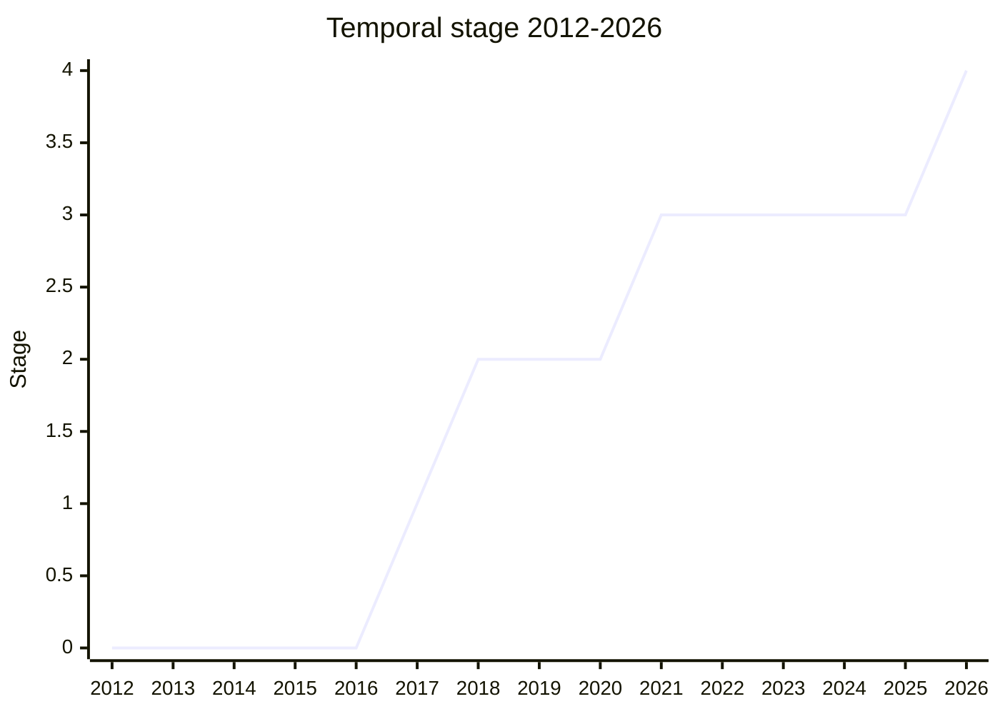

## Overview

Temporal is a new standard API for dates and times, replacing JavaScript's `Date` object. `Date` has long had many problems: it is mutable, timezone handling is ambiguous, parsing behavior is inconsistent, and months are 0-based. Temporal addresses these head-on by providing a set of immutable objects and by clearly separating concepts such as "exact time," "wall-clock time," and "duration" into distinct types.

The design started from Java's JodaTime / java.time, and the original proposal was championed by a Moment maintainer (the original champion is [MPT](../people/MPT.md) = Maggie Pint). It has types such as `Temporal.Instant`, `Temporal.PlainDate`, `Temporal.PlainDateTime`, `Temporal.ZonedDateTime`, and `Temporal.Duration`, and is characterized by a very large API surface. All nondeterministic information, such as the current time, is isolated in `Temporal.Now`, with the design invariant that everything reachable from any other root is deterministic.

Temporal is one of the largest proposals in TC39 history, and its champion group, at 9 to 10 people, was also among the largest. It took about nine years from reaching Stage 1 (2017-03) to reaching Stage 4 (2026-03), and it spans both ECMA-262 and ECMA-402.

## Stage history

| Meeting                                                                             | What happened                                                                                                                                                                                                                                                                                                                    | Stage             |
| ----------------------------------------------------------------------------------- | -------------------------------------------------------------------------------------------------------------------------------------------------------------------------------------------------------------------------------------------------------------------------------------------------------------------------------- | ----------------- |
| [2017-03](https://github.com/tc39/notes/blob/main/meetings/2017-03/mar-23.md)       | [MPT](../people/MPT.md) proposed it as "Date Proposal - NodaTime as a built-in Module" and it reached Stage 1                                                                                                                                                                                                                    | → 1               |
| [2018-09](https://github.com/tc39/notes/blob/main/meetings/2018-09/sept-27.md)      | Reached Stage 2. Approved after cutting back `valueOf` and `Now`                                                                                                                                                                                                                                                                 | 1 → 2             |
| [2021-03](https://github.com/tc39/notes/blob/main/meetings/2021-03/mar-9.md)        | [PFC](../people/PFC.md) requested Stage 3. Withdrew making `Calendar.from()`/`TimeZone.from()` observable                                                                                                                                                                                                                        | 2 → 3 (continued) |
| [2021-03](https://github.com/tc39/notes/blob/main/meetings/2021-03/mar-10.md)       | Discussion continued and it reached Stage 3. Conditional on not shipping unflagged until the IETF finalizes                                                                                                                                                                                                                      | 2 → 3             |
| [2024-02](https://github.com/tc39/notes/blob/main/meetings/2024-02/feb-6.md)        | Four normative fixes agreed on consensus: week numbering made optional for non-ISO calendars (PR #2756), a duration-rounding bug (PR #2758), more useful results from date differences in end-of-month edge cases (PR #2759), and a ZonedDateTime-differences bug (PR #2760). Champions: no further known outstanding bugs       | 3 (kept)          |
| [2024-04](https://github.com/tc39/notes/blob/main/meetings/2024-04/april-08.md)     | Normative bugfix agreed: rounding a `ZonedDateTime` to the nearest day could add an extra day across DST changes. Complexity-reduction concerns aired ([SYG](../people/SYG.md) on V8's code-size/maintenance worry; user-defined calendars and `relativeTo` as candidate cuts) ahead of the June scope reduction                 | 3 (kept)          |
| [2024-06](https://github.com/tc39/notes/blob/main/meetings/2024-06/june-12.md)      | Scope reduction. Removed about 96 functions (about 1/3 of the whole), including custom calendars/time zones                                                                                                                                                                                                                      | 3 (kept)          |
| [2025-02](https://github.com/tc39/notes/blob/main/meetings/2025-02/february-18.md)  | Normative change agreed ([PFC](../people/PFC.md), PR #3054): creating a `PlainMonthDay` in a non-ISO calendar outside the supported `PlainDate` range throws RangeError (ISO 8601 stays permissive, as it is fully specified). Status: Firefox Nightly enabled (pref flipped), MDN docs complete, SpiderMonkey near 100% Test262 | 3 (kept)          |
| [2025-04](https://github.com/tc39/notes/blob/main/meetings/2025-04/april-14.md)     | Reported as scheduled to ship in Firefox 139. "Shippable while still at Stage 3"                                                                                                                                                                                                                                                 | 3 (kept)          |
| [2025-05](https://github.com/tc39/notes/blob/main/meetings/2025-05/may-28.md)       | Status update: shipped in Firefox the day before (SpiderMonkey at ~99% Test262 conformance; V8 temporarily down while swapping its implementation for `temporal_rs`). Consensus on a normative change to UTC offset matching: optional seconds in an offset, when present, must match exactly (else RangeError)                  | 3 (kept)          |
| [2025-07](https://github.com/tc39/notes/blob/main/meetings/2025-07/july-28.md)      | Consensus on a normative PR ([NRO](../people/NRO.md) for [PFC](../people/PFC.md)): reorder the get / cast / validate of options-bag properties (the `until` methods, `durationToString`) to match V8's implementation. Observable effect: errors may be delayed and getters triggered differently                                | 3 (kept)          |
| [2025-09](https://github.com/tc39/notes/blob/main/meetings/2025-09/september-23.md) | Consensus on a normative fix for a sign-flip bug at DST transitions in `ZonedDateTime` difference arithmetic and `Duration`'s `round` / `total` (a regression from a refactor about two years earlier, reported by user Patrick Hensley)                                                                                         | 3 (kept)          |
| [2026-03](https://github.com/tc39/notes/blob/main/meetings/2026-03/march-11.md)     | Reached Stage 4. Splitting the spec document and a dedicated TG deferred for now                                                                                                                                                                                                                                                 | 3 → 4             |

```mermaid
xychart-beta
    title "Temporal stage 2012-2026"
    x-axis [2012, 2013, 2014, 2015, 2016, 2017, 2018, 2019, 2020, 2021, 2022, 2023, 2024, 2025, 2026]
    y-axis "Stage" 0 --> 4
    line [0, 0, 0, 0, 0, 1, 2, 2, 2, 3, 3, 3, 3, 3, 4]
```

> X-axis = the full span covered by the notes (2012-2026); y-axis = Stage. Each point is the stage at year-end, shown stacked from the bottom. Stage 1 in 2017-03, Stage 2 in 2018-09, Stage 3 in 2021-03, Stage 4 in 2026-03. Years before the proposal existed (2012-2016) are 0. Temporal moved from 2 to 3 before the Stage 2.7 process was introduced (2023), so it never passed through a fractional stage.

## Main issues

### Now / isolating nondeterminism (the System object debate)

At Stage 2 (2018-09), how to handle nondeterministic APIs such as reading the current time was a major dispute. [MM](../people/MM.md) argued that, as with WeakRefs and getStack, sources of nondeterminism should be gathered in one place and introduced in a form (something like a System object) that lets earlier code defend itself against later code. [DD](../people/DD.md) countered: "The dream of collecting into a System object all the nondeterminism everyone dislikes will not come true. Hosts will not use System. It does not scale." Temporal settled on isolating the current time in `Temporal.Now`. At Stage 3 (2021-03), [MM](../people/MM.md) supported it after confirming that "dynamically changing information is well-quarantined on a separate property of the root."

### IDL / how the spec is written (WebIDL vs JSIDL)

This was discussed on a **separate agenda item, "IDL for JavaScript"** (presenter [DE](../people/DE.md)), at the same 2018-09 meeting as Temporal's Stage 2. It was not a deliberation of Temporal itself, but it was related as the question of which IDL should describe a large API like Temporal (use WebIDL, or create a "JSIDL" aimed at JS). [WH](../people/WH.md) was concerned that "the IDL specification itself is complex, and depending on an external standard risks a circular reference with the ECMAScript specification." [JHD](../people/JHD.md) opposed it, saying it would be hard to review a normative change on the order of 30,000 lines introduced only to fit an IDL, and the committee settled on proceeding step by step.

### subclassing / @@species

At Stage 3 (2021-03), [SYG](../people/SYG.md) pointed out that Temporal's design mixes a simple string protocol with species-based subclassing and is "muddled." He also said this is not the champions' fault — JS's subclassing design itself is muddled — and that he did not want to stop Temporal over this large unsolved problem, so he did not block. [JHD](../people/JHD.md) proposed making this the first built-in without species, and that if `new.target` is not an intrinsic it should throw and actively close off subclassing. [DE](../people/DE.md) said Temporal is only following current convention, and anyone who wants to change the convention should propose that separately. The committee agreed to address it after Stage 3 via the remove-subclassable-builtins proposal.

### ISO 8601 extended syntax and parallel standardization with the IETF

At Stage 3, extended syntax for time zone annotations (`[...]`) and calendar annotations, being turned into an RFC in parallel at the IETF, became an issue. [RGN](../people/RGN.md) worried: "Stage 3 is a shipping signal. If implementations ship and the RFC later changes the syntax, the proposed syntax and the finalized standard will coexist and get locked in." [USA](../people/USA.md) proposed not shipping unflagged until the RFC is finalized (then expected in July 2021), and [RGN](../people/RGN.md) agreed (it was later standardized as RFC 9557).

### compare() and how calendars are treated

At Stage 3, [KG](../people/KG.md) objected to `compare()` ordering two dates that are the same instant but have different calendars by dictionary order of calendar ID. He argued: "Now that `Array.prototype.sort` is stable, it is fine for `compare()` to return zero even when `equals()` is false. Calendars should not be used for ordering." The champions ([PFC](../people/PFC.md)) were cautious, treating it as something the champion group had already agreed, but [KG](../people/KG.md) asked for a reconsideration because the discussion had rested on a wrong premise (that if compare returns 0, the values ought to be conceptually equal).

### Scope reduction (removing custom calendars/time zones, and user-code callouts)

2024-06 was the largest issue. [JGT](../people/JGT.md) explained that they had received strong feedback from Google, Apple, and Mozilla that Temporal is too big, and that the pressure comes from outside ECMAScript, from people responsible for low-spec devices such as Apple Watch and Android. [SYG](../people/SYG.md) gave a prepared statement on behalf of V8:

> ([SYG](../people/SYG.md)) V8 strongly supports this scope reduction and thanks the champions for being so open to simplifying this late in the process.

In particular, **custom calendars / custom time zones that involve callouts into user code** were a heavy concern on the implementation side. The result was consensus to remove the `Temporal.Calendar` / `Temporal.TimeZone` classes and user-defined calendars/time zones, `getISOFields()`, various conversion methods, `relativeTo` on `Duration.add`, and so on, cutting **about 96 functions (about 300 down to about 200)**. Custom calendars were left only as built-in string identifiers, with room to reintroduce them later in a design that is not reentrant.

The following was recorded at the time:

- Merging the `valueOf` / `toJSON` function objects was carried over, pending implementation confirmation from Mozilla ([ABL](../people/ABL.md)).
- Removing `subtract()` / `since()` did not reach consensus.
- [JHD](../people/JHD.md) said it is important to have reified Calendar/TimeZone objects (avoid a stringly-typed API so features can be added later) and left this as an issue for a future proposal.
- [SBE](../people/SBE.md) treated user time zones as an important use case and recommended adding them back in an iCalendar data model.
- [JHD](../people/JHD.md) commented that complexity and code size could have been evaluated much earlier (though this was not a discussion of changing stage).

### Integration with Intl (non-Gregorian calendars)

[TST](../people/TST.md) had been concerned from early on about insufficient integration with Intl.DateTimeFormat. Custom calendars not being integrated with Intl (formatting with a custom calendar throws) was also one cause of the scope reduction, and [SFC](../people/SFC.md) said CLDR is enough for most use cases. Locale-dependent behavior of era / month code was worked out in parallel in the separate proposal `intl-era-month-code` (2025-04, 2026-03).

### Splitting the specification and a dedicated TG (at Stage 4)

At Stage 4 (2026-03) there was no objection to the proposal itself (nobody defended Date; it was unanimous). The issue was rather how to publish the specification. The editors ([MF](../people/MF.md)) proposed a separate standard plus a dedicated TG (something like TG2), in order to retain specialists, but [JHD](../people/JHD.md) strongly opposed this: splitting is the wrong direction; find-in-page in a single document is valuable, and it should not be scattered the way the HTML specification is; document structure and expert groups are unrelated. [CDA](../people/CDA.md) also pushed back, saying a TG does not guarantee that specialists are retained. The conclusion was that Temporal would **for now neither become a separate specification nor get a dedicated TG** (to be revisited within one year). The same discussion also raised the possibility of splitting out RegExp.

## Related proposals

- [Intl Era/Month Code](intl-era-month-code.md) — locale-dependent behavior of era / month code. Standardized on the ECMA-402 side in parallel with Temporal, and reached Stage 4 in 2026-03.

## Sources

- [2017-03 mar-23](https://github.com/tc39/notes/blob/main/meetings/2017-03/mar-23.md) — [MPT](../people/MPT.md) presented it as "Date Proposal - NodaTime as a built-in Module" and it reached Stage 1
- [2018-09 sept-27](https://github.com/tc39/notes/blob/main/meetings/2018-09/sept-27.md) — Reached Stage 2. Discussion of Now / nondeterminism (the System object) and of IDL
- [2021-03 mar-9](https://github.com/tc39/notes/blob/main/meetings/2021-03/mar-9.md) — Request for Stage 3. Withdrew the monkeypatch; subclassing/species; ISO 8601 extensions and the IETF; compare()
- [2021-03 mar-10](https://github.com/tc39/notes/blob/main/meetings/2021-03/mar-10.md) — Discussion continued and it reached Stage 3 (conditional on unflagged shipping)
- [2024-02 feb-6](https://github.com/tc39/notes/blob/main/meetings/2024-02/feb-6.md) — Four normative fixes on consensus (PRs #2756 / #2758 / #2759 / #2760)
- [2024-04 april-08](https://github.com/tc39/notes/blob/main/meetings/2024-04/april-08.md) — DST rounding bugfix (consensus); complexity-reduction concerns ahead of the scope reduction
- [2024-06 june-12](https://github.com/tc39/notes/blob/main/meetings/2024-06/june-12.md) — Scope reduction. Removed custom calendars/time zones; cut about 96 functions
- [2025-02 february-18](https://github.com/tc39/notes/blob/main/meetings/2025-02/february-18.md) — Normative change on `PlainMonthDay` in non-ISO calendars (PR #3054, consensus); Firefox Nightly enabled
- [2025-04 april-14](https://github.com/tc39/notes/blob/main/meetings/2025-04/april-14.md) — Scheduled to ship in Firefox 139; reported as "shippable while still at Stage 3"
- [2025-05 may-28](https://github.com/tc39/notes/blob/main/meetings/2025-05/may-28.md) — Firefox ship confirmed; normative change to UTC offset matching (consensus)
- [2025-07 july-28](https://github.com/tc39/notes/blob/main/meetings/2025-07/july-28.md) — Normative PR on options-bag get / cast / validate ordering (consensus)
- [2026-03 march-11](https://github.com/tc39/notes/blob/main/meetings/2026-03/march-11.md) — Reached Stage 4. Splitting the spec and a dedicated TG deferred for now
