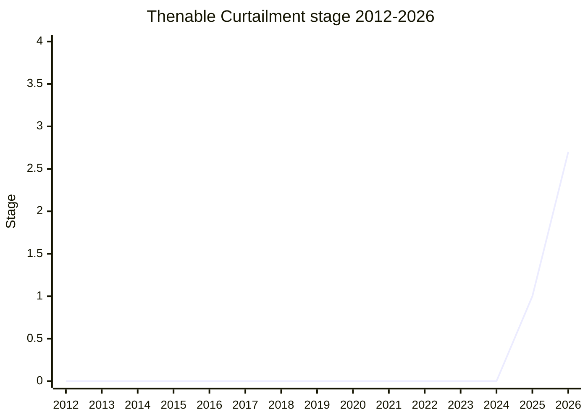

## 概要

Thenable Curtailment(旧称 Curtailing the power of "Thenables")は、**user code を走らせずに Promise を resolve できる仕組み**を導入する提案です。`then` property を持つ object(thenable)は Promise resolution で特別扱いされ、lookup は prototype chain を `Object.prototype` まで遡ります。このため `Object.prototype.then` に getter を仕込むなどの手口で、ブラウザ実装(WebIDL の dictionary → JS object 変換など)が「script を実行するはずのない場所」で user code を実行してしまう脆弱性が繰り返し発生してきました(spec 自体の CVE も 2024 年に発生)。

解は新しい抽象操作 **`SafePromiseResolve`**: resolve しようとする値が「user code を走らせうる」場合(Proxy が絡む、`then` が getter、ordinary object と異なる internal method を持つ等)に限り 1 tick 遅延させ、それ以外は通常どおり resolve します。最終的な狙いは WebIDL の Promise resolve steps にこれを採用させ、web platform 全体で thenable 経由の攻撃面を塞ぐことです。champion は [MAG](../people/MAG.md)(Mozilla)。Firefox には about:config フラグ付きのプロトタイプが存在します。

## ステージ遷移

| 会合                                                       | できごと                                                                                                                                                      | Stage   |
| ---------------------------------------------------------- | ------------------------------------------------------------------------------------------------------------------------------------------------------------- | ------- |
| [2025-02](../../raw/notes/meetings/2025-02/february-18.md) | 問題提起(`[[InternalProto]]` slot 案 + Firefox telemetry)。**Stage 1**。[MAH](../people/MAH.md) が「同期 reentrancy 全般」への一般化を要望                    | 0 → 1   |
| [2025-07](../../raw/notes/meetings/2025-07/july-29.md)     | 「How to make thenables safer?」として設計議論([続き](../../raw/notes/meetings/2025-07/july-30.md) は day 3)                                                  | 1       |
| [2026-03](../../raw/notes/meetings/2026-03/march-12.md)    | SafeResolve 方式へ転換。全 WPT がほぼ pass する実験結果を提示し **Stage 2**。userland への公開は resolve 関数の第 2 引数案([KG](../people/KG.md))を調査       | 1 → 2   |
| [2026-05](../../raw/notes/meetings/2026-05/may-20.md)      | status update(2.7 を狙ったが準備未了)。security bug は「前回話した後にも増えた」                                                                              | 2       |
| [2026-07](../../raw/notes/meetings/2026-07/july-20.md)     | 2.7 要求。TypedArray まで penalize する過剰さが争点になり、[KG](../people/KG.md) の host hook 案を宿題に continuation へ                                      | 2       |
| [2026-07](../../raw/notes/meetings/2026-07/july-22.md)     | host hook(既定 false、hook 自体は user code 実行禁止)の spec text を提示し **Stage 2.7 に consensus**([MM](../people/MM.md)/[JHD](../people/JHD.md) 明示支持) | 2 → 2.7 |

> 横軸=2012-2026、縦軸=Stage。2025-02 に Stage 1、2026-03 に Stage 2、2026-07 に Stage 2.7。前史として `Symbol.thenable`(2018-05 Stage 1 → 2023-09 withdrawn)という別提案が同じ問題圏を扱っていた。

## 主な論点

### `Object.prototype` を exotic にするか、resolution 側を変えるか

Stage 1 時点の候補は (a) `Object.prototype` を exotic 化して `then` の定義を拒否する、(b) 一部の resolution で thenable を無視する、(c) spec 定義の prototype に `[[InternalProto]]` slot を与えて lookup を止める、の 3 案でした。[MAG](../people/MAG.md) は engine 実装者として

> `Object.prototype` は極めて重要な object で、exotic にするのは間違ったアプローチに感じる

と (a) に否定的で、最終的には「resolve する値が危険かを判定して遅延する」SafeResolve 方式(2026-03)に収斂しました。Firefox telemetry では標準 prototype から `then` を拾うページが 0.13% 存在し、[MAG](../people/MAG.md) 自身「期待より 1 桁多い」と述べています。

### 互換性と tick 数の変化

SafeResolve は危険な値に対してのみ microtask tick を追加するため、resolution 順序への依存があると壊れます。2026-03 に [MAG](../people/MAG.md) は全 C++ resolution 経路に適用して WPT を走らせ「fail したのは resolution timing を観測する 8-9 件のみ」と報告。[SHS](../people/SHS.md) は tick 数に依存するテストの移行の脆さを指摘しましたが blocker とはしませんでした。[MM](../people/MM.md) は re-resolve 競合を防ぐ「新 state を足すのではなく spec 内部 Promise へ forward する」定式化を提案しています。

### TypedArray を巻き込む過剰判定と host hook(2026-07)

「ordinary object と異なる `[[GetPrototypeOf]]` / `[[GetOwnProperty]]` を持つ object は危険側に倒す」という [NRO](../people/NRO.md) レビュー対応の書き方だと、TypedArray(fetch の `.bytes()` など Promise で頻繁に返る)まで遅延対象になる過剰さがありました。[KG](../people/KG.md) は

> host に「これは user code を走らせるか」を尋ねる host hook にすればよい。既定実装は false を返し、実際にそんな object を持つ host はまず無い

と提案し、[JRL](../people/JRL.md) は「これは既知の security 脆弱性で、TypedArray の差は実質 observable でない。2 ヶ月遅らせるべきでない」と即時 advancement を主張。折衷として Day 3 の continuation で host hook 入りの spec text(editors / reviewers の sign-off 済み)を確認して 2.7 に至りました。[MM](../people/MM.md) の「hook を誤実装した host は spec 非準拠か」という確認には、normative であり非準拠になると整理されています。

### userland への公開

user code からも安全な resolve を使いたいという要望([MF](../people/MF.md) / [KG](../people/KG.md))に対し、命名の難しさ(「safe from what?」)から、Stage 2 時点では [KG](../people/KG.md) の「resolver 関数の第 2 引数を使う(新しい名前が不要)」案が有力とされ、[MAG](../people/MAG.md) が調査を引き取りました。2026-07 時点では user 向け opt-in は分離され、まず platform 側の修正に集中しています。

## 関連提案

- [Dynamic Code Brand Checks](../proposals/dynamic-code-brand-checks.md) — 同じく web platform の security 問題(Trusted Types)を 262 側の hook で支える隣接提案。
- `symbol-thenable` — 2018 年の別アプローチ(`Symbol.thenable` で opt-out)。2023-09 に withdrawn。

## 出典

- [2025-02 february-18](../../raw/notes/meetings/2025-02/february-18.md) — Stage 1 到達
- [2025-07 july-29](../../raw/notes/meetings/2025-07/july-29.md) / [july-30](../../raw/notes/meetings/2025-07/july-30.md) — How to make thenables safer?
- [2026-03 march-12](../../raw/notes/meetings/2026-03/march-12.md) — Stage 2 到達(SafeResolve 方式)
- [2026-05 may-20](../../raw/notes/meetings/2026-05/may-20.md) — status update
- [2026-07 july-20](../../raw/notes/meetings/2026-07/july-20.md) — 2.7 要求(host hook 化を宿題に持ち越し)
- [2026-07 july-22](../../raw/notes/meetings/2026-07/july-22.md) — Stage 2.7 到達
