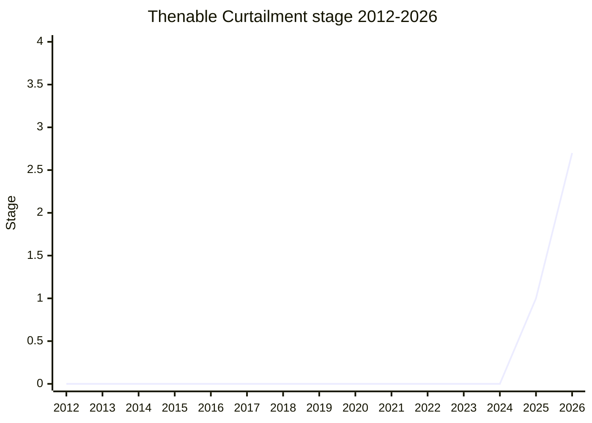

## Overview

Thenable Curtailment (formerly Curtailing the power of "Thenables") introduces **a way to resolve a Promise without running user code**. An object with a `then` property (a thenable) is special-cased during Promise resolution, and the lookup walks the prototype chain up to `Object.prototype`. Because of that, attacks such as installing a getter on `Object.prototype.then` have repeatedly caused browser implementations (WebIDL dictionary-to-JS-object conversion, and the like) to run user code in places that are not supposed to execute script (a CVE in the spec itself also occurred in 2024).

The solution is a new abstract operation, **`SafePromiseResolve`**: only when the value about to be resolved "might run user code" (a Proxy is involved, `then` is a getter, it has internal methods that differ from an ordinary object, and so on) does it delay by one tick; otherwise it resolves as usual. The ultimate aim is to have WebIDL's Promise resolve steps adopt this, closing the thenable attack surface across the web platform. The champion is [MAG](../people/MAG.md) (Mozilla). Firefox has a prototype behind an about:config flag.

## Stage history

| Meeting                                                    | What happened                                                                                                                                                                                                                            | Stage   |
| ---------------------------------------------------------- | ---------------------------------------------------------------------------------------------------------------------------------------------------------------------------------------------------------------------------------------- | ------- |
| [2025-02](../../raw/notes/meetings/2025-02/february-18.md) | Raised the problem (an `[[InternalProto]]` slot proposal, plus Firefox telemetry). **Stage 1**. [MAH](../people/MAH.md) asked to generalize it to "synchronous reentrancy in general"                                                    | 0 → 1   |
| [2025-07](../../raw/notes/meetings/2025-07/july-29.md)     | Design discussion as "How to make thenables safer?" ([continued](../../raw/notes/meetings/2025-07/july-30.md) on day 3)                                                                                                                  | 1       |
| [2026-03](../../raw/notes/meetings/2026-03/march-12.md)    | Switched to the SafeResolve approach. Presented experiment results in which nearly all WPT pass, and reached **Stage 2**. Exposing it to userland: investigate [KG](../people/KG.md)'s idea of a second argument on the resolve function | 1 → 2   |
| [2026-05](../../raw/notes/meetings/2026-05/may-20.md)      | Status update (aimed for 2.7, but not ready). Security bugs "have increased even since we last talked"                                                                                                                                   | 2       |
| [2026-07](../../raw/notes/meetings/2026-07/july-20.md)     | Requested 2.7. The excess of penalizing even TypedArrays became the issue, and [KG](../people/KG.md)'s host-hook idea was carried to continuation as homework                                                                            | 2       |
| [2026-07](../../raw/notes/meetings/2026-07/july-22.md)     | Presented spec text for the host hook (default false; the hook itself is forbidden from running user code) and **consensus for Stage 2.7** ([MM](../people/MM.md)/[JHD](../people/JHD.md) in explicit support)                           | 2 → 2.7 |

```mermaid
xychart-beta
    title "Thenable Curtailment stage 2012-2026"
    x-axis [2012, 2013, 2014, 2015, 2016, 2017, 2018, 2019, 2020, 2021, 2022, 2023, 2024, 2025, 2026]
    y-axis "Stage" 0 --> 4
    line [0, 0, 0, 0, 0, 0, 0, 0, 0, 0, 0, 0, 0, 1, 2.7]
```

> Horizontal axis = 2012-2026, vertical axis = Stage. Stage 1 in 2025-02, Stage 2 in 2026-03, Stage 2.7 in 2026-07. As prehistory, a separate proposal, `Symbol.thenable` (Stage 1 in 2018-05, withdrawn in 2023-09), covered the same problem area.

## Main issues

### Make `Object.prototype` exotic, or change resolution

At Stage 1 there were three candidates: (a) make `Object.prototype` exotic and reject defining `then`; (b) ignore thenables in some resolutions; (c) give spec-defined prototypes an `[[InternalProto]]` slot and stop the lookup there. As an engine implementer, [MAG](../people/MAG.md) was against (a):

> `Object.prototype` is an extremely important object, and making it exotic feels like the wrong approach.

It ultimately converged on the SafeResolve approach (2026-03): judge whether the value being resolved is dangerous, and delay if so. Firefox telemetry showed that 0.13% of pages pick up `then` from a standard prototype, which [MAG](../people/MAG.md) himself called "an order of magnitude more than expected."

### Compatibility and changes in tick count

SafeResolve adds a microtask tick only for dangerous values, so anything that depends on resolution order can break. In 2026-03 [MAG](../people/MAG.md) applied it to every C++ resolution path, ran WPT, and reported that "the only failures were the 8 or 9 tests that observe resolution timing." [SHS](../people/SHS.md) pointed out how fragile it is to migrate tests that depend on tick count, but did not make it a blocker. [MM](../people/MM.md) proposed a formulation that prevents re-resolve races by forwarding to an internal spec Promise rather than adding a new state.

### Over-penalizing TypedArray, and the host hook (2026-07)

Written to address [NRO](../people/NRO.md)'s review — an object whose `[[GetPrototypeOf]]` / `[[GetOwnProperty]]` differ from an ordinary object falls on the dangerous side — the check was overly broad, so even TypedArrays (which Promises often return, such as fetch's `.bytes()`) became subject to the delay. [KG](../people/KG.md) proposed:

> Make it a host hook that asks the host "does this run user code?" The default implementation returns false, and almost no host actually has such an object.

[JRL](../people/JRL.md) argued for immediate advancement: this is a known security vulnerability, the TypedArray difference is not practically observable, and it should not be delayed by two months. As a compromise, the Day 3 continuation confirmed spec text that includes the host hook (already signed off by the editors and reviewers) and reached 2.7. To [MM](../people/MM.md)'s check — is a host that mis-implements the hook non-conformant? — it was settled that the hook is normative, so such a host would be non-conformant.

### Exposing it to userland

Against the request to let user code use a safe resolve as well ([MF](../people/MF.md) / [KG](../people/KG.md)), the difficulty of naming ("safe from what?") made [KG](../people/KG.md)'s idea — use a second argument on the resolver function, so no new name is needed — the leading option at Stage 2, and [MAG](../people/MAG.md) took on investigating it. As of 2026-07 the user-facing opt-in has been split off, and the focus is first on the platform-side fix.

## Related proposals

- [Dynamic Code Brand Checks](../proposals/dynamic-code-brand-checks.md) — an adjacent proposal that likewise supports a web-platform security problem (Trusted Types) with a hook on the 262 side.
- `symbol-thenable` — a separate 2018 approach (opt out via `Symbol.thenable`). Withdrawn in 2023-09.

## Sources

- [2025-02 february-18](../../raw/notes/meetings/2025-02/february-18.md) — Reached Stage 1
- [2025-07 july-29](../../raw/notes/meetings/2025-07/july-29.md) / [july-30](../../raw/notes/meetings/2025-07/july-30.md) — How to make thenables safer?
- [2026-03 march-12](../../raw/notes/meetings/2026-03/march-12.md) — Reached Stage 2 (the SafeResolve approach)
- [2026-05 may-20](../../raw/notes/meetings/2026-05/may-20.md) — status update
- [2026-07 july-20](../../raw/notes/meetings/2026-07/july-20.md) — requested 2.7 (the host-hook change carried over as homework)
- [2026-07 july-22](../../raw/notes/meetings/2026-07/july-22.md) — Reached Stage 2.7
