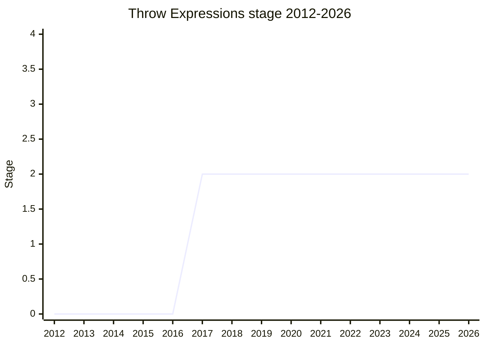

## Overview

`throw` in expression positions: parameter initializers, the branches of a conditional, the right-hand side of `||` / `??`, arrow function bodies - `() => throw new Error()`. Today throwing requires a statement, so the workarounds are clunky: an IIFE, a helper function like `function throwIf(cond, msg) { if (cond) throw new Error(msg) }`, or `Error.throw(...)`-style static methods. The proposal lets the existing `throw` keyword appear wherever an expression can, with the value being convenience plus two things a helper function cannot provide:

- **Debugging experience** - you can pause at the point of the throw. With a helper function you end up paused inside the thrower and have to step out, and stack traces carry an extra frame.
- **Static analysis** - a syntax form is visible to TypeScript-style control-flow analysis at parse time, whereas a never-returning function call is too expensive to track in expression position (see the issues below).

The proposal itself is small, but it has been blocked almost continuously since 2018 - first by its overlap with do expressions, then, after that block was lifted in 2023-07, by syntax questions of its own: the precedence difference between `throw` as a statement and as an expression, and ASI hazards around the punctuation ban that avoids the ambiguity. As of 2024-02 it remains at Stage 2 with three competing grammar options and an unresolved syntax-vs-helper-function dispute with Agoric.

## Stage history

| Meeting                                                                             | What happened                                                                                                                                                                                                                                                                      | Stage |
| ----------------------------------------------------------------------------------- | ---------------------------------------------------------------------------------------------------------------------------------------------------------------------------------------------------------------------------------------------------------------------------------- | ----- |
| [2017-07](https://github.com/tc39/notes/blob/main/meetings/2017-07/jul-27.md)       | Presented by [RBN](../people/RBN.md) and reached Stage 1, with the conclusion "explore the space of turning statements into expressions" - the committee, concerned about overlap with do expressions, asked for the broader statements-as-expressions investigation               | → 1   |
| [2017-09](https://github.com/tc39/notes/blob/main/meetings/2017-09/sept-27.md)      | Reached Stage 2                                                                                                                                                                                                                                                                    | 1 → 2 |
| [2017-11](https://github.com/tc39/notes/blob/main/meetings/2017-11/nov-28.md)       | Stage 3 reviewers requested (Till Schneidereit and Keith Cirkel)                                                                                                                                                                                                                   | 2     |
| [2018-01](https://github.com/tc39/notes/blob/main/meetings/2018-01/jan-24.md)       | Stage 3 ask. [WH](../people/WH.md) had reviewed and was fine with it, but [KG](../people/KG.md) held it pending the do-expressions discussion. No promotion                                                                                                                        | 2     |
| [2023-09](https://github.com/tc39/notes/blob/main/meetings/2023-09/september-26.md) | Stage 3 ask after the 2023-07 stale-proposal review lifted the do-expressions block. Blocked by syntax questions: the statement/expression precedence difference, whether to ban a following comma, and [WH](../people/WH.md)'s ASI hazard. Remained at Stage 2 with no conclusion | 2     |
| [2023-09](https://github.com/tc39/notes/blob/main/meetings/2023-09/september-28.md) | Continued. Two alternatives presented (static-semantics rules vs mandatory parentheses); [WH](../people/WH.md) objected to the first and neither gained consensus. Conclusion: "remains at Stage 2 with no conclusion on syntax questions"                                         | 2     |
| [2024-02](https://github.com/tc39/notes/blob/main/meetings/2024-02/feb-8.md)        | Update (agenda asked for "update or stage 2.7"; stayed update-only). Three syntax options laid out; Agoric argued for a helper function instead of new syntax; consensus to keep exploring the grammar with the editors while investigating a static `Error.throw`-style method    | 2     |

> X-axis = the full span covered by the notes (2012-2026); y-axis = Stage. Each point is the stage at year-end, shown stacked from the bottom. Stage 1 in 2017-07 and Stage 2 in 2017-09 (both in the same year, so 2017 plots as 2), and flat at Stage 2 ever since - blocked from 2018-01 by do expressions, and from 2023-09 by its own syntax questions.

## Main issues

### Overlap with do expressions (the five-year block)

At Stage 1 (2017-07) the committee's acceptance was conditioned on exploring statements-as-expressions broadly, because do expressions (championed by Dave Herman, with [RBN](../people/RBN.md) collaborating) seemed to cover similar ground. The block held at the 2018-01 Stage 3 ask:

> ([KG](../people/KG.md)) I don't want to move this to stage 3 without having that discussion, I'm not yet convinced this is worth adding to the language if we had "do" expressions.

[YK](../people/YK.md) objected that do expressions' champion did not consider them obviating, but the proposal stalled anyway. The unblock came only from the 2023-07 "reviewing proposals that haven't been discussed in a while" session, which decided do expressions were no longer blocking. Asked at 2023-09 whether do was still alive, [KG](../people/KG.md) said "they are not dead. But they are generally not considered an alternative by most of the people in the committee."

### Statement vs expression precedence (UnaryExpression and the punctuation ban)

The core syntax question. A `throw` statement consumes a full expression (`throw 1, 2` evaluates `1` and throws `2`), so an expression form at expression-level precedence would change what `throw x` means depending on context. The champion's choice is **UnaryExpression** precedence (like `void`/`delete`), which covers the predominant cases (`throw new Error(...)`, `x ?? throw new Error(...)`) without parentheses - and to keep statement and expression forms visibly consistent, a lookahead ban on the infix punctuators that would otherwise attach ambiguously (`?`, `:`, `,`, and the arithmetic heads), so `cond ? throw a : b` is legal but `throw a ? b : c` in the head of a conditional requires parentheses.

[RGN](../people/RGN.md) supported the parenthesization fix, comparing it to the exponentiation operator: requiring parentheses "where a human could be confused, is a very good fix that we support wholeheartedly." The comma case split the room: [NRO](../people/NRO.md) preferred not banning a following comma (nobody writes comma expressions by hand, and the ban forces parentheses on parameter defaults), while [KG](../people/KG.md) and [RBN](../people/RBN.md) defended the ban on behalf of people reading minified code, where `throw a, b` sequences are common. [KG](../people/KG.md): "I really think it's a bad idea to have the same key word have different precedence, depending on what position it's in."

### [WH](../people/WH.md)'s ASI hazard and the demand for a simple precedence

At 2023-09 [WH](../people/WH.md) found that the punctuation-ban approach makes line breaks semantically significant:

> ([WH](../people/WH.md)) My concern is that this proposal makes line breaks significant for arithmetic operators, which will behave differently depending on if they are surrounded by line breaks or not. This is significant violence to do to the core ECMAScript functionality.

In `a = throw b - c`, ASI inserts a semicolon before a line-broken `-`, and `/` at a line start parses as a regex. [RBN](../people/RBN.md) came back with two alternatives: (1) keep UnaryExpression precedence and handle the ASI cases with three static-semantics rules, the same mechanism optional chaining already uses, or (2) keep UnaryExpression but require parentheses around the whole throw expression. [WH](../people/WH.md) rejected both as over-complicated and objected to alternative 1 outright, offering his own simple options: bare unary `throw` (his preference), a magic function `throw(expr)`, or `(throw expr)` with full expression precedence inside. The deeper disagreement is about what "simple" means:

> ([WH](../people/WH.md)) The rules are too complicated. I want just a single - a simple precedence for throw.

> ([KG](../people/KG.md)) I think simple rules can have unintuitive outcomes and in particular, `throw A ? B : C` throwing A is so unintuitive that even though it follows from simple rules it is worse to have that experience than to make the rules more complicated.

[MM](../people/MM.md) added an invariant argument against [WH](../people/WH.md)'s function-expression analogy: a function declaration and a function expression keep the same call behavior, but prefixing a throw statement with something else completely changes what the throw consumes, so statement and expression forms of `throw` should keep the same meaning in legal programs. With [WH](../people/WH.md) objecting to alternative 1 and [MF](../people/MF.md)/[DLM](../people/DLM.md) asking for time on alternative 2, the session closed with no conclusion.

### Syntax vs a helper function (the Agoric position)

At 2024-02 [KKL](../people/KKL.md) stated Agoric's position:

> ([KKL](../people/KKL.md)) We strongly favor solving this problem without new syntax, given the price of new syntax. And that we find a helper function to be a tolerable solution and sidesteps much of the issues.

[RBN](../people/RBN.md)'s counterargument is that a helper gives up the proposal's two non-convenience benefits. For TypeScript, a `never`-returning call is only analyzed in statement position - descending into every expression to check for program termination is too expensive, so "syntax is extremely beneficial for TypeScript in this case because we don't require type analysis, we only can require analysis of the syntax" (an answer [MM](../people/MM.md) called "a surprise to me and new information"). A special-cased `Error.throw` would also break down the moment it is aliased, and debuggers would have to know the blessed function to give good breakpoints. [SYG](../people/SYG.md), checking on escape analysis, found the engine side a wash: after inlining, a built-in or small user helper "gets straightforwardly inlined as like a node in our IR that says throw and there's no difference between the statement and expression."

[MM](../people/MM.md) held firm: "we would not be willing to see this advanced as a syntax proposal. We would support exploration of helper function proposals," while remaining open to investigating the TypeScript and optimizer costs. The same session produced a side-debate in which [MM](../people/MM.md) called [WH](../people/WH.md)'s realtime syntax review an "emergency"-level committee resource ("I don't feel comfortable accepting any syntax proposal without seeing [WH](../people/WH.md)'s reaction to it"), which [DE](../people/DE.md) pushed back on as unfair to the rest of the committee's grammar reviewers.

### The three options and the path forward (2024-02)

[RBN](../people/RBN.md) laid out three ways forward, all keeping statement-expression consistency: (1) move `ThrowExpression` into the `Expression` production - parentheses required almost everywhere, but granularly relaxable per production; (2) allow it only inside a parenthesized expression - always parenthesized; (3) keep the current lookahead restriction plus the ASI fix (PR #18) - the champion's preference. [MF](../people/MF.md) argued option 1 dominates option 2 and that the whole framing is wrong:

> ([MF](../people/MF.md)) This is a false choice. The committee should be deciding which cases are important to write in which ways, and then leaving it up to the editors to figure out how to structure the grammar.

[NRO](../people/NRO.md) warned that options 1 and 2 are irreversible - "if we go with option 1 or option 2 we have parentheses forever", since once any expression is allowed inside `throw`, it can never be restricted back without breaking the web. [LCA](../people/LCA.md) defended option 3 on the grounds that the common cases (parameter defaults, `??` right-hand sides) should not need parentheses and "the spec is read by much fewer people than people that would read or write this code." The session's consensus (taken by [USA](../people/USA.md) on [RBN](../people/RBN.md)'s proposal): continue exploring the syntax with the editors along the UnaryExpression path - possibly a grammar formulation that avoids the lookahead - while investigating the static-method alternative with implementers, and return with conclusions. [RBN](../people/RBN.md) also floated a possible future extension: an expression-less `throw` for binding-less `catch` blocks, which a method form could not express.

## Related proposals

- `do-expressions` - the original blocker (2018-2023); its 2023-07 de-blocking is what let this proposal's own syntax questions surface (no page yet).
- ["Discard" (void) Bindings](discard-bindings.md) - fellow [RBN](../people/RBN.md) syntax proposal discussed in the same 2024-02 session.
- [Extractors](extractors.md) - [RBN](../people/RBN.md)'s other long-running Stage 2 syntax proposal, also blocked by grammar questions (ASI).

## Sources

- [2017-07 jul-27](https://github.com/tc39/notes/blob/main/meetings/2017-07/jul-27.md) - Stage 1 ([RBN](../people/RBN.md))
- [2017-09 sept-27](https://github.com/tc39/notes/blob/main/meetings/2017-09/sept-27.md) - Stage 2
- [2017-11 nov-28](https://github.com/tc39/notes/blob/main/meetings/2017-11/nov-28.md) - Stage 3 reviewers requested
- [2018-01 jan-24](https://github.com/tc39/notes/blob/main/meetings/2018-01/jan-24.md) - Stage 3 ask blocked by the do-expressions discussion
- [2023-09 september-26](https://github.com/tc39/notes/blob/main/meetings/2023-09/september-26.md) - Stage 3 ask after the do-block was lifted; precedence, comma, and [WH](../people/WH.md)'s ASI hazard
- [2023-09 september-28](https://github.com/tc39/notes/blob/main/meetings/2023-09/september-28.md) - Alternatives 1/2 rejected or deferred; remains at Stage 2
- [2024-02 feb-8](https://github.com/tc39/notes/blob/main/meetings/2024-02/feb-8.md) - Three options, the syntax-vs-helper-function dispute, consensus to keep exploring
