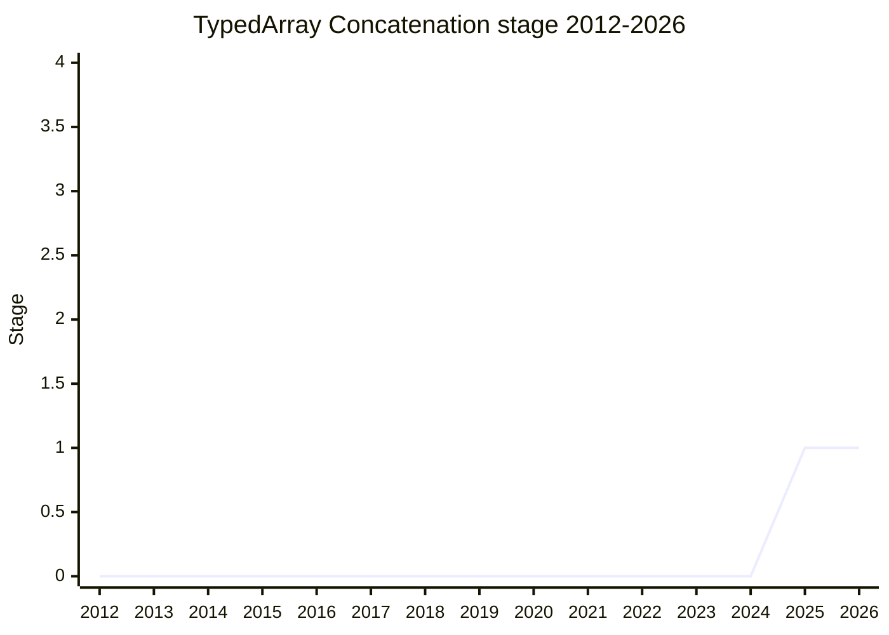

## Overview

Provides an optimizable way to concatenate multiple `TypedArray`s in a single operation. Today the choice is `TypedArray.prototype.set` with manual offset calculation (allocate, then copy piece by piece) or non-standard APIs like Node's `Buffer.concat` (the `BufferList` npm package alone sees 43M weekly downloads). The motivating case is accumulation in `WritableStream` pipelines, where concatenating chunks is common and expensive. The champion (James Snell, [JSL](../people/JSL.md)) stressed the problem statement is about enabling optimization - zero-copy / rope-style laziness is aspirational, not essential.

## Stage history

| Meeting                                                                            | What happened                                                                                  | Stage |
| ---------------------------------------------------------------------------------- | ---------------------------------------------------------------------------------------------- | ----- |
| [2025-11](https://github.com/tc39/notes/blob/main/meetings/2025-11/november-18.md) | First presented. **Conditional Stage 1** accepted, pending creation of the proposal repository | → 1   |
| [2026-03](https://github.com/tc39/notes/blob/main/meetings/2026-03/march-11.md)    | Updates (still Stage 1)                                                                        | 1     |

> Stage 1 (conditional) in 2025-11.

## Main issues

### Ropes and their performance cliffs (2025-11)

[OFR](../people/OFR.md) supported Stage 1 but objected to the "zero-copy" framing in the repository README: "I really don't want to guarantee that. I don't see a zero-copy version of this appearing in engines any time soon" - and noted engines already dislike ropes in strings because of performance cliffs on indexing/finding and imbalance in practice. [YSZ](../people/YSZ.md) raised memory-management concerns (large allocations, lifecycle visibility). The champion agreed the aspirational language would be removed, and [OFR](../people/OFR.md) acknowledged a real optimization opportunity (single allocation with correct size) remains.

### Naming and immutability (2025-11)

[MAH](../people/MAH.md) flagged Stage 2 concerns: `concat` is confusing because it is an instance method on strings but a static on `Buffer`, and the design should account for concatenations of immutable ArrayBuffers being born immutable (interacting with `Immutable ArrayBuffer`) rather than needing a `transferToImmutable` step. [WH](../people/WH.md) confirmed leaving the strategy (e.g. buffer doubling) to implementations.

## Related proposals

- `typedarray-find-within` - presented by the same champion in the same session.
- [Immutable ArrayBuffer](../proposals/immutable-arraybuffer.md) - [MAH](../people/MAH.md)'s Stage 2 concern about born-immutable concatenation ties in here.

## Sources

- [2025-11 november-18](https://github.com/tc39/notes/blob/main/meetings/2025-11/november-18.md) - conditional Stage 1
- [2026-03 march-11](https://github.com/tc39/notes/blob/main/meetings/2026-03/march-11.md) - updates
