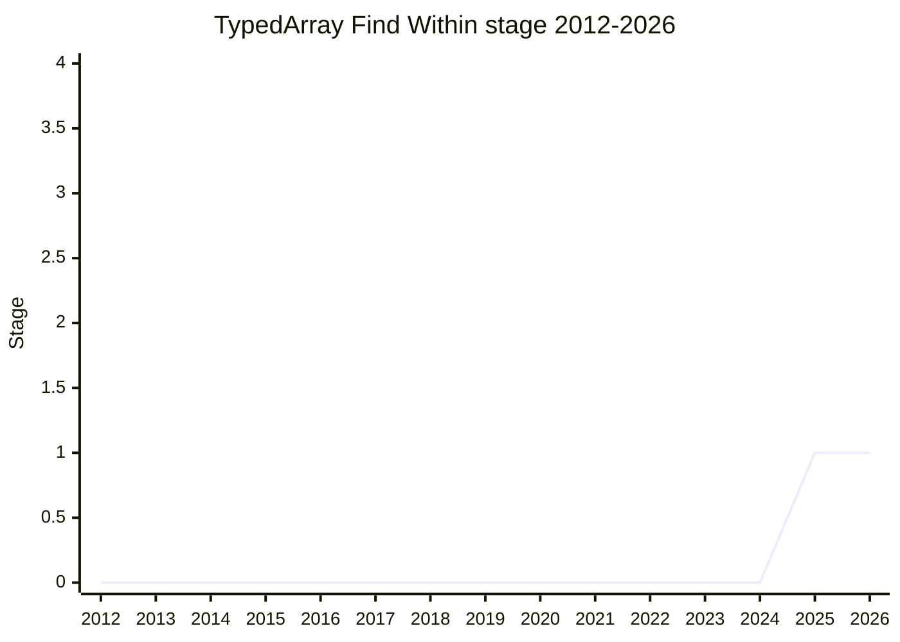

## Overview

Adds a way to search for a subsequence (not just a single element) within a `TypedArray`: something like `indexOf` for a sequence, plus a boolean containment check. `TypedArray` only searches for individual elements today, while Node's `Buffer` overwrites `indexOf` to support subsequence search - a pattern used in the wild (e.g. Next.js). The champion (James Snell, [JSL](../people/JSL.md)) came with no syntax proposals, only the problem statement, and asked for conditional Stage 1.

## Stage history

| Meeting                                                                            | What happened                                                                                                                                                                                                                             | Stage |
| ---------------------------------------------------------------------------------- | ----------------------------------------------------------------------------------------------------------------------------------------------------------------------------------------------------------------------------------------- | ----- |
| [2025-11](https://github.com/tc39/notes/blob/main/meetings/2025-11/november-18.md) | First presented. **Conditional Stage 1** accepted, pending creation of the proposal repository                                                                                                                                            | → 1   |
| [2026-03](https://github.com/tc39/notes/blob/main/meetings/2026-03/march-10.md)    | "TypedArray find within for Stage 2": Stage 2 requested but **not granted** - open questions (needle snapshotting, iterables, mismatched element types) needed changes; conditional Stage 2 declined in favor of a possible overflow slot | 1     |
| [2026-03](https://github.com/tc39/notes/blob/main/meetings/2026-03/march-12.md)    | Continuation, no stage ask (to return in May). Conclusion: no iterables (like concat); no firm conclusion on overloading `indexOf` vs. a new function, but the committee leaned toward a new function                                     | 1     |

> Stage 1 (conditional) in 2025-11. Stage 2 was requested in 2026-03 but not granted.

## Main issues

### Consistency with existing search APIs (2025-11)

[MAH](../people/MAH.md) and [WH](../people/WH.md) both warned against introducing yet another naming/semantic scheme: strings have `indexOf`, arrays have `includes`, and a multi-element match is really a string-like operation rather than a single-element find - the API should not confuse developers. The champion offered to define it in general terms (even as part of the iterator protocol), but [KM](../people/KM.md) pushed back hard on an iterator version: iterator protocols are complicated, hard to optimize, and "it's better to avoid that" - add it as a separate concrete API instead. [WH](../people/WH.md) also hoped for backwards searching.

## Related proposals

- [TypedArray Concatenation](../proposals/typedarray-concat.md) - presented by the same champion in the same session.

## Sources

- [2025-11 november-18](https://github.com/tc39/notes/blob/main/meetings/2025-11/november-18.md) - conditional Stage 1
- [2026-03 march-10](https://github.com/tc39/notes/blob/main/meetings/2026-03/march-10.md) - Stage 2 requested, not granted
- [2026-03 march-12](https://github.com/tc39/notes/blob/main/meetings/2026-03/march-12.md) - continuation
