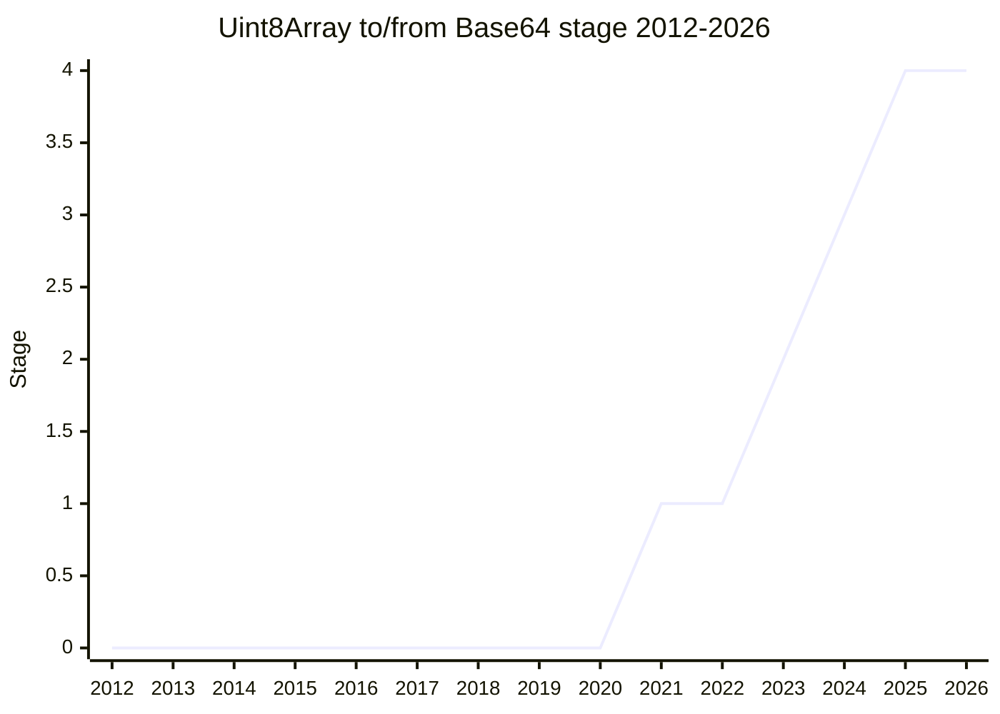

## Overview

Methods for converting between `Uint8Array` and Base64/Hex text: `Uint8Array.fromBase64` / `fromHex`, `toBase64` / `toHex`, and the writing variants `setFromBase64` / `setFromHex`. Base64 is ubiquitous (data URLs, JWTs, email, web APIs) but every JavaScript codebase carries its own implementation; hex likewise. The proposal standardizes the conversions as `Uint8Array` methods, with options for the URL-safe alphabet and padding.

The champion is [KG](../people/KG.md). The long road to Stage 4 (2021-07 to 2025-07) was dominated by one fight: whether the proposal should also provide a **streaming** API for encoding/decoding in chunks, pushed by [PHE](../people/PHE.md) / Moddable for embedded use - which blocked Stage 3 in 2023-09 and was ultimately dropped.

## Stage history

| Meeting                                                                             | What happened                                                                                                                                       | Stage |
| ----------------------------------------------------------------------------------- | --------------------------------------------------------------------------------------------------------------------------------------------------- | ----- |
| [2021-07](https://github.com/tc39/notes/blob/main/meetings/2021-07/july-14.md)      | First presented as "ArrayBuffer to/from Base64". Reached Stage 1 with stated reservations from [PHE](../people/PHE.md)                              | → 1   |
| [2023-05](https://github.com/tc39/notes/blob/main/meetings/2023-05/may-15.md)       | Reached Stage 2 (as "Base64 for Uint8Array")                                                                                                        | 1 → 2 |
| [2023-07](https://github.com/tc39/notes/blob/main/meetings/2023-07/july-12.md)      | A streaming write method was presented; the committee was split on including a streaming API                                                        | 2     |
| [2023-09](https://github.com/tc39/notes/blob/main/meetings/2023-09/september-28.md) | [PHE](../people/PHE.md) blocked Stage 3: embedded platforms (Moddable) need a streaming approach that the proposal does not provide                 | 2     |
| [2023-11](https://github.com/tc39/notes/blob/main/meetings/2023-11/november-27.md)  | Continued discussion of the streaming question                                                                                                      | 2     |
| [2024-02](https://github.com/tc39/notes/blob/main/meetings/2024-02/feb-7.md)        | Reached Stage 3 (asked for 2.7 and 3 together)                                                                                                      | 2 → 3 |
| [2024-06](https://github.com/tc39/notes/blob/main/meetings/2024-06/june-11.md)      | Normative changes: `setFromBase64` / `setFromHex` write decoded data up to the first error instead of failing wholesale; `omitPadding` option added | 3     |
| [2025-07](https://github.com/tc39/notes/blob/main/meetings/2025-07/july-28.md)      | Reached Stage 4. Spec PR [ecma262#3655](https://github.com/tc39/ecma262/pull/3655)                                                                  | 3 → 4 |

> Stage 1 in 2021-07, Stage 2 in 2023-05, Stage 3 in 2024-02 (after the streaming dispute), Stage 4 in 2025-07.

## Main issues

### Streaming API (the Moddable block)

From the start [PHE](../people/PHE.md) (Moddable) argued that embedded devices process large binary data in chunks, so a whole-buffer API is not enough. A streaming write method was presented at Stage 3 request time (2023-07) and "the committee was split" on including one; in 2023-09 [PHE](../people/PHE.md) formally blocked advancement: "in embedded platforms such as Moddable, some use cases require a streaming approach to base64 encoding, and this proposal does not provide that built-in". After further discussion (2023-11) the impasse was resolved by dropping streaming: the proposal went to Stage 3 in 2024-02 without it, and the shipped API is whole-buffer only.

### Error semantics of writing into an existing buffer (2024-06 normative change)

The original `setFromBase64` / `setFromHex` validated first and wrote nothing on error, requiring an internal second pass/buffer. Consensus (2024-06) changed this to "write decoded data up to the occurrence of the first error" - the caller learns how far decoding got, avoiding the hidden extra allocation. The same meeting added the `omitPadding` option to `toBase64` (default `false`, i.e. pad with `=`).

### Options-bag precedent: get-validate-get-validate (at Stage 4)

Before asking for Stage 4 (2025-07), [KG](../people/KG.md) paused to confirm the proposal's options handling (`alphabet`, `lastChunkHandling`) should be the going-forward pattern: read an option, validate it, then read the next - interleaved get-validate-get-validate, not read-everything-then-validate. [NRO](../people/NRO.md) confirmed Temporal's option handling follows the same base pattern, and [JHD](../people/JHD.md) asked for it to be a single shared abstract operation for all future options bags ("whatever logic goes in for base64, I want everything using options bags after this to use that logic"). The committee endorsed the pattern, and Stage 4 followed (support from [DLM](../people/DLM.md), [KM](../people/KM.md), and [MM](../people/MM.md) "+1,000"; [RMH](../people/RMH.md) confirmed Chrome's sign-off). Asked about WebIDL interplay, [KG](../people/KG.md) held that "we want to design the language first and then design the IDL to suit our needs rather than the other way around."

## Related proposals

- [Import Bytes](import-bytes.md) - a different axis of the same problem: getting file bytes into the language at all (`type: "bytes"` imports).
- [Temporal](temporal.md) - the Temporal normative change on option-bag ordering (same 2025-07 meeting) is the counterpart that triggered the get-validate-get-validate precedent discussion here.

## Sources

- [2021-07 july-14](https://github.com/tc39/notes/blob/main/meetings/2021-07/july-14.md) - Stage 1 (reservations from [PHE](../people/PHE.md))
- [2023-05 may-15](https://github.com/tc39/notes/blob/main/meetings/2023-05/may-15.md) - Stage 2
- [2023-07 july-12](https://github.com/tc39/notes/blob/main/meetings/2023-07/july-12.md) - streaming write method, committee split
- [2023-09 september-28](https://github.com/tc39/notes/blob/main/meetings/2023-09/september-28.md) - [PHE](../people/PHE.md) blocks Stage 3 over streaming
- [2024-02 feb-7](https://github.com/tc39/notes/blob/main/meetings/2024-02/feb-7.md) - Stage 3
- [2024-06 june-11](https://github.com/tc39/notes/blob/main/meetings/2024-06/june-11.md) - write-up-to-first-error and omitPadding normative changes
- [2025-07 july-28](https://github.com/tc39/notes/blob/main/meetings/2025-07/july-28.md) - Stage 4; options-bag precedent discussion
