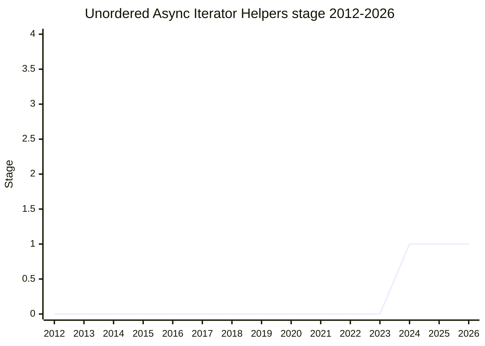

## Overview

An `AsyncIterator.prototype.unordered()` accessor that returns an iterator inheriting from a separate `UnorderedAsyncIterator.prototype`, whose helper methods may yield results in any order. Dropping the ordering constraint lets concurrent pulls use every concurrency slot as soon as a result is ready, instead of holding slots for earlier inputs that are not done yet. The proposal was **split out of [Async Iterator Helpers](async-iterator-helpers.md)** - keeping it there would have expanded that proposal's scope too much - and depends on `concurrency-control` for the consuming methods, since dropping order buys nothing at concurrency 1.

The design deliberately makes it hard to mix ordered and unordered helpers accidentally: there are no `map`/`mapUnordered` twin methods, and no inheritance relationship between the two prototypes, so once you re-apply order you have left the unordered world (by `Function.prototype.call` gymnastics, not by accident).

The champion is [MF](../people/MF.md).

## Stage history

| Meeting                                                                        | Event                                                                                                                                                                                | Stage |
| ------------------------------------------------------------------------------ | ------------------------------------------------------------------------------------------------------------------------------------------------------------------------------------ | ----- |
| [2024-07](https://github.com/tc39/notes/blob/main/meetings/2024-07/july-30.md) | Split out of Async Iterator Helpers; **reached Stage 1**. [MF](../people/MF.md) committed not to seek Stage 2 until Async Iterator Helpers advances further and has field experience | → 1   |

> First seen 2024-07 (split out of Async Iterator Helpers the same cycle), Stage 1.

## Main issues

### Designing too far ahead of field experience

The split-off exists only because async iterator helpers themselves are not done, and both [DLM](../people/DLM.md) and [SYG](../people/SYG.md) worried the committee is going "far down the rabbit hole" without feedback from shipped ordered helpers:

> ([SYG](../people/SYG.md), 2024-07) For asyncIterator helpers the demand from web developers was kind of overwhelming clear ... For async that is less clear to me. For unordered async that is even less clear to me.

[MF](../people/MF.md)'s answer was a commitment written into the Stage 1 conclusion: no Stage 2 attempt until Async Iterator Helpers is further advanced and there is experience with it in the field.

### The shape of the unordered world

[MM](../people/MM.md) probed the object model: which prototype inherits from which? There is none - a deliberate choice ([MF](../people/MF.md) and [KG](../people/KG.md) had discussed it "maybe a dozen times"). [MM](../people/MM.md)'s least-surprise/instanceof concern (substitutability says an unordered async iterator should answer to `AsyncIterator`) was answered by [KG](../people/KG.md) with the Liskov argument in the other direction - an ordered iterator mapped and consumed concurrently yields in order, an unordered one does not - which [MM](../people/MM.md) accepted.

Open questions carried out of the meeting: the naming mismatch between `toAsync` (ordered) and `unordered`, whether `AsyncIterator.prototype` should grow both coercion methods, whether the `concurrency` parameter should be _required_ here (optional in concurrency-control, but a concurrency of 1 defeats the proposal's purpose), and [MM](../people/MM.md)'s point that getting from a plain iterator to an unordered helper should not take two coercions.

## Related proposals

- [Sync Iterator helpers](iterator-helpers.md) - the shipped MVP this whole line extends asynchronously.
- `async-iterator-helpers` - the parent proposal it was split from (no page yet).
- `concurrency-control` - provides the concurrency the unordered helpers exploit (no page yet).

## Sources

- [2024-07 july-30](https://github.com/tc39/notes/blob/main/meetings/2024-07/july-30.md) - Stage 1 ([MF](../people/MF.md))
