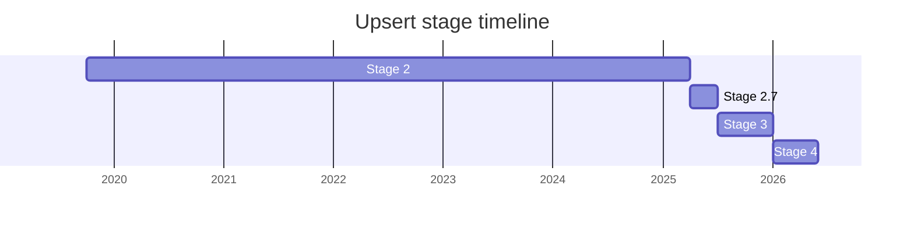

## 概要

Upsert は `Map`(および `WeakMap`)に対する「キーがあれば取得、なければ挿入」を 1 メソッドで行うための提案です。最終的に `Map.prototype.getOrInsert(key, value)` と `Map.prototype.getOrInsertComputed(key, callbackFn)` の 2 メソッド(いずれも `WeakMap.prototype` にも追加)として Stage 4 に到達しました。前者はキーがあれば対応値を返し、なければ `value` を挿入して返す。後者は不在時に `callbackFn` を呼んでその戻り値を挿入するため、デフォルト値の計算が高価な場合に遅延評価できます。

動機は性能ではなく **ergonomics**(可読性)です。従来は `has` → `get`/`set` の二度引きの定型コードが必要で冗長でした。設計上の先例として Java の `computeIfAbsent`、Python の `setdefault` / `defaultdict` が参照されています。`Map.insertOrUpdate`(2019)→ `Map.upsert` → `Map.emplace`(2020)→ 再び `upsert`(2024)と名前が二転三転し、メソッド名は最終的に「解決策ではなく問題で命名すべき」という方針のもと `getOrInsert` 系に確定しました。

元の champion は Erica Pramer ([EPR](../people/EPR.md))で、2020 年の Stage 3 申請は Bradley Farias ([BFS](../people/BFS.md))が発表しました。その後長く active champion 不在で停滞しましたが、2024 年に Mozilla の [DLM](../people/DLM.md)(SpiderMonkey 実装のメンターを兼ねる)が引き継ぎ、Stage 2.7 → 4 へ導きました。

## ステージ遷移

| 会合                                                       | できごと                                                                                                                                | Stage   |
| ---------------------------------------------------------- | --------------------------------------------------------------------------------------------------------------------------------------- | ------- |
| [2019-10](../../raw/notes/meetings/2019-10/october-2.md)   | `Map.upsert`(旧 `Map.insertOrUpdate`)を [EPR](../people/EPR.md) が発表。subclassing hazard・性能・二重コールバックを議論し異議なく前進  | 1 → 2   |
| [2020-07](../../raw/notes/meetings/2020-07/july-22.md)     | `emplace` に改名し options bag 化した版を [BFS](../people/BFS.md) が Stage 3 として発表。命名・単一責務で blocking 懸念多数、**進めず** | 2       |
| [2023-07](../../raw/notes/meetings/2023-07/july-13.md)     | Stage 2 メタレビューで「active champion 不在の提案」として挙げられ、新 champion を募集                                                  | 2       |
| [2024-07](../../raw/notes/meetings/2024-07/july-30.md)     | proposal scrub。[EPR](../people/EPR.md) 離脱を確認。[DLM](../people/DLM.md) が champion 候補として名乗り                                | 2       |
| [2024-10](../../raw/notes/meetings/2024-10/october-09.md)  | Stage 2 update。デフォルト値挿入に絞り、値直渡し版+コールバック版の 2 メソッド構成へ。[DLM](../people/DLM.md) が正式に引き継ぎ          | 2       |
| [2024-12](../../raw/notes/meetings/2024-12/december-02.md) | 提案名を "upsert" に確定。コールバックが map を変更した場合は non-throwing で扱う方針に決定                                             | 2       |
| [2025-04](../../raw/notes/meetings/2025-04/april-14.md)    | **Stage 2.7 到達**。メソッド名を `getOrInsert` / `getOrInsertComputed` に確定                                                           | 2 → 2.7 |
| [2025-07](../../raw/notes/meetings/2025-07/july-28.md)     | **Stage 3 到達**。Test262 を整理・拡充                                                                                                  | 2.7 → 3 |
| [2026-01](../../raw/notes/meetings/2026-01/january-20.md)  | **Stage 4 到達**。Safari/Firefox 出荷・Test262 通過、エディタ承認済み PR。異議なく承認                                                  | 3 → 4   |

> 各 Stage の横棒 = その stage に居た期間(横軸 = 実時間)。Stage 1 単独の記録は議事録コーパスに無く、2019-10 に Stage 2(初出)。2020-07 の Stage 3 申請は不合意で **約 5 年 Stage 2 のまま**(active champion 不在)。2024 に [DLM](../people/DLM.md) が引き継ぎ、2025-04 Stage 2.7 → 2025-07 Stage 3 → 2026-01 Stage 4。

## 主な論点

### 単一メソッド(二コールバック)か責務分割か

提案を 4 年間停滞させた中心論点です。元の設計は insert と update の二コールバック(または options bag)を 1 メソッドに束ねるものでしたが、委員会は「単一責務」での分割を繰り返し要求しました。2020-07 で [YSV](../people/YSV.md) が分割を主張し、[BFS](../people/BFS.md) は単一メソッドを固持しました。

> ([YSV](../people/YSV.md), 2020-07) `.emplace()` に `.getDefault()` まで担わせるのは極めてユーザー敵対的だと思う。

この回では blocking 懸念が解けず Stage 3 に進めませんでした。決着したのは [DLM](../people/DLM.md) が引き継いだ後で、2024-10 に「デフォルト値挿入」というユースケースに焦点を絞り、値直渡し版とコールバック版の 2 メソッドに分割する形になりました。

### 命名(`emplace` 問題)

`emplace` は C++ では insert より低水準の概念を指し、この高水準機能と衝突して混乱を招くと指摘されました。

> ([WH](../people/WH.md), 2020-07) `emplace` という名前は非常に紛らわしい。C++ の世界から来ると別の概念を指す言葉なので。

2024-10 で [SYG](../people/SYG.md) も「`emplace` は特に悪い、意味が分かる人が少ない」と述べ、[KG](../people/KG.md) が `getOrInsert` を提案。提案名は問題ベースの "upsert" に、メソッド名は `getOrInsert` / `getOrInsertComputed` に確定しました。

### `getOrInsertComputed` のコールバックが map を変更したとき

コールバック内でユーザーが同一キーを挿入するなど map を変更した場合に throw するか non-throwing で扱うかが 2024-12 で議論されました。[DLM](../people/DLM.md) は当初 throw に傾きましたが、[KG](../people/KG.md)・[SYG](../people/SYG.md)・[KM](../people/KM.md)・[RBN](../people/RBN.md) らが pay-as-you-go の観点で non-throwing を支持。

> ([SYG](../people/SYG.md), 2024-12) ほとんどの機能は pay-as-you-go であってほしい。non-throwing 案はこのメソッドを使うときだけコストを払うので明快だ。

決着は non-throwing。throw 方式は全 map 操作にチェックコストを課すため不採用とし、コールバック完了後にキー存在を再チェックして戻り値でセットする(コールバック中の変更は上書きされる)形になりました。

### 性能ではなくエルゴノミクスが主動機

二重ルックアップ回避という性能上の動機は、実装者から重視されませんでした。

> ([SYG](../people/SYG.md), 2019-10) V8 の見地では、ここでの性能上の動機は重要ではないと強調したい。この機能は気に入っているし、エルゴノミクスとして単体で成立する。

以後この提案は性能ではなく可読性・ergonomics を主たる正当化として進みました。

## 関連提案

- [Records & Tuples](../proposals/records-and-tuples.md) — 合成キーで `getOrInsertComputed` を使う議論の文脈(2019-10)で言及。
- `composites` — Records & Tuples の後継。collection キー周辺で 2025-04 に言及(提案ページ未作成)。

## 出典

- [2019-10 october-2](../../raw/notes/meetings/2019-10/october-2.md) — Stage 1 → 2([EPR](../people/EPR.md) 発表)
- [2020-07 july-22](../../raw/notes/meetings/2020-07/july-22.md) — Stage 3 申請失敗(`emplace` 改名、命名・単一責務の論争)
- [2023-07 july-13](../../raw/notes/meetings/2023-07/july-13.md) — Stage 2 メタレビュー(champion 不在として言及)
- [2024-07 july-30](../../raw/notes/meetings/2024-07/july-30.md) — proposal scrub、[DLM](../people/DLM.md) が champion 候補に
- [2024-10 october-09](../../raw/notes/meetings/2024-10/october-09.md) — Stage 2 update、2 メソッド化、champion 引き継ぎ
- [2024-12 december-02](../../raw/notes/meetings/2024-12/december-02.md) — "upsert" 改名、non-throwing 決定
- [2025-04 april-14](../../raw/notes/meetings/2025-04/april-14.md) — Stage 2.7 到達、メソッド名確定
- [2025-07 july-28](../../raw/notes/meetings/2025-07/july-28.md) — Stage 3 到達
- [2026-01 january-20](../../raw/notes/meetings/2026-01/january-20.md) — Stage 4 到達
