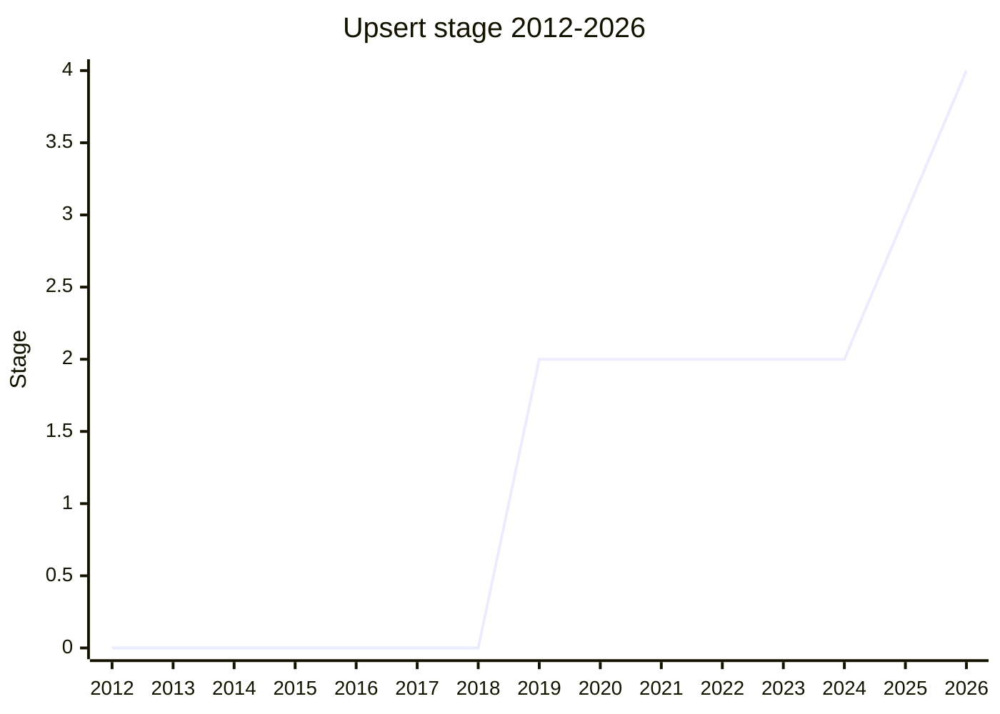

## Overview

Upsert does "get if the key is present, otherwise insert" on a `Map` (and a `WeakMap`) in one method. It reached Stage 4 as two methods, `Map.prototype.getOrInsert(key, value)` and `Map.prototype.getOrInsertComputed(key, callbackFn)` (both also added to `WeakMap.prototype`). The first returns the corresponding value if the key is present, and otherwise inserts `value` and returns it. The second, when the key is absent, calls `callbackFn` and inserts its return value, so the default can be computed lazily when that computation is expensive.

The motivation is not performance but **ergonomics** (readability). Previously the idiom was a double lookup, `has` then `get` / `set`, which is verbose. The design precedents cited are Java's `computeIfAbsent` and Python's `setdefault` / `defaultdict`. The name turned over twice: `Map.insertOrUpdate` (2019) → `Map.upsert` → `Map.emplace` (2020) → `upsert` again (2024). The method names finally settled on the `getOrInsert` family (a name [KG](../people/KG.md) floated in 2024-10), while the proposal itself was renamed to "upsert".

The original champion was Erica Pramer ([EPR](../people/EPR.md)). The 2020 Stage 3 request was presented by Bradley Farias ([BFS](../people/BFS.md)). After that it stalled for a long time with no active champion. In 2024, Mozilla's [DLM](../people/DLM.md) (who also mentored the SpiderMonkey implementation) took it over and led it from Stage 2.7 to 4.

## Stage history

| Meeting                                                                            | What happened                                                                                                                                                                               | Stage   |
| ---------------------------------------------------------------------------------- | ------------------------------------------------------------------------------------------------------------------------------------------------------------------------------------------- | ------- |
| [2019-10](https://github.com/tc39/notes/blob/main/meetings/2019-10/october-2.md)   | [EPR](../people/EPR.md) presented `Map.upsert` (formerly `Map.insertOrUpdate`). Subclassing hazard, performance, and a double callback were discussed, and it advanced with no objection    | 1 → 2   |
| [2020-07](https://github.com/tc39/notes/blob/main/meetings/2020-07/july-22.md)     | [BFS](../people/BFS.md) presented a version renamed `emplace` and turned into an options bag, as Stage 3. Many blocking concerns on the name and single responsibility. **Did not advance** | 2       |
| [2023-07](https://github.com/tc39/notes/blob/main/meetings/2023-07/july-13.md)     | Named in a Stage 2 meta-review as one of two proposals "potentially needing new champion involvement"                                                                                       | 2       |
| [2024-07](https://github.com/tc39/notes/blob/main/meetings/2024-07/july-30.md)     | Proposal scrub. Confirmed [EPR](../people/EPR.md) had left. [DLM](../people/DLM.md) volunteered as a champion candidate                                                                     | 2       |
| [2024-10](https://github.com/tc39/notes/blob/main/meetings/2024-10/october-09.md)  | Stage 2 update. Narrowed to inserting a default value, and moved to a two-method shape: a value passed directly, plus a callback version. [DLM](../people/DLM.md) formally took it over     | 2       |
| [2024-12](https://github.com/tc39/notes/blob/main/meetings/2024-12/december-02.md) | The proposal name was settled as "upsert." If the callback mutates the map, it is handled as non-throwing; Stage 2 reviewers [JMN](../people/JMN.md) and [MF](../people/MF.md) volunteered  | 2       |
| [2025-04](https://github.com/tc39/notes/blob/main/meetings/2025-04/april-14.md)    | **Reached Stage 2.7**. Method names settled as `getOrInsert` / `getOrInsertComputed`                                                                                                        | 2 → 2.7 |
| [2025-07](https://github.com/tc39/notes/blob/main/meetings/2025-07/july-28.md)     | **Reached Stage 3**. test262 was cleaned up and expanded                                                                                                                                    | 2.7 → 3 |
| [2026-01](https://github.com/tc39/notes/blob/main/meetings/2026-01/january-20.md)  | **Reached Stage 4**. Shipped in Safari / Firefox, test262 passing, an editor-approved PR. Approved with no objection                                                                        | 3 → 4   |

```mermaid
xychart-beta
    title "Upsert stage 2012-2026"
    x-axis [2012, 2013, 2014, 2015, 2016, 2017, 2018, 2019, 2020, 2021, 2022, 2023, 2024, 2025, 2026]
    y-axis "Stage" 0 --> 4
    line [0, 0, 0, 0, 0, 0, 0, 2, 2, 2, 2, 2, 2, 3, 4]
```

> Horizontal axis = 2012-2026, vertical axis = Stage. First appearance is 2019-10, and that meeting went Stage 1 → 2 (there is no record of Stage 1 alone in the notes corpus; 2019-10 is the first appearance). The 2020-07 Stage 3 request did not get agreement, so it stayed **flat at 2 for about five years** (no active champion). [DLM](../people/DLM.md) took it over in 2024. Stage 2.7 in 2025-04, Stage 3 in 2025-07, Stage 4 in 2026-01. It passed through both 2.7 and 3 within 2025, so the year-end value is 3.

## Main issues

### One method (two callbacks) or a split of responsibilities

This is the central issue that stalled the proposal for four years. The original design bundled two callbacks, insert and update (or an options bag), into one method, and the committee repeatedly asked for a split into single responsibilities. In 2020-07, [YSV](../people/YSV.md) argued for the split ("We should have single responsibility for this."), and [BFS](../people/BFS.md) held to a single method.

> ([YSV](../people/YSV.md), 2020-07) I would find stretching .emplace() to do .getDefault() be very user-hostile.

That meeting did not resolve the blocking concerns, and it did not advance to Stage 3. It was settled after [DLM](../people/DLM.md) took over. In 2024-10 the focus was narrowed to "the use case of inserting a default value into a Map during a get," and it was split into two methods, a value passed directly and a callback version.

### The name (the `emplace` problem)

In C++, `emplace` means a concept lower-level than insert, and it was pointed out that colliding with this higher-level feature causes confusion.

> ([WH](../people/WH.md), 2020-07) I just find the name “emplace” very confusing, coming from the C++ world, because it stands for a different concept.

In 2024-10, [SYG](../people/SYG.md) also said "I think emplace is particularly bad. I think two people understand emplace," and [KG](../people/KG.md) proposed `getOrInsert`. The proposal name settled on the problem-based "upsert," and the method names on `getOrInsert` / `getOrInsertComputed`.

### When the `getOrInsertComputed` callback mutates the map

Whether to throw, or to handle it as non-throwing, when the user inserts the same key or otherwise mutates the map inside the callback, was discussed in 2024-12. [DLM](../people/DLM.md) initially leaned toward throwing, but [KG](../people/KG.md), [SYG](../people/SYG.md), [KM](../people/KM.md), [RBN](../people/RBN.md), and others supported non-throwing from a pay-as-you-go point of view.

> ([SYG](../people/SYG.md), 2024-12) I want basically most features to be pay as you go and that would be the—no throwing thing is clear that is pay as you go for use of this particular method.

The settlement was non-throwing. The throwing approach was rejected because it imposes a check cost on every map operation. After the callback finishes, the key's presence is checked again and the return value sets it (a mutation during the callback is overwritten).

### Ergonomics, not performance, is the main motivation

Implementers did not treat avoiding a double lookup, the performance motivation, as important.

> ([SYG](../people/SYG.md), 2019-10) I want to stress that it’s V8’s point of view that the performance motivations here are not important. I like the feature and ergonomically it stands on its own.

After that, this proposal proceeded with readability and ergonomics, not performance, as its main justification.

## Related proposals

- [Records & Tuples](records-and-tuples.md) — mentioned in the context of using `getOrInsertComputed` with a composite key (2019-10).
- [Composite Keys](composite-keys.md) — the successor to Records & Tuples. Mentioned around collection keys in 2025-04.

## Sources

- [2019-10 october-2](https://github.com/tc39/notes/blob/main/meetings/2019-10/october-2.md) — Stage 1 → 2 (presented by [EPR](../people/EPR.md))
- [2020-07 july-22](https://github.com/tc39/notes/blob/main/meetings/2020-07/july-22.md) — Stage 3 request failed (renamed `emplace`; the name and single-responsibility dispute)
- [2023-07 july-13](https://github.com/tc39/notes/blob/main/meetings/2023-07/july-13.md) — Stage 2 meta-review (mentioned as having no champion)
- [2024-07 july-30](https://github.com/tc39/notes/blob/main/meetings/2024-07/july-30.md) — proposal scrub; [DLM](../people/DLM.md) became a champion candidate
- [2024-10 october-09](https://github.com/tc39/notes/blob/main/meetings/2024-10/october-09.md) — Stage 2 update, two methods, champion handover
- [2024-12 december-02](https://github.com/tc39/notes/blob/main/meetings/2024-12/december-02.md) — renamed "upsert"; non-throwing decided
- [2025-04 april-14](https://github.com/tc39/notes/blob/main/meetings/2025-04/april-14.md) — reached Stage 2.7; method names settled
- [2025-07 july-28](https://github.com/tc39/notes/blob/main/meetings/2025-07/july-28.md) — reached Stage 3
- [2026-01 january-20](https://github.com/tc39/notes/blob/main/meetings/2026-01/january-20.md) — reached Stage 4
