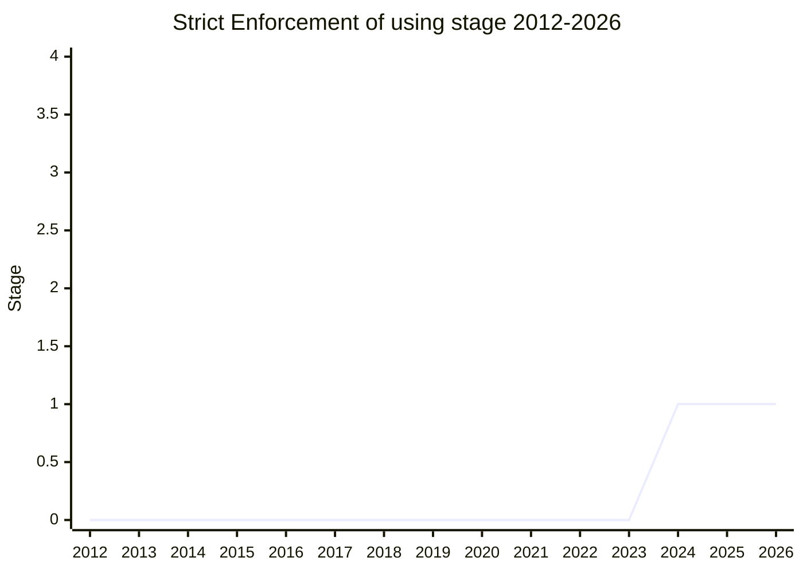

## Overview

An opt-in "stricter enforcement" companion to [Explicit Resource Management](explicit-resource-management.md). An API producer that wants its resources to be consumed with `using` can return a wrapper whose only meaningful member is a `[Symbol.enter]()` method; `using`, `await using`, and `DisposableStack` invoke it and unwrap the real resource. Code that grabs the value directly hits an object it can't use - a "stumbling block" that steers the user toward `using` - while still allowing building blocks that need direct access to call `[Symbol.enter]()` explicitly.

The motivation: today nothing enforces that a disposable is actually disposed. Host APIs in Node.js, the DOM, and Electron could adopt disposability, but only if they don't have to bifurcate their APIs for callers who don't opt in - hence enforcement is opt-in at the API-producer level. The champion himself was candid that the proposal may not be needed: workarounds exist (a `FinalizationRegistry`-based warning, or turning `[Symbol.dispose]()` into a getter so untouched resources can be detected), and "even as presenting this as a proposal, my initial reaction is that we don't need this." Explicitly out of scope: Python-style context-manager semantics (an exit mechanism that can intercept and swallow exceptions - "a spooky action").

## Stage history

| Meeting                                                                         | Event                                                                                                              | Stage |
| ------------------------------------------------------------------------------- | ------------------------------------------------------------------------------------------------------------------ | ----- |
| [2024-04](https://github.com/tc39/notes/blob/main/meetings/2024-04/april-11.md) | Presented by [RBN](../people/RBN.md) as a potential follow-on to Explicit Resource Management; **reached Stage 1** | → 1   |

> First presented 2024-04 and reached Stage 1; not presented since.

## Main issues

### Does the getter workaround make this unnecessary?

[MM](../people/MM.md) was "very, very positive on the problem", and initially on the `[Symbol.enter]` mechanism - until [RBN](../people/RBN.md) described the getter alternative (making `[Symbol.dispose]()` a getter that registers the resource for disposal on first access), which [MM](../people/MM.md) thought solved the problem within the existing proposal ("I no longer see the need for a new mechanism"). [RBN](../people/RBN.md) agreed that was "generally my position as well".

[KG](../people/KG.md) disagreed that the getter gives enforcement at all: it only works if the consumer happens to touch the instance later, requires turning every field into a getter, and even then "you will just not get an error... if you just happen to make one of these things, and don't end up `using` it" - and when the error does come, it is "in the distant future instead of at the place that you actually made the mistake". [SYG](../people/SYG.md) pressed for the mechanical story of how `[Symbol.enter]` enforces anything at the `using` site and concluded it cannot - the error surfaces "whenever they touch that binding for the first time", arbitrarily far from the mistake, unlike C++'s compile-time annotation. The proposal was adopted for Stage 1 despite this, as an opt-in follow-on rather than a change to the main proposal.

### Relationship with Explicit Resource Management

Opt-in by design ("mandatory enforcement would complicate adoption in DOM/NodeJS/Electron/etc."), and positioned so as not to gate the parent: [RBN](../people/RBN.md) stated that strict enforcement "is not necessary... to be the key part of the initial roll-out" and not a blocker for Explicit Resource Management to reach Stage 4. If pursued further, it would be an add-on proposal.

## Related proposals

- [Explicit Resource Management](explicit-resource-management.md) - the parent proposal (`using` declarations, `DisposableStack`).

## Sources

- [2024-04 april-11](https://github.com/tc39/notes/blob/main/meetings/2024-04/april-11.md) - Stage 1
